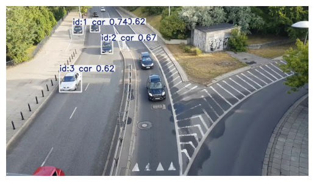

```python
from google.colab import drive
drive.mount('/content/drive')
```

    Mounted at /content/drive
    


```python
!pip install ultralytics
```

    Collecting ultralytics
      Downloading ultralytics-8.2.50-py3-none-any.whl (799 kB)
    [?25l     ━━━━━━━━━━━━━━━━━━━━━━━━━━━━━━━━━━━━━━━━ 0.0/799.4 kB ? eta -:--:--
     ━━━━━━━╺━━━━━━━━━━━━━━━━━━━━━━━━━━━━━━━━ 143.4/799.4 kB 4.3 MB/s eta 0:00:01
     ━━━━━━━━━━━━━━━━━━━━━━━━╺━━━━━━━━━━━━━━━ 481.3/799.4 kB 6.9 MB/s eta 0:00:01
     ━━━━━━━━━━━━━━━━━━━━━━━━━━━━━━━━━━━━━━━╸ 798.7/799.4 kB 8.2 MB/s eta 0:00:01
     ━━━━━━━━━━━━━━━━━━━━━━━━━━━━━━━━━━━━━━━━ 799.4/799.4 kB 7.2 MB/s eta 0:00:00
    [?25hRequirement already satisfied: numpy<2.0.0,>=1.23.0 in /usr/local/lib/python3.10/dist-packages (from ultralytics) (1.25.2)
    Requirement already satisfied: matplotlib>=3.3.0 in /usr/local/lib/python3.10/dist-packages (from ultralytics) (3.7.1)
    Requirement already satisfied: opencv-python>=4.6.0 in /usr/local/lib/python3.10/dist-packages (from ultralytics) (4.8.0.76)
    Requirement already satisfied: pillow>=7.1.2 in /usr/local/lib/python3.10/dist-packages (from ultralytics) (9.4.0)
    Requirement already satisfied: pyyaml>=5.3.1 in /usr/local/lib/python3.10/dist-packages (from ultralytics) (6.0.1)
    Requirement already satisfied: requests>=2.23.0 in /usr/local/lib/python3.10/dist-packages (from ultralytics) (2.31.0)
    Requirement already satisfied: scipy>=1.4.1 in /usr/local/lib/python3.10/dist-packages (from ultralytics) (1.11.4)
    Requirement already satisfied: torch>=1.8.0 in /usr/local/lib/python3.10/dist-packages (from ultralytics) (2.3.0+cu121)
    Requirement already satisfied: torchvision>=0.9.0 in /usr/local/lib/python3.10/dist-packages (from ultralytics) (0.18.0+cu121)
    Requirement already satisfied: tqdm>=4.64.0 in /usr/local/lib/python3.10/dist-packages (from ultralytics) (4.66.4)
    Requirement already satisfied: psutil in /usr/local/lib/python3.10/dist-packages (from ultralytics) (5.9.5)
    Requirement already satisfied: py-cpuinfo in /usr/local/lib/python3.10/dist-packages (from ultralytics) (9.0.0)
    Requirement already satisfied: pandas>=1.1.4 in /usr/local/lib/python3.10/dist-packages (from ultralytics) (2.0.3)
    Requirement already satisfied: seaborn>=0.11.0 in /usr/local/lib/python3.10/dist-packages (from ultralytics) (0.13.1)
    Collecting ultralytics-thop>=2.0.0 (from ultralytics)
      Downloading ultralytics_thop-2.0.0-py3-none-any.whl (25 kB)
    Requirement already satisfied: contourpy>=1.0.1 in /usr/local/lib/python3.10/dist-packages (from matplotlib>=3.3.0->ultralytics) (1.2.1)
    Requirement already satisfied: cycler>=0.10 in /usr/local/lib/python3.10/dist-packages (from matplotlib>=3.3.0->ultralytics) (0.12.1)
    Requirement already satisfied: fonttools>=4.22.0 in /usr/local/lib/python3.10/dist-packages (from matplotlib>=3.3.0->ultralytics) (4.53.0)
    Requirement already satisfied: kiwisolver>=1.0.1 in /usr/local/lib/python3.10/dist-packages (from matplotlib>=3.3.0->ultralytics) (1.4.5)
    Requirement already satisfied: packaging>=20.0 in /usr/local/lib/python3.10/dist-packages (from matplotlib>=3.3.0->ultralytics) (24.1)
    Requirement already satisfied: pyparsing>=2.3.1 in /usr/local/lib/python3.10/dist-packages (from matplotlib>=3.3.0->ultralytics) (3.1.2)
    Requirement already satisfied: python-dateutil>=2.7 in /usr/local/lib/python3.10/dist-packages (from matplotlib>=3.3.0->ultralytics) (2.8.2)
    Requirement already satisfied: pytz>=2020.1 in /usr/local/lib/python3.10/dist-packages (from pandas>=1.1.4->ultralytics) (2023.4)
    Requirement already satisfied: tzdata>=2022.1 in /usr/local/lib/python3.10/dist-packages (from pandas>=1.1.4->ultralytics) (2024.1)
    Requirement already satisfied: charset-normalizer<4,>=2 in /usr/local/lib/python3.10/dist-packages (from requests>=2.23.0->ultralytics) (3.3.2)
    Requirement already satisfied: idna<4,>=2.5 in /usr/local/lib/python3.10/dist-packages (from requests>=2.23.0->ultralytics) (3.7)
    Requirement already satisfied: urllib3<3,>=1.21.1 in /usr/local/lib/python3.10/dist-packages (from requests>=2.23.0->ultralytics) (2.0.7)
    Requirement already satisfied: certifi>=2017.4.17 in /usr/local/lib/python3.10/dist-packages (from requests>=2.23.0->ultralytics) (2024.6.2)
    Requirement already satisfied: filelock in /usr/local/lib/python3.10/dist-packages (from torch>=1.8.0->ultralytics) (3.15.4)
    Requirement already satisfied: typing-extensions>=4.8.0 in /usr/local/lib/python3.10/dist-packages (from torch>=1.8.0->ultralytics) (4.12.2)
    Requirement already satisfied: sympy in /usr/local/lib/python3.10/dist-packages (from torch>=1.8.0->ultralytics) (1.12.1)
    Requirement already satisfied: networkx in /usr/local/lib/python3.10/dist-packages (from torch>=1.8.0->ultralytics) (3.3)
    Requirement already satisfied: jinja2 in /usr/local/lib/python3.10/dist-packages (from torch>=1.8.0->ultralytics) (3.1.4)
    Requirement already satisfied: fsspec in /usr/local/lib/python3.10/dist-packages (from torch>=1.8.0->ultralytics) (2023.6.0)
    Collecting nvidia-cuda-nvrtc-cu12==12.1.105 (from torch>=1.8.0->ultralytics)
      Using cached nvidia_cuda_nvrtc_cu12-12.1.105-py3-none-manylinux1_x86_64.whl (23.7 MB)
    Collecting nvidia-cuda-runtime-cu12==12.1.105 (from torch>=1.8.0->ultralytics)
      Using cached nvidia_cuda_runtime_cu12-12.1.105-py3-none-manylinux1_x86_64.whl (823 kB)
    Collecting nvidia-cuda-cupti-cu12==12.1.105 (from torch>=1.8.0->ultralytics)
      Using cached nvidia_cuda_cupti_cu12-12.1.105-py3-none-manylinux1_x86_64.whl (14.1 MB)
    Collecting nvidia-cudnn-cu12==8.9.2.26 (from torch>=1.8.0->ultralytics)
      Using cached nvidia_cudnn_cu12-8.9.2.26-py3-none-manylinux1_x86_64.whl (731.7 MB)
    Collecting nvidia-cublas-cu12==12.1.3.1 (from torch>=1.8.0->ultralytics)
      Using cached nvidia_cublas_cu12-12.1.3.1-py3-none-manylinux1_x86_64.whl (410.6 MB)
    Collecting nvidia-cufft-cu12==11.0.2.54 (from torch>=1.8.0->ultralytics)
      Using cached nvidia_cufft_cu12-11.0.2.54-py3-none-manylinux1_x86_64.whl (121.6 MB)
    Collecting nvidia-curand-cu12==10.3.2.106 (from torch>=1.8.0->ultralytics)
      Using cached nvidia_curand_cu12-10.3.2.106-py3-none-manylinux1_x86_64.whl (56.5 MB)
    Collecting nvidia-cusolver-cu12==11.4.5.107 (from torch>=1.8.0->ultralytics)
      Using cached nvidia_cusolver_cu12-11.4.5.107-py3-none-manylinux1_x86_64.whl (124.2 MB)
    Collecting nvidia-cusparse-cu12==12.1.0.106 (from torch>=1.8.0->ultralytics)
      Using cached nvidia_cusparse_cu12-12.1.0.106-py3-none-manylinux1_x86_64.whl (196.0 MB)
    Collecting nvidia-nccl-cu12==2.20.5 (from torch>=1.8.0->ultralytics)
      Using cached nvidia_nccl_cu12-2.20.5-py3-none-manylinux2014_x86_64.whl (176.2 MB)
    Collecting nvidia-nvtx-cu12==12.1.105 (from torch>=1.8.0->ultralytics)
      Using cached nvidia_nvtx_cu12-12.1.105-py3-none-manylinux1_x86_64.whl (99 kB)
    Requirement already satisfied: triton==2.3.0 in /usr/local/lib/python3.10/dist-packages (from torch>=1.8.0->ultralytics) (2.3.0)
    Collecting nvidia-nvjitlink-cu12 (from nvidia-cusolver-cu12==11.4.5.107->torch>=1.8.0->ultralytics)
      Downloading nvidia_nvjitlink_cu12-12.5.82-py3-none-manylinux2014_x86_64.whl (21.3 MB)
         ━━━━━━━━━━━━━━━━━━━━━━━━━━━━━━━━━━━━━━━━ 21.3/21.3 MB 51.9 MB/s eta 0:00:00
    [?25hRequirement already satisfied: six>=1.5 in /usr/local/lib/python3.10/dist-packages (from python-dateutil>=2.7->matplotlib>=3.3.0->ultralytics) (1.16.0)
    Requirement already satisfied: MarkupSafe>=2.0 in /usr/local/lib/python3.10/dist-packages (from jinja2->torch>=1.8.0->ultralytics) (2.1.5)
    Requirement already satisfied: mpmath<1.4.0,>=1.1.0 in /usr/local/lib/python3.10/dist-packages (from sympy->torch>=1.8.0->ultralytics) (1.3.0)
    Installing collected packages: nvidia-nvtx-cu12, nvidia-nvjitlink-cu12, nvidia-nccl-cu12, nvidia-curand-cu12, nvidia-cufft-cu12, nvidia-cuda-runtime-cu12, nvidia-cuda-nvrtc-cu12, nvidia-cuda-cupti-cu12, nvidia-cublas-cu12, nvidia-cusparse-cu12, nvidia-cudnn-cu12, nvidia-cusolver-cu12, ultralytics-thop, ultralytics
    Successfully installed nvidia-cublas-cu12-12.1.3.1 nvidia-cuda-cupti-cu12-12.1.105 nvidia-cuda-nvrtc-cu12-12.1.105 nvidia-cuda-runtime-cu12-12.1.105 nvidia-cudnn-cu12-8.9.2.26 nvidia-cufft-cu12-11.0.2.54 nvidia-curand-cu12-10.3.2.106 nvidia-cusolver-cu12-11.4.5.107 nvidia-cusparse-cu12-12.1.0.106 nvidia-nccl-cu12-2.20.5 nvidia-nvjitlink-cu12-12.5.82 nvidia-nvtx-cu12-12.1.105 ultralytics-8.2.50 ultralytics-thop-2.0.0
    


```python
import os
import shutil
import cv2
import numpy as np
import pandas as pd
from ultralytics import YOLO
#from PIL import Image, ImageDraw
import plotly.express as px
import plotly.graph_objects as go
from plotly.subplots import make_subplots
from matplotlib import animation, rc
rc('animation', html='jshtml')
from IPython.display import Image, Video
import matplotlib.pyplot as plt
from matplotlib.animation import FuncAnimation
```


```python
image_dir = '/content/drive/My Drive/archive (16)/images'
image_files = [os.path.join(image_dir, f) for f in os.listdir(image_dir) if f.endswith('.PNG')]
image_files = sorted(image_files)
images = []
for path in image_files:
    image=plt.imread(path)
    image=cv2.resize(image, dsize=None, fx=0.3, fy=0.3, interpolation=cv2.INTER_LINEAR)
    #print(image.shape)
    images+=[image]

def update(frame):
    plt.clf()
    plt.imshow(images[frame])
    plt.axis('off')

ani = FuncAnimation(plt.gcf(), update, frames=len(images), interval=300)
ani.save('detections.gif', writer='pillow', fps=30)
```


    

    


```python
Image(open('./detections.gif','rb').read())
```


    

    


```python
!mkdir yolov8_tracking
!mkdir yolov8_tracking/examples
!mkdir yolov8_tracking/examples/weights
```


```python
dir0='/content/drive/My Drive/archive (16)/images'
```


```python
!yolo mode=track tracker="bytetrack.yaml" model=yolov8n.pt conf=0.01 source='/content/drive/My Drive/archive (16)/images' save=True save_txt=True
```

    Downloading https://github.com/ultralytics/assets/releases/download/v8.2.0/yolov8n.pt to 'yolov8n.pt'...
    100% 6.25M/6.25M [00:00<00:00, 88.6MB/s]
    requirements: Ultralytics requirement ['lapx>=0.5.2'] not found, attempting AutoUpdate...
    Collecting lapx>=0.5.2
      Downloading lapx-0.5.9.post1-cp310-cp310-manylinux_2_5_x86_64.manylinux1_x86_64.manylinux_2_17_x86_64.manylinux2014_x86_64.whl (1.7 MB)
         ━━━━━━━━━━━━━━━━━━━━━━━━━━━━━━━━━━━━━━━━ 1.7/1.7 MB 10.1 MB/s eta 0:00:00
    Requirement already satisfied: numpy>=1.21.6 in /usr/local/lib/python3.10/dist-packages (from lapx>=0.5.2) (1.25.2)
    Installing collected packages: lapx
    Successfully installed lapx-0.5.9.post1
    
    requirements: AutoUpdate success ✅ 8.2s, installed 1 package: ['lapx>=0.5.2']
    requirements: ⚠️ Restart runtime or rerun command for updates to take effect
    
    Ultralytics YOLOv8.2.50 🚀 Python-3.10.12 torch-2.3.0+cu121 CPU (Intel Xeon 2.20GHz)
    YOLOv8n summary (fused): 168 layers, 3151904 parameters, 0 gradients, 8.7 GFLOPs
    
    image 1/301 /content/drive/My Drive/archive (16)/images/frame_000000.PNG: 384x640 4 cars, 246.4ms
    image 2/301 /content/drive/My Drive/archive (16)/images/frame_000001.PNG: 384x640 3 cars, 196.1ms
    image 3/301 /content/drive/My Drive/archive (16)/images/frame_000002.PNG: 384x640 3 cars, 192.6ms
    image 4/301 /content/drive/My Drive/archive (16)/images/frame_000003.PNG: 384x640 4 cars, 190.9ms
    image 5/301 /content/drive/My Drive/archive (16)/images/frame_000004.PNG: 384x640 4 cars, 203.9ms
    image 6/301 /content/drive/My Drive/archive (16)/images/frame_000005.PNG: 384x640 3 cars, 1 bus, 198.3ms
    image 7/301 /content/drive/My Drive/archive (16)/images/frame_000006.PNG: 384x640 3 cars, 210.5ms
    image 8/301 /content/drive/My Drive/archive (16)/images/frame_000007.PNG: 384x640 3 cars, 210.4ms
    image 9/301 /content/drive/My Drive/archive (16)/images/frame_000008.PNG: 384x640 3 cars, 184.0ms
    image 10/301 /content/drive/My Drive/archive (16)/images/frame_000009.PNG: 384x640 4 cars, 1 bus, 139.3ms
    image 11/301 /content/drive/My Drive/archive (16)/images/frame_000010.PNG: 384x640 3 cars, 122.0ms
    image 12/301 /content/drive/My Drive/archive (16)/images/frame_000011.PNG: 384x640 4 cars, 129.9ms
    image 13/301 /content/drive/My Drive/archive (16)/images/frame_000012.PNG: 384x640 3 cars, 137.2ms
    image 14/301 /content/drive/My Drive/archive (16)/images/frame_000013.PNG: 384x640 2 cars, 127.8ms
    image 15/301 /content/drive/My Drive/archive (16)/images/frame_000014.PNG: 384x640 3 cars, 146.0ms
    image 16/301 /content/drive/My Drive/archive (16)/images/frame_000015.PNG: 384x640 4 cars, 132.9ms
    image 17/301 /content/drive/My Drive/archive (16)/images/frame_000016.PNG: 384x640 3 cars, 129.1ms
    image 18/301 /content/drive/My Drive/archive (16)/images/frame_000017.PNG: 384x640 4 cars, 126.0ms
    image 19/301 /content/drive/My Drive/archive (16)/images/frame_000018.PNG: 384x640 2 cars, 137.6ms
    image 20/301 /content/drive/My Drive/archive (16)/images/frame_000019.PNG: 384x640 3 cars, 124.6ms
    image 21/301 /content/drive/My Drive/archive (16)/images/frame_000020.PNG: 384x640 2 cars, 128.1ms
    image 22/301 /content/drive/My Drive/archive (16)/images/frame_000021.PNG: 384x640 3 cars, 136.3ms
    image 23/301 /content/drive/My Drive/archive (16)/images/frame_000022.PNG: 384x640 3 cars, 126.0ms
    image 24/301 /content/drive/My Drive/archive (16)/images/frame_000023.PNG: 384x640 3 cars, 126.6ms
    image 25/301 /content/drive/My Drive/archive (16)/images/frame_000024.PNG: 384x640 4 cars, 133.4ms
    image 26/301 /content/drive/My Drive/archive (16)/images/frame_000025.PNG: 384x640 4 cars, 127.0ms
    image 27/301 /content/drive/My Drive/archive (16)/images/frame_000026.PNG: 384x640 2 cars, 1 train, 132.6ms
    image 28/301 /content/drive/My Drive/archive (16)/images/frame_000027.PNG: 384x640 2 cars, 137.7ms
    image 29/301 /content/drive/My Drive/archive (16)/images/frame_000028.PNG: 384x640 4 cars, 127.9ms
    image 30/301 /content/drive/My Drive/archive (16)/images/frame_000029.PNG: 384x640 2 cars, 135.8ms
    image 31/301 /content/drive/My Drive/archive (16)/images/frame_000030.PNG: 384x640 2 cars, 1 train, 133.2ms
    image 32/301 /content/drive/My Drive/archive (16)/images/frame_000031.PNG: 384x640 2 cars, 151.3ms
    image 33/301 /content/drive/My Drive/archive (16)/images/frame_000032.PNG: 384x640 3 cars, 128.3ms
    image 34/301 /content/drive/My Drive/archive (16)/images/frame_000033.PNG: 384x640 2 cars, 132.6ms
    image 35/301 /content/drive/My Drive/archive (16)/images/frame_000034.PNG: 384x640 3 cars, 1 train, 131.1ms
    image 36/301 /content/drive/My Drive/archive (16)/images/frame_000035.PNG: 384x640 2 cars, 123.0ms
    image 37/301 /content/drive/My Drive/archive (16)/images/frame_000036.PNG: 384x640 3 cars, 132.5ms
    image 38/301 /content/drive/My Drive/archive (16)/images/frame_000037.PNG: 384x640 4 cars, 150.7ms
    image 39/301 /content/drive/My Drive/archive (16)/images/frame_000038.PNG: 384x640 4 cars, 205.3ms
    image 40/301 /content/drive/My Drive/archive (16)/images/frame_000039.PNG: 384x640 5 cars, 208.3ms
    image 41/301 /content/drive/My Drive/archive (16)/images/frame_000040.PNG: 384x640 4 cars, 199.0ms
    image 42/301 /content/drive/My Drive/archive (16)/images/frame_000041.PNG: 384x640 3 cars, 201.5ms
    image 43/301 /content/drive/My Drive/archive (16)/images/frame_000042.PNG: 384x640 3 cars, 188.4ms
    image 44/301 /content/drive/My Drive/archive (16)/images/frame_000043.PNG: 384x640 3 cars, 229.5ms
    image 45/301 /content/drive/My Drive/archive (16)/images/frame_000044.PNG: 384x640 3 cars, 195.8ms
    image 46/301 /content/drive/My Drive/archive (16)/images/frame_000045.PNG: 384x640 2 cars, 203.0ms
    image 47/301 /content/drive/My Drive/archive (16)/images/frame_000046.PNG: 384x640 2 cars, 199.6ms
    image 48/301 /content/drive/My Drive/archive (16)/images/frame_000047.PNG: 384x640 3 cars, 141.4ms
    image 49/301 /content/drive/My Drive/archive (16)/images/frame_000048.PNG: 384x640 3 cars, 131.3ms
    image 50/301 /content/drive/My Drive/archive (16)/images/frame_000049.PNG: 384x640 3 cars, 125.6ms
    image 51/301 /content/drive/My Drive/archive (16)/images/frame_000050.PNG: 384x640 3 cars, 1 train, 145.8ms
    image 52/301 /content/drive/My Drive/archive (16)/images/frame_000051.PNG: 384x640 1 car, 126.4ms
    image 53/301 /content/drive/My Drive/archive (16)/images/frame_000052.PNG: 384x640 3 cars, 130.1ms
    image 54/301 /content/drive/My Drive/archive (16)/images/frame_000053.PNG: 384x640 2 cars, 125.8ms
    image 55/301 /content/drive/My Drive/archive (16)/images/frame_000054.PNG: 384x640 2 cars, 126.8ms
    image 56/301 /content/drive/My Drive/archive (16)/images/frame_000055.PNG: 384x640 5 cars, 125.3ms
    image 57/301 /content/drive/My Drive/archive (16)/images/frame_000056.PNG: 384x640 3 cars, 130.4ms
    image 58/301 /content/drive/My Drive/archive (16)/images/frame_000057.PNG: 384x640 4 cars, 122.7ms
    image 59/301 /content/drive/My Drive/archive (16)/images/frame_000058.PNG: 384x640 2 cars, 133.2ms
    image 60/301 /content/drive/My Drive/archive (16)/images/frame_000059.PNG: 384x640 3 cars, 130.9ms
    image 61/301 /content/drive/My Drive/archive (16)/images/frame_000060.PNG: 384x640 2 cars, 128.3ms
    image 62/301 /content/drive/My Drive/archive (16)/images/frame_000061.PNG: 384x640 3 cars, 125.7ms
    image 63/301 /content/drive/My Drive/archive (16)/images/frame_000062.PNG: 384x640 2 cars, 130.8ms
    image 64/301 /content/drive/My Drive/archive (16)/images/frame_000063.PNG: 384x640 3 cars, 126.0ms
    image 65/301 /content/drive/My Drive/archive (16)/images/frame_000064.PNG: 384x640 3 cars, 126.2ms
    image 66/301 /content/drive/My Drive/archive (16)/images/frame_000065.PNG: 384x640 3 cars, 151.2ms
    image 67/301 /content/drive/My Drive/archive (16)/images/frame_000066.PNG: 384x640 4 cars, 143.3ms
    image 68/301 /content/drive/My Drive/archive (16)/images/frame_000067.PNG: 384x640 3 cars, 144.4ms
    image 69/301 /content/drive/My Drive/archive (16)/images/frame_000068.PNG: 384x640 3 cars, 153.5ms
    image 70/301 /content/drive/My Drive/archive (16)/images/frame_000069.PNG: 384x640 2 cars, 127.0ms
    image 71/301 /content/drive/My Drive/archive (16)/images/frame_000070.PNG: 384x640 2 cars, 130.3ms
    image 72/301 /content/drive/My Drive/archive (16)/images/frame_000071.PNG: 384x640 3 cars, 125.2ms
    image 73/301 /content/drive/My Drive/archive (16)/images/frame_000072.PNG: 384x640 3 cars, 134.8ms
    image 74/301 /content/drive/My Drive/archive (16)/images/frame_000073.PNG: 384x640 4 cars, 142.0ms
    image 75/301 /content/drive/My Drive/archive (16)/images/frame_000074.PNG: 384x640 3 cars, 130.3ms
    image 76/301 /content/drive/My Drive/archive (16)/images/frame_000075.PNG: 384x640 2 cars, 199.3ms
    image 77/301 /content/drive/My Drive/archive (16)/images/frame_000076.PNG: 384x640 2 cars, 189.1ms
    image 78/301 /content/drive/My Drive/archive (16)/images/frame_000077.PNG: 384x640 1 car, 193.3ms
    image 79/301 /content/drive/My Drive/archive (16)/images/frame_000078.PNG: 384x640 2 cars, 198.2ms
    image 80/301 /content/drive/My Drive/archive (16)/images/frame_000079.PNG: 384x640 3 cars, 197.1ms
    image 81/301 /content/drive/My Drive/archive (16)/images/frame_000080.PNG: 384x640 3 cars, 264.4ms
    image 82/301 /content/drive/My Drive/archive (16)/images/frame_000081.PNG: 384x640 3 cars, 195.5ms
    image 83/301 /content/drive/My Drive/archive (16)/images/frame_000082.PNG: 384x640 2 cars, 1 bus, 226.5ms
    image 84/301 /content/drive/My Drive/archive (16)/images/frame_000083.PNG: 384x640 1 car, 210.9ms
    image 85/301 /content/drive/My Drive/archive (16)/images/frame_000084.PNG: 384x640 1 car, 127.4ms
    image 86/301 /content/drive/My Drive/archive (16)/images/frame_000085.PNG: 384x640 25 persons, 31 cars, 7 buss, 1 train, 8 trucks, 5 umbrellas, 123.6ms
    image 87/301 /content/drive/My Drive/archive (16)/images/frame_000086.PNG: 384x640 22 persons, 22 cars, 7 buss, 1 train, 4 trucks, 5 umbrellas, 128.4ms
    image 88/301 /content/drive/My Drive/archive (16)/images/frame_000087.PNG: 384x640 29 persons, 27 cars, 9 buss, 1 train, 6 trucks, 4 umbrellas, 145.3ms
    image 89/301 /content/drive/My Drive/archive (16)/images/frame_000088.PNG: 384x640 1 car, 135.6ms
    image 90/301 /content/drive/My Drive/archive (16)/images/frame_000089.PNG: 384x640 2 cars, 123.6ms
    image 91/301 /content/drive/My Drive/archive (16)/images/frame_000090.PNG: 384x640 1 person, 2 cars, 124.4ms
    image 92/301 /content/drive/My Drive/archive (16)/images/frame_000091.PNG: 384x640 2 cars, 130.7ms
    image 93/301 /content/drive/My Drive/archive (16)/images/frame_000092.PNG: 384x640 1 person, 1 car, 125.4ms
    image 94/301 /content/drive/My Drive/archive (16)/images/frame_000093.PNG: 384x640 29 persons, 28 cars, 6 buss, 1 train, 6 trucks, 4 umbrellas, 124.7ms
    image 95/301 /content/drive/My Drive/archive (16)/images/frame_000094.PNG: 384x640 27 persons, 27 cars, 5 buss, 1 train, 10 trucks, 3 umbrellas, 144.8ms
    image 96/301 /content/drive/My Drive/archive (16)/images/frame_000095.PNG: 384x640 1 car, 165.2ms
    image 97/301 /content/drive/My Drive/archive (16)/images/frame_000096.PNG: 384x640 28 persons, 25 cars, 6 buss, 1 train, 6 trucks, 4 umbrellas, 126.5ms
    image 98/301 /content/drive/My Drive/archive (16)/images/frame_000097.PNG: 384x640 26 persons, 29 cars, 5 buss, 5 trains, 6 trucks, 5 umbrellas, 126.6ms
    image 99/301 /content/drive/My Drive/archive (16)/images/frame_000098.PNG: 384x640 21 persons, 26 cars, 6 buss, 4 trains, 6 trucks, 4 umbrellas, 137.5ms
    image 100/301 /content/drive/My Drive/archive (16)/images/frame_000099.PNG: 384x640 1 car, 126.6ms
    image 101/301 /content/drive/My Drive/archive (16)/images/frame_000100.PNG: 384x640 28 persons, 27 cars, 5 buss, 5 trains, 7 trucks, 4 umbrellas, 122.8ms
    image 102/301 /content/drive/My Drive/archive (16)/images/frame_000101.PNG: 384x640 1 car, 132.9ms
    image 103/301 /content/drive/My Drive/archive (16)/images/frame_000102.PNG: 384x640 1 car, 129.4ms
    image 104/301 /content/drive/My Drive/archive (16)/images/frame_000103.PNG: 384x640 2 cars, 125.4ms
    image 105/301 /content/drive/My Drive/archive (16)/images/frame_000104.PNG: 384x640 31 persons, 26 cars, 4 buss, 7 trains, 6 trucks, 4 umbrellas, 125.8ms
    image 106/301 /content/drive/My Drive/archive (16)/images/frame_000105.PNG: 384x640 2 cars, 127.4ms
    image 107/301 /content/drive/My Drive/archive (16)/images/frame_000106.PNG: 384x640 1 car, 129.2ms
    image 108/301 /content/drive/My Drive/archive (16)/images/frame_000107.PNG: 384x640 1 car, 128.1ms
    image 109/301 /content/drive/My Drive/archive (16)/images/frame_000108.PNG: 384x640 2 cars, 125.9ms
    image 110/301 /content/drive/My Drive/archive (16)/images/frame_000109.PNG: 384x640 3 cars, 130.0ms
    image 111/301 /content/drive/My Drive/archive (16)/images/frame_000110.PNG: 384x640 1 person, 2 cars, 126.3ms
    image 112/301 /content/drive/My Drive/archive (16)/images/frame_000111.PNG: 384x640 23 persons, 30 cars, 3 buss, 5 trains, 5 trucks, 6 umbrellas, 166.8ms
    image 113/301 /content/drive/My Drive/archive (16)/images/frame_000112.PNG: 384x640 1 car, 202.2ms
    image 114/301 /content/drive/My Drive/archive (16)/images/frame_000113.PNG: 384x640 2 cars, 193.2ms
    image 115/301 /content/drive/My Drive/archive (16)/images/frame_000114.PNG: 384x640 1 car, 213.3ms
    image 116/301 /content/drive/My Drive/archive (16)/images/frame_000115.PNG: 384x640 2 cars, 197.7ms
    image 117/301 /content/drive/My Drive/archive (16)/images/frame_000116.PNG: 384x640 1 car, 199.1ms
    image 118/301 /content/drive/My Drive/archive (16)/images/frame_000117.PNG: 384x640 1 car, 206.9ms
    image 119/301 /content/drive/My Drive/archive (16)/images/frame_000118.PNG: 384x640 1 car, 201.5ms
    image 120/301 /content/drive/My Drive/archive (16)/images/frame_000119.PNG: 384x640 28 persons, 30 cars, 3 buss, 5 trains, 6 trucks, 3 umbrellas, 245.8ms
    image 121/301 /content/drive/My Drive/archive (16)/images/frame_000120.PNG: 384x640 1 car, 207.1ms
    image 122/301 /content/drive/My Drive/archive (16)/images/frame_000121.PNG: 384x640 1 car, 125.5ms
    image 123/301 /content/drive/My Drive/archive (16)/images/frame_000122.PNG: 384x640 1 car, 121.0ms
    image 124/301 /content/drive/My Drive/archive (16)/images/frame_000123.PNG: 384x640 2 cars, 1 truck, 145.3ms
    image 125/301 /content/drive/My Drive/archive (16)/images/frame_000124.PNG: 384x640 1 car, 121.5ms
    image 126/301 /content/drive/My Drive/archive (16)/images/frame_000125.PNG: 384x640 2 cars, 125.8ms
    image 127/301 /content/drive/My Drive/archive (16)/images/frame_000126.PNG: 384x640 2 cars, 143.5ms
    image 128/301 /content/drive/My Drive/archive (16)/images/frame_000127.PNG: 384x640 2 cars, 1 truck, 130.1ms
    image 129/301 /content/drive/My Drive/archive (16)/images/frame_000128.PNG: 384x640 2 cars, 137.9ms
    image 130/301 /content/drive/My Drive/archive (16)/images/frame_000129.PNG: 384x640 3 cars, 130.3ms
    image 131/301 /content/drive/My Drive/archive (16)/images/frame_000130.PNG: 384x640 1 car, 127.9ms
    image 132/301 /content/drive/My Drive/archive (16)/images/frame_000131.PNG: 384x640 2 cars, 141.7ms
    image 133/301 /content/drive/My Drive/archive (16)/images/frame_000132.PNG: 384x640 2 cars, 126.2ms
    image 134/301 /content/drive/My Drive/archive (16)/images/frame_000133.PNG: 384x640 2 cars, 125.3ms
    image 135/301 /content/drive/My Drive/archive (16)/images/frame_000134.PNG: 384x640 2 cars, 134.4ms
    image 136/301 /content/drive/My Drive/archive (16)/images/frame_000135.PNG: 384x640 2 cars, 138.7ms
    image 137/301 /content/drive/My Drive/archive (16)/images/frame_000136.PNG: 384x640 2 cars, 128.0ms
    image 138/301 /content/drive/My Drive/archive (16)/images/frame_000137.PNG: 384x640 2 cars, 131.8ms
    image 139/301 /content/drive/My Drive/archive (16)/images/frame_000138.PNG: 384x640 3 cars, 124.8ms
    image 140/301 /content/drive/My Drive/archive (16)/images/frame_000139.PNG: 384x640 3 cars, 129.0ms
    image 141/301 /content/drive/My Drive/archive (16)/images/frame_000140.PNG: 384x640 3 cars, 174.7ms
    image 142/301 /content/drive/My Drive/archive (16)/images/frame_000141.PNG: 384x640 2 cars, 127.7ms
    image 143/301 /content/drive/My Drive/archive (16)/images/frame_000142.PNG: 384x640 3 cars, 139.1ms
    image 144/301 /content/drive/My Drive/archive (16)/images/frame_000143.PNG: 384x640 3 cars, 124.4ms
    image 145/301 /content/drive/My Drive/archive (16)/images/frame_000144.PNG: 384x640 4 cars, 123.2ms
    image 146/301 /content/drive/My Drive/archive (16)/images/frame_000145.PNG: 384x640 4 cars, 127.7ms
    image 147/301 /content/drive/My Drive/archive (16)/images/frame_000146.PNG: 384x640 5 cars, 124.9ms
    image 148/301 /content/drive/My Drive/archive (16)/images/frame_000147.PNG: 384x640 2 cars, 129.1ms
    image 149/301 /content/drive/My Drive/archive (16)/images/frame_000148.PNG: 384x640 4 cars, 198.5ms
    image 150/301 /content/drive/My Drive/archive (16)/images/frame_000149.PNG: 384x640 3 cars, 190.4ms
    image 151/301 /content/drive/My Drive/archive (16)/images/frame_000150.PNG: 384x640 5 cars, 202.5ms
    image 152/301 /content/drive/My Drive/archive (16)/images/frame_000151.PNG: 384x640 5 cars, 201.8ms
    image 153/301 /content/drive/My Drive/archive (16)/images/frame_000152.PNG: 384x640 5 cars, 199.8ms
    image 154/301 /content/drive/My Drive/archive (16)/images/frame_000153.PNG: 384x640 4 cars, 199.9ms
    image 155/301 /content/drive/My Drive/archive (16)/images/frame_000154.PNG: 384x640 6 cars, 204.0ms
    image 156/301 /content/drive/My Drive/archive (16)/images/frame_000155.PNG: 384x640 3 cars, 208.4ms
    image 157/301 /content/drive/My Drive/archive (16)/images/frame_000156.PNG: 384x640 4 cars, 213.8ms
    image 158/301 /content/drive/My Drive/archive (16)/images/frame_000157.PNG: 384x640 5 cars, 173.8ms
    image 159/301 /content/drive/My Drive/archive (16)/images/frame_000158.PNG: 384x640 5 cars, 125.6ms
    image 160/301 /content/drive/My Drive/archive (16)/images/frame_000159.PNG: 384x640 5 cars, 125.6ms
    image 161/301 /content/drive/My Drive/archive (16)/images/frame_000160.PNG: 384x640 4 cars, 129.5ms
    image 162/301 /content/drive/My Drive/archive (16)/images/frame_000161.PNG: 384x640 3 cars, 125.1ms
    image 163/301 /content/drive/My Drive/archive (16)/images/frame_000162.PNG: 384x640 2 cars, 139.4ms
    image 164/301 /content/drive/My Drive/archive (16)/images/frame_000163.PNG: 384x640 5 cars, 125.4ms
    image 165/301 /content/drive/My Drive/archive (16)/images/frame_000164.PNG: 384x640 3 cars, 126.4ms
    image 166/301 /content/drive/My Drive/archive (16)/images/frame_000165.PNG: 384x640 5 cars, 124.0ms
    image 167/301 /content/drive/My Drive/archive (16)/images/frame_000166.PNG: 384x640 3 cars, 127.3ms
    image 168/301 /content/drive/My Drive/archive (16)/images/frame_000167.PNG: 384x640 5 cars, 130.9ms
    image 169/301 /content/drive/My Drive/archive (16)/images/frame_000168.PNG: 384x640 4 cars, 137.8ms
    image 170/301 /content/drive/My Drive/archive (16)/images/frame_000169.PNG: 384x640 3 cars, 139.1ms
    image 171/301 /content/drive/My Drive/archive (16)/images/frame_000170.PNG: 384x640 4 cars, 123.1ms
    image 172/301 /content/drive/My Drive/archive (16)/images/frame_000171.PNG: 384x640 3 cars, 120.6ms
    image 173/301 /content/drive/My Drive/archive (16)/images/frame_000172.PNG: 384x640 3 cars, 182.4ms
    image 174/301 /content/drive/My Drive/archive (16)/images/frame_000173.PNG: 384x640 3 cars, 126.6ms
    image 175/301 /content/drive/My Drive/archive (16)/images/frame_000174.PNG: 384x640 3 cars, 130.6ms
    image 176/301 /content/drive/My Drive/archive (16)/images/frame_000175.PNG: 384x640 4 cars, 131.7ms
    image 177/301 /content/drive/My Drive/archive (16)/images/frame_000176.PNG: 384x640 5 cars, 123.3ms
    image 178/301 /content/drive/My Drive/archive (16)/images/frame_000177.PNG: 384x640 6 cars, 130.3ms
    image 179/301 /content/drive/My Drive/archive (16)/images/frame_000178.PNG: 384x640 5 cars, 153.7ms
    image 180/301 /content/drive/My Drive/archive (16)/images/frame_000179.PNG: 384x640 6 cars, 144.0ms
    image 181/301 /content/drive/My Drive/archive (16)/images/frame_000180.PNG: 384x640 4 cars, 144.0ms
    image 182/301 /content/drive/My Drive/archive (16)/images/frame_000181.PNG: 384x640 4 cars, 140.7ms
    image 183/301 /content/drive/My Drive/archive (16)/images/frame_000182.PNG: 384x640 6 cars, 134.0ms
    image 184/301 /content/drive/My Drive/archive (16)/images/frame_000183.PNG: 384x640 5 cars, 131.2ms
    image 185/301 /content/drive/My Drive/archive (16)/images/frame_000184.PNG: 384x640 4 cars, 136.6ms
    image 186/301 /content/drive/My Drive/archive (16)/images/frame_000185.PNG: 384x640 4 cars, 208.6ms
    image 187/301 /content/drive/My Drive/archive (16)/images/frame_000186.PNG: 384x640 6 cars, 198.2ms
    image 188/301 /content/drive/My Drive/archive (16)/images/frame_000187.PNG: 384x640 5 cars, 211.5ms
    image 189/301 /content/drive/My Drive/archive (16)/images/frame_000188.PNG: 384x640 4 cars, 191.1ms
    image 190/301 /content/drive/My Drive/archive (16)/images/frame_000189.PNG: 384x640 5 cars, 206.4ms
    image 191/301 /content/drive/My Drive/archive (16)/images/frame_000190.PNG: 384x640 5 cars, 213.5ms
    image 192/301 /content/drive/My Drive/archive (16)/images/frame_000191.PNG: 384x640 6 cars, 200.0ms
    image 193/301 /content/drive/My Drive/archive (16)/images/frame_000192.PNG: 384x640 6 cars, 210.9ms
    image 194/301 /content/drive/My Drive/archive (16)/images/frame_000193.PNG: 384x640 5 cars, 217.0ms
    image 195/301 /content/drive/My Drive/archive (16)/images/frame_000194.PNG: 384x640 3 cars, 199.8ms
    image 196/301 /content/drive/My Drive/archive (16)/images/frame_000195.PNG: 384x640 3 cars, 124.7ms
    image 197/301 /content/drive/My Drive/archive (16)/images/frame_000196.PNG: 384x640 4 cars, 129.1ms
    image 198/301 /content/drive/My Drive/archive (16)/images/frame_000197.PNG: 384x640 2 cars, 134.7ms
    image 199/301 /content/drive/My Drive/archive (16)/images/frame_000198.PNG: 384x640 3 cars, 124.0ms
    image 200/301 /content/drive/My Drive/archive (16)/images/frame_000199.PNG: 384x640 6 cars, 149.7ms
    image 201/301 /content/drive/My Drive/archive (16)/images/frame_000200.PNG: 384x640 5 cars, 127.1ms
    image 202/301 /content/drive/My Drive/archive (16)/images/frame_000201.PNG: 384x640 4 cars, 126.4ms
    image 203/301 /content/drive/My Drive/archive (16)/images/frame_000202.PNG: 384x640 4 cars, 139.3ms
    image 204/301 /content/drive/My Drive/archive (16)/images/frame_000203.PNG: 384x640 5 cars, 126.5ms
    image 205/301 /content/drive/My Drive/archive (16)/images/frame_000204.PNG: 384x640 6 cars, 154.7ms
    image 206/301 /content/drive/My Drive/archive (16)/images/frame_000205.PNG: 384x640 5 cars, 156.9ms
    image 207/301 /content/drive/My Drive/archive (16)/images/frame_000206.PNG: 384x640 5 cars, 147.3ms
    image 208/301 /content/drive/My Drive/archive (16)/images/frame_000207.PNG: 384x640 5 cars, 128.2ms
    image 209/301 /content/drive/My Drive/archive (16)/images/frame_000208.PNG: 384x640 5 cars, 139.7ms
    image 210/301 /content/drive/My Drive/archive (16)/images/frame_000209.PNG: 384x640 4 cars, 127.7ms
    image 211/301 /content/drive/My Drive/archive (16)/images/frame_000210.PNG: 384x640 4 cars, 165.8ms
    image 212/301 /content/drive/My Drive/archive (16)/images/frame_000211.PNG: 384x640 4 cars, 141.7ms
    image 213/301 /content/drive/My Drive/archive (16)/images/frame_000212.PNG: 384x640 5 cars, 131.7ms
    image 214/301 /content/drive/My Drive/archive (16)/images/frame_000213.PNG: 384x640 5 cars, 123.7ms
    image 215/301 /content/drive/My Drive/archive (16)/images/frame_000214.PNG: 384x640 1 car, 125.7ms
    image 216/301 /content/drive/My Drive/archive (16)/images/frame_000215.PNG: 384x640 2 cars, 140.6ms
    image 217/301 /content/drive/My Drive/archive (16)/images/frame_000216.PNG: 384x640 3 cars, 142.6ms
    image 218/301 /content/drive/My Drive/archive (16)/images/frame_000217.PNG: 384x640 3 cars, 142.1ms
    image 219/301 /content/drive/My Drive/archive (16)/images/frame_000218.PNG: 384x640 3 cars, 126.6ms
    image 220/301 /content/drive/My Drive/archive (16)/images/frame_000219.PNG: 384x640 3 cars, 125.5ms
    image 221/301 /content/drive/My Drive/archive (16)/images/frame_000220.PNG: 384x640 4 cars, 121.3ms
    image 222/301 /content/drive/My Drive/archive (16)/images/frame_000221.PNG: 384x640 3 cars, 129.4ms
    image 223/301 /content/drive/My Drive/archive (16)/images/frame_000222.PNG: 384x640 3 cars, 122.9ms
    image 224/301 /content/drive/My Drive/archive (16)/images/frame_000223.PNG: 384x640 4 cars, 208.3ms
    image 225/301 /content/drive/My Drive/archive (16)/images/frame_000224.PNG: 384x640 5 cars, 207.9ms
    image 226/301 /content/drive/My Drive/archive (16)/images/frame_000225.PNG: 384x640 5 cars, 201.5ms
    image 227/301 /content/drive/My Drive/archive (16)/images/frame_000226.PNG: 384x640 4 cars, 200.0ms
    image 228/301 /content/drive/My Drive/archive (16)/images/frame_000227.PNG: 384x640 4 cars, 212.0ms
    image 229/301 /content/drive/My Drive/archive (16)/images/frame_000228.PNG: 384x640 4 cars, 196.7ms
    image 230/301 /content/drive/My Drive/archive (16)/images/frame_000229.PNG: 384x640 3 cars, 216.6ms
    image 231/301 /content/drive/My Drive/archive (16)/images/frame_000230.PNG: 384x640 2 cars, 218.0ms
    image 232/301 /content/drive/My Drive/archive (16)/images/frame_000231.PNG: 384x640 2 cars, 225.6ms
    image 233/301 /content/drive/My Drive/archive (16)/images/frame_000232.PNG: 384x640 1 car, 128.6ms
    image 234/301 /content/drive/My Drive/archive (16)/images/frame_000233.PNG: 384x640 1 car, 124.9ms
    image 235/301 /content/drive/My Drive/archive (16)/images/frame_000234.PNG: 384x640 2 cars, 124.3ms
    image 236/301 /content/drive/My Drive/archive (16)/images/frame_000235.PNG: 384x640 2 cars, 124.1ms
    image 237/301 /content/drive/My Drive/archive (16)/images/frame_000236.PNG: 384x640 27 persons, 40 cars, 1 airplane, 8 buss, 3 trains, 7 trucks, 3 boats, 5 umbrellas, 136.5ms
    image 238/301 /content/drive/My Drive/archive (16)/images/frame_000237.PNG: 384x640 1 car, 139.7ms
    image 239/301 /content/drive/My Drive/archive (16)/images/frame_000238.PNG: 384x640 23 persons, 43 cars, 1 airplane, 7 buss, 2 trains, 5 trucks, 2 boats, 5 umbrellas, 141.7ms
    image 240/301 /content/drive/My Drive/archive (16)/images/frame_000239.PNG: 384x640 1 car, 155.2ms
    image 241/301 /content/drive/My Drive/archive (16)/images/frame_000240.PNG: 384x640 1 car, 132.7ms
    image 242/301 /content/drive/My Drive/archive (16)/images/frame_000241.PNG: 384x640 1 car, 123.8ms
    image 243/301 /content/drive/My Drive/archive (16)/images/frame_000242.PNG: 384x640 1 car, 131.7ms
    image 244/301 /content/drive/My Drive/archive (16)/images/frame_000243.PNG: 384x640 1 car, 137.8ms
    image 245/301 /content/drive/My Drive/archive (16)/images/frame_000244.PNG: 384x640 1 car, 138.6ms
    image 246/301 /content/drive/My Drive/archive (16)/images/frame_000245.PNG: 384x640 2 cars, 151.7ms
    image 247/301 /content/drive/My Drive/archive (16)/images/frame_000246.PNG: 384x640 1 car, 124.5ms
    image 248/301 /content/drive/My Drive/archive (16)/images/frame_000247.PNG: 384x640 2 cars, 128.1ms
    image 249/301 /content/drive/My Drive/archive (16)/images/frame_000248.PNG: 384x640 1 car, 133.3ms
    image 250/301 /content/drive/My Drive/archive (16)/images/frame_000249.PNG: 384x640 1 car, 125.4ms
    image 251/301 /content/drive/My Drive/archive (16)/images/frame_000250.PNG: 384x640 25 persons, 29 cars, 7 buss, 1 train, 4 trucks, 3 umbrellas, 132.4ms
    image 252/301 /content/drive/My Drive/archive (16)/images/frame_000251.PNG: 384x640 2 cars, 145.6ms
    image 253/301 /content/drive/My Drive/archive (16)/images/frame_000252.PNG: 384x640 1 car, 168.4ms
    image 254/301 /content/drive/My Drive/archive (16)/images/frame_000253.PNG: 384x640 1 car, 128.5ms
    image 255/301 /content/drive/My Drive/archive (16)/images/frame_000254.PNG: 384x640 1 car, 142.8ms
    image 256/301 /content/drive/My Drive/archive (16)/images/frame_000255.PNG: 384x640 27 persons, 35 cars, 1 airplane, 5 buss, 1 train, 4 trucks, 3 umbrellas, 124.6ms
    image 257/301 /content/drive/My Drive/archive (16)/images/frame_000256.PNG: 384x640 1 car, 126.8ms
    image 258/301 /content/drive/My Drive/archive (16)/images/frame_000257.PNG: 384x640 25 persons, 38 cars, 1 airplane, 6 buss, 1 train, 3 trucks, 4 umbrellas, 133.8ms
    image 259/301 /content/drive/My Drive/archive (16)/images/frame_000258.PNG: 384x640 2 cars, 128.5ms
    image 260/301 /content/drive/My Drive/archive (16)/images/frame_000259.PNG: 384x640 2 cars, 126.5ms
    image 261/301 /content/drive/My Drive/archive (16)/images/frame_000260.PNG: 384x640 2 cars, 200.5ms
    image 262/301 /content/drive/My Drive/archive (16)/images/frame_000261.PNG: 384x640 1 car, 192.1ms
    image 263/301 /content/drive/My Drive/archive (16)/images/frame_000262.PNG: 384x640 2 cars, 206.9ms
    image 264/301 /content/drive/My Drive/archive (16)/images/frame_000263.PNG: 384x640 3 cars, 202.0ms
    image 265/301 /content/drive/My Drive/archive (16)/images/frame_000264.PNG: 384x640 2 cars, 205.4ms
    image 266/301 /content/drive/My Drive/archive (16)/images/frame_000265.PNG: 384x640 4 cars, 196.2ms
    image 267/301 /content/drive/My Drive/archive (16)/images/frame_000266.PNG: 384x640 1 car, 203.8ms
    image 268/301 /content/drive/My Drive/archive (16)/images/frame_000267.PNG: 384x640 23 persons, 31 cars, 1 airplane, 5 buss, 2 trains, 5 trucks, 1 boat, 3 umbrellas, 221.0ms
    image 269/301 /content/drive/My Drive/archive (16)/images/frame_000268.PNG: 384x640 1 car, 1 bus, 242.5ms
    image 270/301 /content/drive/My Drive/archive (16)/images/frame_000269.PNG: 384x640 1 truck, 144.4ms
    image 271/301 /content/drive/My Drive/archive (16)/images/frame_000270.PNG: 384x640 1 car, 125.0ms
    image 272/301 /content/drive/My Drive/archive (16)/images/frame_000271.PNG: 384x640 3 cars, 134.1ms
    image 273/301 /content/drive/My Drive/archive (16)/images/frame_000272.PNG: 384x640 4 cars, 129.8ms
    image 274/301 /content/drive/My Drive/archive (16)/images/frame_000273.PNG: 384x640 4 cars, 127.3ms
    image 275/301 /content/drive/My Drive/archive (16)/images/frame_000274.PNG: 384x640 5 cars, 132.4ms
    image 276/301 /content/drive/My Drive/archive (16)/images/frame_000275.PNG: 384x640 4 cars, 1 truck, 125.7ms
    image 277/301 /content/drive/My Drive/archive (16)/images/frame_000276.PNG: 384x640 3 cars, 1 truck, 124.5ms
    image 278/301 /content/drive/My Drive/archive (16)/images/frame_000277.PNG: 384x640 3 cars, 1 truck, 134.7ms
    image 279/301 /content/drive/My Drive/archive (16)/images/frame_000278.PNG: 384x640 5 cars, 1 truck, 124.5ms
    image 280/301 /content/drive/My Drive/archive (16)/images/frame_000279.PNG: 384x640 6 cars, 1 truck, 129.2ms
    image 281/301 /content/drive/My Drive/archive (16)/images/frame_000280.PNG: 384x640 6 cars, 1 truck, 135.8ms
    image 282/301 /content/drive/My Drive/archive (16)/images/frame_000281.PNG: 384x640 7 cars, 1 bus, 129.3ms
    image 283/301 /content/drive/My Drive/archive (16)/images/frame_000282.PNG: 384x640 4 cars, 130.4ms
    image 284/301 /content/drive/My Drive/archive (16)/images/frame_000283.PNG: 384x640 5 cars, 131.1ms
    image 285/301 /content/drive/My Drive/archive (16)/images/frame_000284.PNG: 384x640 4 cars, 1 truck, 125.6ms
    image 286/301 /content/drive/My Drive/archive (16)/images/frame_000285.PNG: 384x640 5 cars, 1 bus, 1 truck, 122.8ms
    image 287/301 /content/drive/My Drive/archive (16)/images/frame_000286.PNG: 384x640 5 cars, 1 truck, 134.0ms
    image 288/301 /content/drive/My Drive/archive (16)/images/frame_000287.PNG: 384x640 4 cars, 1 truck, 123.1ms
    image 289/301 /content/drive/My Drive/archive (16)/images/frame_000288.PNG: 384x640 4 cars, 1 bus, 124.2ms
    image 290/301 /content/drive/My Drive/archive (16)/images/frame_000289.PNG: 384x640 4 cars, 132.2ms
    image 291/301 /content/drive/My Drive/archive (16)/images/frame_000290.PNG: 384x640 5 cars, 128.0ms
    image 292/301 /content/drive/My Drive/archive (16)/images/frame_000291.PNG: 384x640 5 cars, 1 bus, 123.8ms
    image 293/301 /content/drive/My Drive/archive (16)/images/frame_000292.PNG: 384x640 4 cars, 141.6ms
    image 294/301 /content/drive/My Drive/archive (16)/images/frame_000293.PNG: 384x640 5 cars, 137.6ms
    image 295/301 /content/drive/My Drive/archive (16)/images/frame_000294.PNG: 384x640 4 cars, 1 bus, 131.0ms
    image 296/301 /content/drive/My Drive/archive (16)/images/frame_000295.PNG: 384x640 5 cars, 181.8ms
    image 297/301 /content/drive/My Drive/archive (16)/images/frame_000296.PNG: 384x640 6 cars, 128.6ms
    image 298/301 /content/drive/My Drive/archive (16)/images/frame_000297.PNG: 384x640 6 cars, 1 bus, 126.5ms
    image 299/301 /content/drive/My Drive/archive (16)/images/frame_000298.PNG: 384x640 6 cars, 186.9ms
    image 300/301 /content/drive/My Drive/archive (16)/images/frame_000299.PNG: 384x640 6 cars, 197.0ms
    image 301/301 /content/drive/My Drive/archive (16)/images/frame_000300.PNG: 384x640 6 cars, 206.6ms
    Speed: 3.2ms preprocess, 151.4ms inference, 1.5ms postprocess per image at shape (1, 3, 384, 640)
    Results saved to runs/detect/track
    301 labels saved to runs/detect/track/labels
    💡 Learn more at https://docs.ultralytics.com/modes/track
    


```python
image_dir2 = '/content/runs/detect/track'
image_files2 = [os.path.join(image_dir2, f) for f in os.listdir(image_dir2) if f.endswith('.PNG')]
image_files2 = sorted(image_files2)
images2 = [plt.imread(image_file) for image_file in image_files2]

def update2(frame):
    plt.clf()
    plt.imshow(images2[frame])
    plt.axis('off')

ani2 = FuncAnimation(plt.gcf(), update2, frames=len(images2), interval=300)
ani2.save('detections2.gif', writer='pillow', fps=30)
```


    

    


```python
Image(open('./detections2.gif','rb').read())

```


    

    


#Analysing results of tracking


```python
txt_dir='/content/runs/detect/track/labels'
txtpaths=[]
texts=os.listdir(txt_dir)
for item in texts:
    txtpaths+=[os.path.join(txt_dir,item)]
```


```python
boxdata=[]
boxfile=[]
for i in range(len(txtpaths)):
    file=txtpaths[i]
    boxdata+=[np.loadtxt(file)]
    filename=file.split('/')[-1]
    if filename=='output.txt':
        filename='output_0.txt'
    boxfile+=[filename[0:-4]]
```


```python
BOX=pd.DataFrame(columns=range(7))

for i in range(len(boxdata)):
    if type(boxdata[i][0])==np.float64:
        add=pd.DataFrame([boxdata[i]])
        add[6]=boxfile[i]
        BOX=pd.concat([BOX,add],axis=0)
    else:
        add=pd.DataFrame(boxdata[i])
        add[6]=boxfile[i]

        BOX=pd.concat([BOX,add],axis=0)

BOX2=BOX.iloc[:,0:7][BOX[0]!=0]#person
BOX2[0:5]
```


  <div id="df-0018d877-8bfb-4952-9d30-d7b3e3265985" class="colab-df-container">
    <div>
<style scoped>
    .dataframe tbody tr th:only-of-type {
        vertical-align: middle;
    }

    .dataframe tbody tr th {
        vertical-align: top;
    }

    .dataframe thead th {
        text-align: right;
    }
</style>
<table border="1" class="dataframe">
  <thead>
    <tr style="text-align: right;">
      <th></th>
      <th>0</th>
      <th>1</th>
      <th>2</th>
      <th>3</th>
      <th>4</th>
      <th>5</th>
      <th>6</th>
    </tr>
  </thead>
  <tbody>
    <tr>
      <th>0</th>
      <td>2.0</td>
      <td>0.220768</td>
      <td>0.760597</td>
      <td>0.116664</td>
      <td>0.262745</td>
      <td>1.0</td>
      <td>frame_000155</td>
    </tr>
    <tr>
      <th>1</th>
      <td>2.0</td>
      <td>0.240921</td>
      <td>0.157956</td>
      <td>0.034966</td>
      <td>0.057104</td>
      <td>2.0</td>
      <td>frame_000155</td>
    </tr>
    <tr>
      <th>2</th>
      <td>2.0</td>
      <td>0.492532</td>
      <td>0.839030</td>
      <td>0.091108</td>
      <td>0.311955</td>
      <td>3.0</td>
      <td>frame_000155</td>
    </tr>
    <tr>
      <th>0</th>
      <td>2.0</td>
      <td>0.239818</td>
      <td>0.152885</td>
      <td>0.034340</td>
      <td>0.055635</td>
      <td>NaN</td>
      <td>frame_000097</td>
    </tr>
    <tr>
      <th>1</th>
      <td>2.0</td>
      <td>0.187876</td>
      <td>0.569200</td>
      <td>0.102855</td>
      <td>0.178561</td>
      <td>NaN</td>
      <td>frame_000097</td>
    </tr>
  </tbody>
</table>
</div>
    <div class="colab-df-buttons">

  <div class="colab-df-container">
    <button class="colab-df-convert" onclick="convertToInteractive('df-0018d877-8bfb-4952-9d30-d7b3e3265985')"
            title="Convert this dataframe to an interactive table."
            style="display:none;">

  <svg xmlns="http://www.w3.org/2000/svg" height="24px" viewBox="0 -960 960 960">
    <path d="M120-120v-720h720v720H120Zm60-500h600v-160H180v160Zm220 220h160v-160H400v160Zm0 220h160v-160H400v160ZM180-400h160v-160H180v160Zm440 0h160v-160H620v160ZM180-180h160v-160H180v160Zm440 0h160v-160H620v160Z"/>
  </svg>
    </button>

  <style>
    .colab-df-container {
      display:flex;
      gap: 12px;
    }

    .colab-df-convert {
      background-color: #E8F0FE;
      border: none;
      border-radius: 50%;
      cursor: pointer;
      display: none;
      fill: #1967D2;
      height: 32px;
      padding: 0 0 0 0;
      width: 32px;
    }

    .colab-df-convert:hover {
      background-color: #E2EBFA;
      box-shadow: 0px 1px 2px rgba(60, 64, 67, 0.3), 0px 1px 3px 1px rgba(60, 64, 67, 0.15);
      fill: #174EA6;
    }

    .colab-df-buttons div {
      margin-bottom: 4px;
    }

    [theme=dark] .colab-df-convert {
      background-color: #3B4455;
      fill: #D2E3FC;
    }

    [theme=dark] .colab-df-convert:hover {
      background-color: #434B5C;
      box-shadow: 0px 1px 3px 1px rgba(0, 0, 0, 0.15);
      filter: drop-shadow(0px 1px 2px rgba(0, 0, 0, 0.3));
      fill: #FFFFFF;
    }
  </style>

    <script>
      const buttonEl =
        document.querySelector('#df-0018d877-8bfb-4952-9d30-d7b3e3265985 button.colab-df-convert');
      buttonEl.style.display =
        google.colab.kernel.accessAllowed ? 'block' : 'none';

      async function convertToInteractive(key) {
        const element = document.querySelector('#df-0018d877-8bfb-4952-9d30-d7b3e3265985');
        const dataTable =
          await google.colab.kernel.invokeFunction('convertToInteractive',
                                                    [key], {});
        if (!dataTable) return;

        const docLinkHtml = 'Like what you see? Visit the ' +
          '<a target="_blank" href=https://colab.research.google.com/notebooks/data_table.ipynb>data table notebook</a>'
          + ' to learn more about interactive tables.';
        element.innerHTML = '';
        dataTable['output_type'] = 'display_data';
        await google.colab.output.renderOutput(dataTable, element);
        const docLink = document.createElement('div');
        docLink.innerHTML = docLinkHtml;
        element.appendChild(docLink);
      }
    </script>
  </div>


<div id="df-370a5c3f-04c1-490c-a034-670c641e1ae9">
  <button class="colab-df-quickchart" onclick="quickchart('df-370a5c3f-04c1-490c-a034-670c641e1ae9')"
            title="Suggest charts"
            style="display:none;">

<svg xmlns="http://www.w3.org/2000/svg" height="24px"viewBox="0 0 24 24"
     width="24px">
    <g>
        <path d="M19 3H5c-1.1 0-2 .9-2 2v14c0 1.1.9 2 2 2h14c1.1 0 2-.9 2-2V5c0-1.1-.9-2-2-2zM9 17H7v-7h2v7zm4 0h-2V7h2v10zm4 0h-2v-4h2v4z"/>
    </g>
</svg>
  </button>

<style>
  .colab-df-quickchart {
      --bg-color: #E8F0FE;
      --fill-color: #1967D2;
      --hover-bg-color: #E2EBFA;
      --hover-fill-color: #174EA6;
      --disabled-fill-color: #AAA;
      --disabled-bg-color: #DDD;
  }

  [theme=dark] .colab-df-quickchart {
      --bg-color: #3B4455;
      --fill-color: #D2E3FC;
      --hover-bg-color: #434B5C;
      --hover-fill-color: #FFFFFF;
      --disabled-bg-color: #3B4455;
      --disabled-fill-color: #666;
  }

  .colab-df-quickchart {
    background-color: var(--bg-color);
    border: none;
    border-radius: 50%;
    cursor: pointer;
    display: none;
    fill: var(--fill-color);
    height: 32px;
    padding: 0;
    width: 32px;
  }

  .colab-df-quickchart:hover {
    background-color: var(--hover-bg-color);
    box-shadow: 0 1px 2px rgba(60, 64, 67, 0.3), 0 1px 3px 1px rgba(60, 64, 67, 0.15);
    fill: var(--button-hover-fill-color);
  }

  .colab-df-quickchart-complete:disabled,
  .colab-df-quickchart-complete:disabled:hover {
    background-color: var(--disabled-bg-color);
    fill: var(--disabled-fill-color);
    box-shadow: none;
  }

  .colab-df-spinner {
    border: 2px solid var(--fill-color);
    border-color: transparent;
    border-bottom-color: var(--fill-color);
    animation:
      spin 1s steps(1) infinite;
  }

  @keyframes spin {
    0% {
      border-color: transparent;
      border-bottom-color: var(--fill-color);
      border-left-color: var(--fill-color);
    }
    20% {
      border-color: transparent;
      border-left-color: var(--fill-color);
      border-top-color: var(--fill-color);
    }
    30% {
      border-color: transparent;
      border-left-color: var(--fill-color);
      border-top-color: var(--fill-color);
      border-right-color: var(--fill-color);
    }
    40% {
      border-color: transparent;
      border-right-color: var(--fill-color);
      border-top-color: var(--fill-color);
    }
    60% {
      border-color: transparent;
      border-right-color: var(--fill-color);
    }
    80% {
      border-color: transparent;
      border-right-color: var(--fill-color);
      border-bottom-color: var(--fill-color);
    }
    90% {
      border-color: transparent;
      border-bottom-color: var(--fill-color);
    }
  }
</style>

  <script>
    async function quickchart(key) {
      const quickchartButtonEl =
        document.querySelector('#' + key + ' button');
      quickchartButtonEl.disabled = true;  // To prevent multiple clicks.
      quickchartButtonEl.classList.add('colab-df-spinner');
      try {
        const charts = await google.colab.kernel.invokeFunction(
            'suggestCharts', [key], {});
      } catch (error) {
        console.error('Error during call to suggestCharts:', error);
      }
      quickchartButtonEl.classList.remove('colab-df-spinner');
      quickchartButtonEl.classList.add('colab-df-quickchart-complete');
    }
    (() => {
      let quickchartButtonEl =
        document.querySelector('#df-370a5c3f-04c1-490c-a034-670c641e1ae9 button');
      quickchartButtonEl.style.display =
        google.colab.kernel.accessAllowed ? 'block' : 'none';
    })();
  </script>
</div>

    </div>
  </div>


```python
BOX2.columns=['class','x','y','w','h','id','file']
BOX2['order']=BOX2['file'].apply(lambda x:x.split('_')[-1].zfill(3))
data0=BOX2.sort_values('order',ascending=True).reset_index(drop=True)
display(data0)
data0=data0.fillna(0)
```


  <div id="df-d4417b4c-9f21-45eb-808f-14447c38e629" class="colab-df-container">
    <div>
<style scoped>
    .dataframe tbody tr th:only-of-type {
        vertical-align: middle;
    }

    .dataframe tbody tr th {
        vertical-align: top;
    }

    .dataframe thead th {
        text-align: right;
    }
</style>
<table border="1" class="dataframe">
  <thead>
    <tr style="text-align: right;">
      <th></th>
      <th>class</th>
      <th>x</th>
      <th>y</th>
      <th>w</th>
      <th>h</th>
      <th>id</th>
      <th>file</th>
      <th>order</th>
    </tr>
  </thead>
  <tbody>
    <tr>
      <th>0</th>
      <td>2.0</td>
      <td>0.237348</td>
      <td>0.137721</td>
      <td>0.033857</td>
      <td>0.054244</td>
      <td>1.0</td>
      <td>frame_000000</td>
      <td>000000</td>
    </tr>
    <tr>
      <th>1</th>
      <td>2.0</td>
      <td>0.294020</td>
      <td>0.130499</td>
      <td>0.030309</td>
      <td>0.044368</td>
      <td>4.0</td>
      <td>frame_000000</td>
      <td>000000</td>
    </tr>
    <tr>
      <th>2</th>
      <td>2.0</td>
      <td>0.212907</td>
      <td>0.444593</td>
      <td>0.072416</td>
      <td>0.120281</td>
      <td>3.0</td>
      <td>frame_000000</td>
      <td>000000</td>
    </tr>
    <tr>
      <th>3</th>
      <td>2.0</td>
      <td>0.333941</td>
      <td>0.242067</td>
      <td>0.037156</td>
      <td>0.076852</td>
      <td>2.0</td>
      <td>frame_000000</td>
      <td>000000</td>
    </tr>
    <tr>
      <th>4</th>
      <td>2.0</td>
      <td>0.333053</td>
      <td>0.246089</td>
      <td>0.037966</td>
      <td>0.079677</td>
      <td>1.0</td>
      <td>frame_000001</td>
      <td>000001</td>
    </tr>
    <tr>
      <th>...</th>
      <td>...</td>
      <td>...</td>
      <td>...</td>
      <td>...</td>
      <td>...</td>
      <td>...</td>
      <td>...</td>
      <td>...</td>
    </tr>
    <tr>
      <th>1785</th>
      <td>2.0</td>
      <td>0.290942</td>
      <td>0.177486</td>
      <td>0.032560</td>
      <td>0.051907</td>
      <td>4.0</td>
      <td>frame_000300</td>
      <td>000300</td>
    </tr>
    <tr>
      <th>1786</th>
      <td>2.0</td>
      <td>0.495273</td>
      <td>0.863356</td>
      <td>0.095040</td>
      <td>0.244178</td>
      <td>3.0</td>
      <td>frame_000300</td>
      <td>000300</td>
    </tr>
    <tr>
      <th>1787</th>
      <td>2.0</td>
      <td>0.382673</td>
      <td>0.095559</td>
      <td>0.021755</td>
      <td>0.041209</td>
      <td>2.0</td>
      <td>frame_000300</td>
      <td>000300</td>
    </tr>
    <tr>
      <th>1788</th>
      <td>2.0</td>
      <td>0.341082</td>
      <td>0.193119</td>
      <td>0.036163</td>
      <td>0.054095</td>
      <td>1.0</td>
      <td>frame_000300</td>
      <td>000300</td>
    </tr>
    <tr>
      <th>1789</th>
      <td>2.0</td>
      <td>0.434020</td>
      <td>0.209569</td>
      <td>0.035216</td>
      <td>0.046533</td>
      <td>6.0</td>
      <td>frame_000300</td>
      <td>000300</td>
    </tr>
  </tbody>
</table>
<p>1790 rows × 8 columns</p>
</div>
    <div class="colab-df-buttons">

  <div class="colab-df-container">
    <button class="colab-df-convert" onclick="convertToInteractive('df-d4417b4c-9f21-45eb-808f-14447c38e629')"
            title="Convert this dataframe to an interactive table."
            style="display:none;">

  <svg xmlns="http://www.w3.org/2000/svg" height="24px" viewBox="0 -960 960 960">
    <path d="M120-120v-720h720v720H120Zm60-500h600v-160H180v160Zm220 220h160v-160H400v160Zm0 220h160v-160H400v160ZM180-400h160v-160H180v160Zm440 0h160v-160H620v160ZM180-180h160v-160H180v160Zm440 0h160v-160H620v160Z"/>
  </svg>
    </button>

  <style>
    .colab-df-container {
      display:flex;
      gap: 12px;
    }

    .colab-df-convert {
      background-color: #E8F0FE;
      border: none;
      border-radius: 50%;
      cursor: pointer;
      display: none;
      fill: #1967D2;
      height: 32px;
      padding: 0 0 0 0;
      width: 32px;
    }

    .colab-df-convert:hover {
      background-color: #E2EBFA;
      box-shadow: 0px 1px 2px rgba(60, 64, 67, 0.3), 0px 1px 3px 1px rgba(60, 64, 67, 0.15);
      fill: #174EA6;
    }

    .colab-df-buttons div {
      margin-bottom: 4px;
    }

    [theme=dark] .colab-df-convert {
      background-color: #3B4455;
      fill: #D2E3FC;
    }

    [theme=dark] .colab-df-convert:hover {
      background-color: #434B5C;
      box-shadow: 0px 1px 3px 1px rgba(0, 0, 0, 0.15);
      filter: drop-shadow(0px 1px 2px rgba(0, 0, 0, 0.3));
      fill: #FFFFFF;
    }
  </style>

    <script>
      const buttonEl =
        document.querySelector('#df-d4417b4c-9f21-45eb-808f-14447c38e629 button.colab-df-convert');
      buttonEl.style.display =
        google.colab.kernel.accessAllowed ? 'block' : 'none';

      async function convertToInteractive(key) {
        const element = document.querySelector('#df-d4417b4c-9f21-45eb-808f-14447c38e629');
        const dataTable =
          await google.colab.kernel.invokeFunction('convertToInteractive',
                                                    [key], {});
        if (!dataTable) return;

        const docLinkHtml = 'Like what you see? Visit the ' +
          '<a target="_blank" href=https://colab.research.google.com/notebooks/data_table.ipynb>data table notebook</a>'
          + ' to learn more about interactive tables.';
        element.innerHTML = '';
        dataTable['output_type'] = 'display_data';
        await google.colab.output.renderOutput(dataTable, element);
        const docLink = document.createElement('div');
        docLink.innerHTML = docLinkHtml;
        element.appendChild(docLink);
      }
    </script>
  </div>


<div id="df-12045061-5e9e-4b4b-87e2-fe1705a495bc">
  <button class="colab-df-quickchart" onclick="quickchart('df-12045061-5e9e-4b4b-87e2-fe1705a495bc')"
            title="Suggest charts"
            style="display:none;">

<svg xmlns="http://www.w3.org/2000/svg" height="24px"viewBox="0 0 24 24"
     width="24px">
    <g>
        <path d="M19 3H5c-1.1 0-2 .9-2 2v14c0 1.1.9 2 2 2h14c1.1 0 2-.9 2-2V5c0-1.1-.9-2-2-2zM9 17H7v-7h2v7zm4 0h-2V7h2v10zm4 0h-2v-4h2v4z"/>
    </g>
</svg>
  </button>

<style>
  .colab-df-quickchart {
      --bg-color: #E8F0FE;
      --fill-color: #1967D2;
      --hover-bg-color: #E2EBFA;
      --hover-fill-color: #174EA6;
      --disabled-fill-color: #AAA;
      --disabled-bg-color: #DDD;
  }

  [theme=dark] .colab-df-quickchart {
      --bg-color: #3B4455;
      --fill-color: #D2E3FC;
      --hover-bg-color: #434B5C;
      --hover-fill-color: #FFFFFF;
      --disabled-bg-color: #3B4455;
      --disabled-fill-color: #666;
  }

  .colab-df-quickchart {
    background-color: var(--bg-color);
    border: none;
    border-radius: 50%;
    cursor: pointer;
    display: none;
    fill: var(--fill-color);
    height: 32px;
    padding: 0;
    width: 32px;
  }

  .colab-df-quickchart:hover {
    background-color: var(--hover-bg-color);
    box-shadow: 0 1px 2px rgba(60, 64, 67, 0.3), 0 1px 3px 1px rgba(60, 64, 67, 0.15);
    fill: var(--button-hover-fill-color);
  }

  .colab-df-quickchart-complete:disabled,
  .colab-df-quickchart-complete:disabled:hover {
    background-color: var(--disabled-bg-color);
    fill: var(--disabled-fill-color);
    box-shadow: none;
  }

  .colab-df-spinner {
    border: 2px solid var(--fill-color);
    border-color: transparent;
    border-bottom-color: var(--fill-color);
    animation:
      spin 1s steps(1) infinite;
  }

  @keyframes spin {
    0% {
      border-color: transparent;
      border-bottom-color: var(--fill-color);
      border-left-color: var(--fill-color);
    }
    20% {
      border-color: transparent;
      border-left-color: var(--fill-color);
      border-top-color: var(--fill-color);
    }
    30% {
      border-color: transparent;
      border-left-color: var(--fill-color);
      border-top-color: var(--fill-color);
      border-right-color: var(--fill-color);
    }
    40% {
      border-color: transparent;
      border-right-color: var(--fill-color);
      border-top-color: var(--fill-color);
    }
    60% {
      border-color: transparent;
      border-right-color: var(--fill-color);
    }
    80% {
      border-color: transparent;
      border-right-color: var(--fill-color);
      border-bottom-color: var(--fill-color);
    }
    90% {
      border-color: transparent;
      border-bottom-color: var(--fill-color);
    }
  }
</style>

  <script>
    async function quickchart(key) {
      const quickchartButtonEl =
        document.querySelector('#' + key + ' button');
      quickchartButtonEl.disabled = true;  // To prevent multiple clicks.
      quickchartButtonEl.classList.add('colab-df-spinner');
      try {
        const charts = await google.colab.kernel.invokeFunction(
            'suggestCharts', [key], {});
      } catch (error) {
        console.error('Error during call to suggestCharts:', error);
      }
      quickchartButtonEl.classList.remove('colab-df-spinner');
      quickchartButtonEl.classList.add('colab-df-quickchart-complete');
    }
    (() => {
      let quickchartButtonEl =
        document.querySelector('#df-12045061-5e9e-4b4b-87e2-fe1705a495bc button');
      quickchartButtonEl.style.display =
        google.colab.kernel.accessAllowed ? 'block' : 'none';
    })();
  </script>
</div>

  <div id="id_aa512c99-d1db-4bda-8c8f-9c93fadc73d7">
    <style>
      .colab-df-generate {
        background-color: #E8F0FE;
        border: none;
        border-radius: 50%;
        cursor: pointer;
        display: none;
        fill: #1967D2;
        height: 32px;
        padding: 0 0 0 0;
        width: 32px;
      }

      .colab-df-generate:hover {
        background-color: #E2EBFA;
        box-shadow: 0px 1px 2px rgba(60, 64, 67, 0.3), 0px 1px 3px 1px rgba(60, 64, 67, 0.15);
        fill: #174EA6;
      }

      [theme=dark] .colab-df-generate {
        background-color: #3B4455;
        fill: #D2E3FC;
      }

      [theme=dark] .colab-df-generate:hover {
        background-color: #434B5C;
        box-shadow: 0px 1px 3px 1px rgba(0, 0, 0, 0.15);
        filter: drop-shadow(0px 1px 2px rgba(0, 0, 0, 0.3));
        fill: #FFFFFF;
      }
    </style>
    <button class="colab-df-generate" onclick="generateWithVariable('data0')"
            title="Generate code using this dataframe."
            style="display:none;">

  <svg xmlns="http://www.w3.org/2000/svg" height="24px"viewBox="0 0 24 24"
       width="24px">
    <path d="M7,19H8.4L18.45,9,17,7.55,7,17.6ZM5,21V16.75L18.45,3.32a2,2,0,0,1,2.83,0l1.4,1.43a1.91,1.91,0,0,1,.58,1.4,1.91,1.91,0,0,1-.58,1.4L9.25,21ZM18.45,9,17,7.55Zm-12,3A5.31,5.31,0,0,0,4.9,8.1,5.31,5.31,0,0,0,1,6.5,5.31,5.31,0,0,0,4.9,4.9,5.31,5.31,0,0,0,6.5,1,5.31,5.31,0,0,0,8.1,4.9,5.31,5.31,0,0,0,12,6.5,5.46,5.46,0,0,0,6.5,12Z"/>
  </svg>
    </button>
    <script>
      (() => {
      const buttonEl =
        document.querySelector('#id_aa512c99-d1db-4bda-8c8f-9c93fadc73d7 button.colab-df-generate');
      buttonEl.style.display =
        google.colab.kernel.accessAllowed ? 'block' : 'none';

      buttonEl.onclick = () => {
        google.colab.notebook.generateWithVariable('data0');
      }
      })();
    </script>
  </div>

    </div>
  </div>


```python
ids=sorted(data0['id'].unique().tolist())
orders=sorted(data0['order'].unique().tolist())
orders=pd.DataFrame(columns=['order'],data=orders)
```


```python
fig=make_subplots(specs=[[{"secondary_y":False}]])
for i in range(len(ids)):
    idi=ids[i]
    datai=data0[data0['id']==idi]
    datai=orders.merge(datai,on='order',how='left')
    idi2='id:'+str(int(idi))
    fig.add_trace(go.Scatter(x=datai['x'],y=-datai['y'],name=idi2,hovertext=idi2),secondary_y=False)
fig.update_layout(autosize=False,width=700,height=500,title_text="Car Tracking")
fig.update_xaxes(title_text="x")
fig.update_yaxes(title_text="y",secondary_y=False)
fig.show()

```


<html>
<head><meta charset="utf-8" /></head>
<body>
    <div>            <script src="https://cdnjs.cloudflare.com/ajax/libs/mathjax/2.7.5/MathJax.js?config=TeX-AMS-MML_SVG"></script><script type="text/javascript">if (window.MathJax && window.MathJax.Hub && window.MathJax.Hub.Config) {window.MathJax.Hub.Config({SVG: {font: "STIX-Web"}});}</script>                <script type="text/javascript">window.PlotlyConfig = {MathJaxConfig: 'local'};</script>
        <script charset="utf-8" src="https://cdn.plot.ly/plotly-2.24.1.min.js"></script>                <div id="1f9aab76-57ff-4155-8fc4-3b8402a8a312" class="plotly-graph-div" style="height:500px; width:700px;"></div>            <script type="text/javascript">                                    window.PLOTLYENV=window.PLOTLYENV || {};                                    if (document.getElementById("1f9aab76-57ff-4155-8fc4-3b8402a8a312")) {                    Plotly.newPlot(                        "1f9aab76-57ff-4155-8fc4-3b8402a8a312",                        [{"hovertext":"id:0","name":"id:0","x":[null,null,null,null,null,null,null,null,null,null,null,null,null,null,null,null,null,null,null,null,null,null,null,null,null,null,null,null,null,null,null,null,null,null,null,null,null,null,null,null,null,null,null,null,null,null,null,null,null,null,null,null,null,null,null,null,null,null,null,null,null,null,null,null,null,null,null,null,null,null,null,null,null,null,null,null,null,null,null,null,null,null,null,null,null,0.335077,0.479744,0.339009,0.323367,0.164663,0.187062,0.476661,0.331774,0.165873,0.157537,0.406884,0.970484,0.455258,0.216842,0.404627,0.477263,0.139731,0.382523,0.807251,0.822095,0.606553,0.47656,0.232544,0.412791,0.338553,0.519545,0.24137,0.247053,0.325755,0.481967,0.924863,0.697491,0.802272,0.480602,0.317017,0.971357,0.481491,0.409083,0.34421,0.970939,0.348262,0.410704,0.480347,0.216406,0.322004,0.478005,0.456394,0.319654,0.244065,0.506422,0.402785,0.332549,0.482073,0.477673,0.21649,0.231212,0.41,0.456867,0.971012,0.409079,0.34803,0.814214,0.481594,0.971397,0.324022,0.480729,0.519668,0.326736,0.24286,0.241224,0.338344,0.477822,0.412409,0.925113,0.31634,0.480639,0.407577,0.382626,0.338055,0.815975,0.242667,0.268645,0.484004,0.334728,0.689178,0.404266,0.330452,0.459044,0.970521,0.332017,0.322633,0.482249,0.97133,0.480864,0.348073,0.408902,0.481868,0.9245,0.458468,0.240222,0.241124,0.481313,0.2348,0.233629,0.483072,0.338259,0.519797,0.409991,0.402793,0.215663,0.326698,0.323377,0.331868,0.324218,0.326897,0.164103,0.478328,0.412739,0.263199,0.248391,0.476772,0.215968,0.320554,0.321613,0.241443,0.382597,0.326911,0.259094,0.336549,0.970488,0.481819,0.90488,0.455264,0.970945,0.216365,0.328141,0.810115,0.23055,null,null,null,null,null,0.349483,0.323049,0.233455,0.971246,0.480331,0.20336,0.215628,0.235934,0.90514,0.40512,0.199061,0.326453,0.402313,0.45701,0.325222,0.21623,0.332508,0.412059,0.323838,0.19135,0.190072,0.47808,0.814898,0.970837,0.381114,0.329046,0.50516,0.4831,0.481009,0.22864,0.351962,0.924351,0.409577,0.240088,0.52112,0.482957,0.458898,0.477743,0.814412,0.336699,0.208081,0.971513,0.328369,0.477306,0.326975,0.971742,0.812598,0.481515,0.924526,0.459511,0.35141,0.206228,0.190932,0.337017,0.329051,0.522748,0.206356,0.505223,0.292853,0.402271,0.483621,0.482864,0.381363,0.189877,0.323254,0.409592,0.328294,0.233899,0.23111,0.347975,0.482527,0.457879,0.324417,0.240242,0.32626,0.224215,0.333294,0.505021,0.216054,0.324374,0.971498,0.324804,0.406566,0.905311,0.479456,0.219261,0.477766,0.196997,0.227309,0.476953,0.477465,null,0.905292,0.381333,0.352064,0.384095,0.235379,0.348438,0.403391,0.323686,0.325138,0.186418,0.971429,0.22338,0.411548,0.216025,0.332842,0.216174,0.229531,0.409675,0.50538,0.190491,0.477792,0.971015,0.479546,0.224916,0.184939,0.48233,0.458911,0.409676,0.33846,0.482891,0.924281,0.32379,0.483141,0.329078,0.808735,0.194121,0.233049,0.971669,0.3223,0.32819,0.239992,0.525359,0.353501,0.640617,0.234418,0.3324,0.905761,0.198877,0.405673,0.239818,0.187876,0.33685,0.458256,0.32945,0.525196,0.810445,0.924264,0.328033,0.482687,0.482606,0.346274,0.323292,0.483091,0.397075,0.401141,0.814416,0.289916,0.18593,0.462615,0.905386,0.479527,0.202862,0.381512,0.403454,0.505377,0.180208,0.970941,0.207261,0.483337,0.211868,0.325508,0.40957,0.216789,0.218542,0.325156,0.971493,0.32334,0.971698,0.190876,0.324509,0.292169,0.409601,0.80931,0.180342,0.239881,0.524803,0.353679,0.483458,0.180376,0.329939,0.3364,0.525516,0.45805,0.216992,0.482796,0.215825,0.184375,0.190084,0.813742,0.478928,0.388628,0.483837,0.405786,0.645807,0.166128,0.381169,0.190559,0.505522,0.905239,0.482718,0.292076,0.324856,0.323818,0.323467,0.216465,0.971217,0.347478,0.403111,0.328116,0.321534,0.971538,0.233215,0.924357,0.409454,0.328633,0.970632,0.324865,0.401337,null,0.97162,0.324869,0.409539,0.324999,0.34598,0.811474,0.924282,0.233305,0.47831,0.482818,0.812073,0.483882,0.483928,0.354972,0.164273,0.329803,0.164171,0.525505,0.164461,0.458444,0.337457,0.239497,0.525879,0.325073,0.97107,0.289915,0.481173,0.151361,0.524062,0.0117812,0.427669,0.399471,0.449254,0.323301,0.528683,0.474108,0.291207,0.354387,0.3319,0.403542,0.184157,0.249968,0.484036,0.406352,0.327487,0.216263,0.970953,0.905599,null,null,null,0.327983,0.239508,0.482991,0.525157,0.32454,0.40535,0.40942,0.524007,0.332217,0.483724,0.97137,0.326134,0.924955,0.325122,0.483277,0.484047,0.32595,0.479724,0.435819,0.385833,0.971806,0.252641,0.21613,0.418562,0.0127705,0.40478,0.530721,0.510466,0.905794,0.485514,0.530571,0.0121563,0.382059,0.184725,0.80074,0.971244,0.489477,0.477785,0.342516,0.79951,0.356413,0.460477,0.12246,0.122954,0.336129,0.233667,0.331141,null,null,null,null,null,null,0.241075,0.335399,0.529702,0.32666,0.359984,0.460238,0.332256,0.924671,0.327702,0.345348,0.530978,0.0603884,0.480751,0.816233,0.48577,0.480717,0.292833,0.719037,0.27046,0.383333,0.385045,0.325455,0.319193,0.0607078,0.451687,0.971323,0.0124053,0.970905,0.190812,0.485053,0.410611,0.407969,0.483516,0.187108,0.905364,0.481321,0.1868,0.217358,0.409141,0.442925,0.331389,0.971638,0.292483,0.192519,0.485841,0.352107,0.482701,0.330003,0.817066,null,null,null,null,null,null,null,0.217156,0.332168,0.23494,0.800281,0.291552,0.327919,0.362532,0.925577,0.971865,0.364217,0.4829,0.330249,0.327781,0.327658,0.489553,0.460883,0.333634,0.330795,0.240012,0.331126,0.328958,0.488838,0.722301,0.461613,0.0126454,0.456028,0.383662,0.431574,0.330994,0.384643,0.460452,0.32985,0.352711,0.347331,0.486544,0.269118,0.291492,0.404866,0.316354,0.489292,0.409409,0.327031,0.80253,0.53332,0.248625,0.971876,0.312985,null,null,null,null,null,null,null,null,null,null,null,null,null,null,null,null,null,null,null,null,null,null,null,null,null,null,null,null,null,null,null,null,null,null,null,null,null,null,null,null,null,null,null,null,null,null,null,null,null,null,null,null,null,null,null,null,null,null,null,null,null,null,null,null,null,null,null,null,null,null,null,null,null,null,null,null,null,null,null,null,null,null,null,null,null,null,null,null,null,null,null,null,null,null,null,null,null,null,null,null,null,null,null,null,null,null,null,null,null,null,null,null,null,null,null,null,0.430412,0.307695,0.23943,0.34386,0.313906,0.292912,0.241207,0.944397,0.292903,0.291549,0.329681,0.972432,0.383489,0.326796,0.309928,0.3227,0.331248,0.506016,0.361338,0.292478,0.972451,0.309351,0.307686,0.216121,0.217215,0.350401,0.376441,0.315575,0.466742,0.320571,0.291586,0.233743,0.332086,0.925672,0.293262,0.467364,0.460078,0.46671,0.278814,0.336,0.278282,0.505563,0.972428,0.345735,0.466593,0.278909,0.376433,0.334275,0.376151,0.972211,0.99003,0.391912,0.819227,0.383477,0.971785,0.990721,0.249492,0.0123863,0.323242,0.410024,0.609446,0.369229,0.795381,0.402164,0.386723,0.374537,0.335155,null,0.505993,0.990686,0.293567,0.343257,0.405293,0.391998,0.971758,0.796663,0.990144,0.0127741,0.300177,0.387385,0.382808,0.400632,0.383808,0.0124599,0.337969,0.212964,0.316773,0.432951,0.50553,0.813786,0.972172,0.376673,0.328261,0.325338,0.410051,0.292068,0.945527,0.308856,0.184011,0.201327,0.382549,0.301434,0.290817,0.972414,0.346017,0.4697,0.925656,0.378744,0.291001,0.301352,0.352111,0.469813,0.233855,0.331996,0.461003,0.335455,0.469907,0.29329,0.216048,0.336938,0.301345,0.277523,0.343268,0.239617,0.378738,0.325443,0.216136,0.972432,0.335936,0.384485,0.972406,0.37763,0.249543,null,null,null,null,null,null,null,null,null,null,null,0.971898,0.263545,0.259199,0.355905,0.333725,0.339056,0.26445,0.4607,0.33666,0.38694,0.259501,0.812932,0.447193,0.336697,0.239102,0.478163,0.92533,0.292308,0.233728,0.478299,0.29324,0.259599,0.32479,0.338488,0.459784,0.344217,0.292598,0.972102,0.337881,0.505615,0.325311,0.292307,0.990406,0.385608,0.941816,0.29055,0.383593,0.0122432,0.350333,0.506147,0.383088,0.409682,0.337307,0.217223,null,null,null,null,0.227673,0.391047,0.972286,0.452742,0.45289,0.216289,0.293005,0.925513,0.324624,0.24013,0.341305,0.292144,0.461056,0.336309,0.357587,0.25599,0.390622,0.483519,0.328514,0.233909,0.332373,0.807226,0.460852,0.302811,0.256211,0.990387,0.331135,0.971774,0.328249,0.360891,0.291087,0.237501,0.941611,0.181052,0.390549,0.339109,0.291606,0.409708,0.29216,0.356445,0.459275,0.344326,0.165748,0.341262,0.505988,0.292507,0.972233,0.388177,0.0125041,null,0.194853,0.165451,0.208747,0.233977,0.925587,0.216306,0.972314,0.506008,0.340842,0.250968,0.211113,0.225975,0.325438,0.972271,0.808503,0.0126736,0.340956,0.453743,0.330134,0.972228,0.409738,0.27361,0.394468,0.338709,0.201043,0.38372,0.358681,0.461178,0.198023,0.325421,0.291993,0.251902,0.325698,0.941426,0.292145,0.240054,0.353503,0.190336,0.392034,0.971886,0.990501,0.358486,0.325395,0.209926,0.391909,0.199384,0.455029,0.484179,0.336506,0.25265,0.483775,0.45911,0.342349,null,null,null,null,null,null,null,null,null,0.463775,0.303171,0.407279,0.334214,0.331172,0.328027,0.29047,0.925433,0.311232,0.233704,0.284464,0.337173,0.292326,0.490473,0.364279,0.216261,0.460857,0.326099,0.301632,0.40008,0.491057,0.239799,0.344083,0.227643,0.289491,0.463298,0.972231,0.313327,0.298086,0.49178,0.397774,0.504178,0.971401,0.506828,0.48552,0.335059,0.457826,0.463418,0.40952,0.245488,0.400157,0.341147,0.971998,0.972203,0.809693,0.0128452,0.388461,0.990318,null,null,null,null,null,null,null,null,null,null,null,null,null,null,null,null,null,null,null,null,null,null,null,null,null,null,null,null,null,null,null,null,null],"y":[null,null,null,null,null,null,null,null,null,null,null,null,null,null,null,null,null,null,null,null,null,null,null,null,null,null,null,null,null,null,null,null,null,null,null,null,null,null,null,null,null,null,null,null,null,null,null,null,null,null,null,null,null,null,null,null,null,null,null,null,null,null,null,null,null,null,null,null,null,null,null,null,null,null,null,null,null,null,null,null,null,null,null,null,null,-0.0188958,-0.448282,-0.161758,-0.0554911,-0.412597,-0.395406,-0.405547,-0.164143,-0.427576,-0.42181,-0.470785,-0.141908,-0.71056,-0.295508,-0.422163,-0.415579,-0.48739,-0.229857,-0.700359,-0.696946,-0.808703,-0.406687,-0.158948,-0.461489,-0.164407,-0.732016,-0.149689,-0.397309,-0.0665888,-0.479599,-0.732687,-0.97028,-0.674706,-0.449883,-0.0540406,-0.124807,-0.493701,-0.687401,-0.0149789,-0.170578,-0.0146119,-0.420315,-0.446236,-0.166092,-0.0275392,-0.41694,-0.713799,-0.0482213,-0.412788,-0.641052,-0.330123,-0.0665097,-0.477031,-0.40862,-0.167026,-0.159845,-0.419716,-0.714439,-0.170614,-0.68746,-0.015558,-0.676274,-0.465022,-0.124655,-0.0584141,-0.451255,-0.734173,-0.0644593,-0.409342,-0.149583,-0.1682,-0.417672,-0.450288,-0.731757,-0.0588979,-0.450297,-0.471566,-0.230103,-0.162032,-0.701189,-0.411175,-0.378615,-0.500261,-0.0650197,-0.984359,-0.421982,-0.0189925,-0.313088,-0.141914,-0.165921,-0.0256527,-0.45789,-0.124965,-0.454121,-0.0161547,-0.687299,-0.493443,-0.731895,-0.713866,-0.422069,-0.150004,-0.45357,-0.433748,-0.448489,-0.479155,-0.17153,-0.739925,-0.419755,-0.329966,-0.29655,-0.0684329,-0.0456737,-0.164028,-0.057069,-0.0639641,-0.400695,-0.420042,-0.444058,-0.400015,-0.400423,-0.406656,-0.174574,-0.0496985,-0.0289151,-0.412791,-0.230461,-0.0223273,-0.404735,-0.160467,-0.141228,-0.477845,-0.33945,-0.713177,-0.17059,-0.165342,-0.0476758,-0.68931,-0.158738,null,null,null,null,null,-0.0180933,-0.0364446,-0.157271,-0.164041,-0.429954,-0.535253,-0.171683,-0.462457,-0.338841,-0.418437,-0.554579,-0.0205531,-0.329077,-0.713329,-0.0510469,-0.492692,-0.076267,-0.42694,-0.0323459,-0.361369,-0.368194,-0.427767,-0.69937,-0.142592,-0.227442,-0.0758926,-0.603947,-0.491038,-0.469225,-0.464411,-0.0190728,-0.730441,-0.688175,-0.150884,-0.795905,-0.491011,-0.712305,-0.418731,-0.695214,-0.193198,-0.503984,-0.125514,-0.0797344,-0.418029,-0.0751687,-0.125659,-0.69571,-0.47191,-0.730346,-0.712225,-0.0192783,-0.518222,-0.362464,-0.197824,-0.0824485,-0.805751,-0.518678,-0.611461,-0.0202715,-0.328971,-0.49492,-0.491935,-0.227927,-0.369837,-0.0455312,-0.688238,-0.0768728,-0.475497,-0.15754,-0.0185069,-0.4922,-0.712881,-0.0340921,-0.15228,-0.0270669,-0.481581,-0.0793045,-0.604068,-0.172292,-0.0441149,-0.156878,-0.0584965,-0.418992,-0.338872,-0.432599,-0.513966,-0.431265,-0.552168,-0.471546,-0.422663,-0.4218,null,-0.339866,-0.227671,-0.0225741,-0.232432,-0.507547,-0.0184633,-0.419277,-0.0311547,-0.0194669,-0.556519,-0.158731,-0.504176,-0.426261,-0.172067,-0.0813873,-0.163224,-0.504056,-0.678229,-0.603952,-0.369889,-0.430648,-0.142545,-0.440269,-0.505614,-0.380803,-0.475657,-0.711846,-0.688173,-0.20079,-0.476186,-0.729886,-0.0586164,-0.497089,-0.0845746,-0.697544,-0.553744,-0.15722,-0.125401,-0.0485491,-0.0793092,-0.150777,-0.824004,-0.0226017,-0.493232,-0.156601,-0.0808989,-0.340462,-0.527205,-0.464267,-0.152885,-0.5692,-0.206148,-0.713118,-0.0881411,-0.831533,-0.697299,-0.731223,-0.0777412,-0.478214,-0.478531,-0.0193525,-0.0213905,-0.478446,-0.519168,-0.615701,-0.706587,-0.0257784,-0.376106,-0.71772,-0.338444,-0.442584,-0.488934,-0.227614,-0.418409,-0.603548,-0.573508,-0.141427,-0.488355,-0.479896,-0.521357,-0.0641906,-0.676317,-0.164929,-0.52152,-0.0185528,-0.161485,-0.0439654,-0.126683,-0.369365,-0.0491783,-0.0212001,-0.688276,-0.701212,-0.588801,-0.150834,-0.837751,-0.0219342,-0.482516,-0.588268,-0.0901342,-0.20911,-0.838179,-0.713578,-0.162773,-0.481593,-0.537929,-0.382753,-0.369482,-0.707189,-0.443596,-0.678221,-0.504202,-0.457109,-0.493573,-0.636531,-0.227204,-0.361378,-0.603866,-0.339082,-0.480694,-0.0224109,-0.0226906,-0.0426256,-0.0250906,-0.172422,-0.163975,-0.0191319,-0.41783,-0.0780571,-0.05975,-0.126622,-0.155876,-0.73083,-0.688673,-0.0863539,-0.142596,-0.0419962,-0.619026,null,-0.125255,-0.0625568,-0.688505,-0.0414674,-0.0165642,-0.701291,-0.730474,-0.159908,-0.431788,-0.485392,-0.704565,-0.508462,-0.508655,-0.0233783,-0.632827,-0.090661,-0.632632,-0.845891,-0.633017,-0.713504,-0.217692,-0.151973,-0.845887,-0.0387776,-0.168323,-0.0274556,-0.447768,-0.645402,-0.758707,-0.337323,-0.62445,-0.525743,-0.841531,-0.0301736,-0.898135,-0.719529,-0.0242693,-0.0283918,-0.0898041,-0.419054,-0.395305,-0.152953,-0.509677,-0.620486,-0.0729528,-0.169585,-0.13693,-0.338567,null,null,null,-0.074244,-0.151168,-0.496931,-0.862984,-0.0278719,-0.617482,-0.688145,-0.862833,-0.0934033,-0.499034,-0.169296,-0.070305,-0.730013,-0.0447982,-0.497285,-0.527804,-0.0381977,-0.455706,-0.622752,-0.234902,-0.12564,-0.153831,-0.16921,-0.621433,-0.344185,-0.420188,-0.923894,-0.666332,-0.339425,-0.485721,-0.923306,-0.337612,-0.235064,-0.394755,-0.706158,-0.135934,-0.628664,-0.441053,-0.0150471,-0.70226,-0.0317905,-0.714078,-0.729636,-0.73006,-0.233798,-0.160595,-0.100531,null,null,null,null,null,null,-0.156072,-0.265302,-0.895965,-0.0440293,-0.0428124,-0.714669,-0.114312,-0.74178,-0.0785399,-0.0170017,-0.89581,-0.895464,-0.463855,-0.690369,-0.552994,-0.549874,-0.0391642,-0.661105,-0.493786,-0.231857,-0.23671,-0.0245378,-0.02117,-0.893923,-0.843637,-0.149768,-0.338249,-0.175973,-0.359023,-0.567027,-0.689387,-0.62584,-0.479743,-0.374741,-0.340228,-0.509621,-0.365033,-0.167129,-0.679034,-0.621835,-0.097159,-0.128705,-0.0321154,-0.350514,-0.525963,-0.0217442,-0.479685,-0.109278,-0.70033,null,null,null,null,null,null,null,-0.176043,-0.123831,-0.165234,-0.696684,-0.0447015,-0.0522798,-0.0484244,-0.759102,-0.131199,-0.0520683,-0.498765,-0.0809767,-0.0712392,-0.0880773,-0.55613,-0.716721,-0.13328,-0.309496,-0.15613,-0.116735,-0.0972511,-0.584829,-0.657884,-0.319782,-0.348306,-0.842399,-0.235698,-0.590325,-0.0900316,-0.225282,-0.472519,-0.0297916,-0.0213689,-0.0230377,-0.511485,-0.494159,-0.0372955,-0.624857,-0.0179305,-0.586948,-0.691186,-0.051405,-0.700973,-0.945804,-0.157394,-0.176109,-0.0188844,null,null,null,null,null,null,null,null,null,null,null,null,null,null,null,null,null,null,null,null,null,null,null,null,null,null,null,null,null,null,null,null,null,null,null,null,null,null,null,null,null,null,null,null,null,null,null,null,null,null,null,null,null,null,null,null,null,null,null,null,null,null,null,null,null,null,null,null,null,null,null,null,null,null,null,null,null,null,null,null,null,null,null,null,null,null,null,null,null,null,null,null,null,null,null,null,null,null,null,null,null,null,null,null,null,null,null,null,null,null,null,null,null,null,null,null,-0.203922,-0.458731,-0.158674,-0.25939,-0.422276,-0.0763314,-0.272751,-0.41368,-0.119258,-0.105893,-0.428306,-0.149935,-0.249597,-0.0421166,-0.450963,-0.0396194,-0.0254461,-0.610545,-0.064622,-0.105646,-0.178068,-0.436021,-0.479985,-0.177639,-0.28185,-0.0205827,-0.0792217,-0.428588,-0.331317,-0.419835,-0.108573,-0.164538,-0.0729572,-0.754334,-0.126641,-0.331319,-0.719132,-0.332035,-0.247605,-0.0981651,-0.247542,-0.610057,-0.132997,-0.0203469,-0.331248,-0.247578,-0.0833536,-0.0868389,-0.0777253,-0.181554,-0.489524,-0.251594,-0.680124,-0.247542,-0.182154,-0.181385,-0.153813,-0.350999,-0.0313279,-0.692218,-0.517597,-0.0636752,-0.657079,-0.262144,-0.675907,-0.0759496,-0.0970218,null,-0.610854,-0.181576,-0.0774966,-0.288841,-0.380396,-0.250929,-0.182245,-0.657358,-0.489565,-0.34048,-0.442985,-0.675913,-0.46323,-0.260448,-0.247558,-0.349584,-0.450228,-0.296262,-0.442497,-0.209683,-0.609559,-0.68458,-0.181932,-0.0860516,-0.444603,-0.0309139,-0.692052,-0.107655,-0.413366,-0.443394,-0.273446,-0.287277,-0.0860693,-0.481174,-0.108841,-0.132932,-0.0229439,-0.341885,-0.754099,-0.0825747,-0.119898,-0.478282,-0.0226987,-0.342854,-0.165548,-0.0738443,-0.718287,-0.0943753,-0.341201,-0.129392,-0.288575,-0.101466,-0.50396,-0.255992,-0.271279,-0.15883,-0.0875918,-0.0370851,-0.179039,-0.178779,-0.0991402,-0.247646,-0.146406,-0.0790369,-0.153474,null,null,null,null,null,null,null,null,null,null,null,-0.179429,-0.306384,-0.657296,-0.0342609,-0.0901542,-0.131142,-0.304361,-0.718945,-0.346177,-0.100748,-0.658579,-0.676361,-0.240078,-0.343653,-0.158568,-0.403551,-0.756994,-0.0962363,-0.162091,-0.402314,-0.152766,-0.657231,-0.0445466,-0.129144,-0.322819,-0.0319172,-0.602952,-0.133311,-0.112902,-0.61074,-0.0369671,-0.143101,-0.491268,-0.102751,-0.413924,-0.127815,-0.232887,-0.348446,-0.0373923,-0.610865,-0.0931795,-0.692778,-0.09136,-0.17458,null,null,null,null,-0.76926,-0.10925,-0.133155,-0.258713,-0.258376,-0.174268,-0.16119,-0.75588,-0.0491381,-0.158698,-0.144765,-0.100067,-0.719181,-0.0944168,-0.0420959,-0.330218,-0.116075,-0.429621,-0.389281,-0.163122,-0.0906772,-0.6898,-0.398069,-0.0666364,-0.1577,-0.491275,-0.0649637,-0.181979,-0.0349499,-0.0426567,-0.139695,-0.694991,-0.41337,-0.365855,-0.0990033,-0.0909742,-0.100035,-0.693369,-0.139483,-0.0339841,-0.325204,-0.142488,-0.365236,-0.13234,-0.610449,-0.152534,-0.179109,-0.0930372,-0.346219,null,-0.367699,-0.373598,-0.734754,-0.163562,-0.75651,-0.176111,-0.133129,-0.609892,-0.140137,-0.349466,-0.824922,-0.754374,-0.407698,-0.178145,-0.685658,-0.345737,-0.119704,-0.26164,-0.374188,-0.149352,-0.693062,-0.160379,-0.116369,-0.094147,-0.736133,-0.244154,-0.0360573,-0.719461,-0.858325,-0.0494289,-0.103451,-0.343156,-0.0503215,-0.41354,-0.165641,-0.15889,-0.196362,-0.37386,-0.103342,-0.181741,-0.491704,-0.0441022,-0.407218,-0.825151,-0.119305,-0.735769,-0.262978,-0.440671,-0.098972,-0.34233,-0.441035,-0.324339,-0.146942,null,null,null,null,null,null,null,null,null,-0.293393,-0.529132,-0.677337,-0.102366,-0.114717,-0.49369,-0.117453,-0.756287,-0.50844,-0.16429,-0.190152,-0.115826,-0.116695,-0.509359,-0.0557394,-0.177409,-0.718835,-0.0594518,-0.536056,-0.133596,-0.506446,-0.159298,-0.167953,-0.411463,-0.190795,-0.295671,-0.133442,-0.493109,-0.55989,-0.531274,-0.123881,-0.458585,-0.181477,-0.608115,-0.469242,-0.108904,-0.270866,-0.295494,-0.692934,-0.156056,-0.131074,-0.139328,-0.180583,-0.178894,-0.690696,-0.345567,-0.678116,-0.49116,null,null,null,null,null,null,null,null,null,null,null,null,null,null,null,null,null,null,null,null,null,null,null,null,null,null,null,null,null,null,null,null,null],"type":"scatter","xaxis":"x","yaxis":"y"},{"hovertext":"id:1","name":"id:1","x":[0.237348,0.333053,0.332348,0.332711,0.331918,0.331227,0.329663,0.180988,0.238095,0.237975,0.164274,0.325815,0.150576,0.143432,0.135047,0.127688,0.118866,0.110977,0.101909,0.0917668,0.0787446,0.0719999,0.0676065,0.062101,0.0572591,0.0519459,0.046168,0.0399707,0.0339314,0.298474,0.298188,0.298357,0.298158,0.298395,0.298295,0.298125,0.29803,0.298258,0.29833,0.297263,0.29732,0.297835,0.296917,0.296396,0.296821,0.296755,0.29694,0.296829,0.296727,0.296232,0.29632,0.296449,0.295253,0.295394,0.294815,0.153432,0.294811,0.293709,0.292092,0.292085,0.806789,0.28982,0.289675,0.790242,0.287103,0.781275,0.77535,0.769881,0.764793,0.068438,0.062747,0.0566505,0.0490248,0.737573,0.732013,0.726133,0.722593,0.718541,0.717003,0.338102,0.7101,0.337951,0.338003,0.338147,0.337993,null,null,null,0.240978,0.338485,0.338177,0.2407,0.240957,null,null,0.337736,null,null,null,0.17145,null,0.155154,0.145448,0.336021,null,0.112426,0.0989053,0.0839669,0.0777581,0.335551,0.335511,null,0.334884,0.334501,0.334938,0.333911,0.332449,0.331651,0.331868,null,0.32875,0.327266,0.326578,0.325756,0.32451,0.322168,0.321301,0.320671,0.319089,0.317655,0.240018,0.240157,0.312762,0.309754,0.240096,0.240897,0.337135,0.240584,0.24112,0.241022,0.337288,0.240725,0.240795,0.337189,0.336589,0.336548,0.272709,0.336318,0.261383,0.25828,0.337056,0.247253,0.24077,0.336202,0.2282,0.220768,0.212045,0.204123,0.331973,0.331783,0.332117,0.332216,0.331583,0.159016,0.393858,0.331493,0.331602,0.331798,0.331929,0.332168,0.331633,0.331737,0.331391,0.331221,0.331302,0.330651,0.330129,0.340687,0.405439,0.341201,0.24135,0.341475,0.326784,0.241411,0.241152,0.380995,0.291301,0.341279,0.341857,0.341935,0.418213,0.319674,0.419637,0.340647,0.316123,0.340607,0.340989,0.312706,0.310435,0.427654,0.340186,0.341009,0.396245,0.339754,0.396482,0.339316,0.341156,0.338899,0.340982,0.34161,0.341631,0.341471,0.341364,0.341729,0.341452,0.407911,0.408644,0.410163,0.411058,0.343453,0.332047,0.343127,0.331629,0.330023,0.329047,0.418272,0.343456,0.173136,0.167763,0.159971,0.153205,0.148069,0.425617,0.427294,0.343959,0.309539,null,0.304057,null,0.297539,0.295785,0.379562,0.379805,0.380664,0.381355,0.240464,0.383803,0.38413,0.240578,0.445069,null,0.335335,0.29368,0.293829,0.29295,null,0.327289,null,0.392049,0.392737,0.394606,0.395697,0.395297,0.291427,0.291159,0.291094,0.290108,null,0.225099,0.221979,0.291898,0.289178,0.289199,0.288137,0.269268,0.266045,0.262108,0.368076,0.286559,0.286414,0.232855,0.223559,0.21415,0.283209,0.202294,0.149434,0.189832,0.281166,0.181079,0.341501,0.279601,0.422779,0.29246,0.292163,0.292264,0.29201,0.379932,0.342344,0.381764,0.340503,0.341082],"y":[-0.137721,-0.246089,-0.251217,-0.254622,-0.261658,-0.267215,-0.273258,-0.529251,-0.13786,-0.137763,-0.571828,-0.303975,-0.604195,-0.621295,-0.64068,-0.657929,-0.678849,-0.698146,-0.721636,-0.743468,-0.76963,-0.795175,-0.823161,-0.847561,-0.861109,-0.875378,-0.887023,-0.901888,-0.91701,-0.107774,-0.110012,-0.111462,-0.113611,-0.116844,-0.121513,-0.122711,-0.124775,-0.12819,-0.130295,-0.133671,-0.137406,-0.139956,-0.144763,-0.148853,-0.152216,-0.154881,-0.158064,-0.160586,-0.165103,-0.169821,-0.173756,-0.178142,-0.182732,-0.185241,-0.19078,-0.913564,-0.200522,-0.204719,-0.209968,-0.213407,-0.660877,-0.221229,-0.229174,-0.698479,-0.236735,-0.726539,-0.741083,-0.755397,-0.770921,-0.836694,-0.852624,-0.866816,-0.884846,-0.851667,-0.858844,-0.867054,-0.877017,-0.88481,-0.895335,-0.15057,-0.912567,-0.153825,-0.156998,-0.15971,-0.162484,null,null,null,-0.150429,-0.178347,-0.181473,-0.150172,-0.150269,null,null,-0.198,null,null,null,-0.609946,null,-0.652499,-0.679451,-0.230108,null,-0.76007,-0.78855,-0.820103,-0.846583,-0.255183,-0.260527,null,-0.271364,-0.277394,-0.282474,-0.286658,-0.293375,-0.297823,-0.304039,null,-0.318977,-0.322668,-0.331227,-0.337159,-0.342712,-0.351621,-0.358978,-0.366332,-0.376412,-0.382312,-0.158599,-0.158578,-0.408193,-0.418201,-0.1582,-0.158168,-0.178553,-0.158008,-0.15815,-0.157802,-0.190726,-0.157568,-0.157363,-0.200314,-0.205019,-0.206426,-0.58243,-0.213326,-0.613481,-0.632045,-0.227759,-0.674333,-0.694175,-0.241494,-0.739129,-0.760597,-0.793801,-0.823087,-0.182217,-0.1842,-0.188484,-0.191457,-0.194968,-0.925781,-0.119235,-0.206579,-0.209461,-0.213648,-0.216614,-0.220601,-0.225186,-0.229693,-0.232704,-0.236959,-0.241245,-0.244847,-0.250292,-0.152916,-0.146144,-0.156488,-0.15898,-0.161754,-0.280485,-0.159298,-0.159426,-0.0990083,-0.498079,-0.178866,-0.181903,-0.184174,-0.175533,-0.334542,-0.180151,-0.197958,-0.356166,-0.204913,-0.207825,-0.3788,-0.3886,-0.199558,-0.134478,-0.136498,-0.129928,-0.234804,-0.130909,-0.243469,-0.152743,-0.252149,-0.156642,-0.158785,-0.16051,-0.163271,-0.167314,-0.170335,-0.172612,-0.15566,-0.156223,-0.159208,-0.162799,-0.188492,-0.322486,-0.196395,-0.333822,-0.340178,-0.346854,-0.17512,-0.213024,-0.870697,-0.884579,-0.899577,-0.915346,-0.931935,-0.192248,-0.193707,-0.248322,-0.449692,null,-0.490814,null,-0.506634,-0.509878,-0.0899922,-0.0916322,-0.0925985,-0.0927443,-0.158766,-0.0944947,-0.094951,-0.15862,-0.238497,null,-0.350421,-0.15584,-0.156117,-0.157223,null,-0.396524,null,-0.119405,-0.120593,-0.122016,-0.122804,-0.124831,-0.178604,-0.181116,-0.18341,-0.186267,null,-0.417597,-0.42703,-0.579359,-0.20133,-0.204704,-0.207863,-0.654522,-0.675916,-0.697888,-0.0655092,-0.219819,-0.223177,-0.808323,-0.839356,-0.854435,-0.236801,-0.882605,-0.60673,-0.913432,-0.252287,-0.950963,-0.162677,-0.262905,-0.184961,-0.160976,-0.162265,-0.163061,-0.167259,-0.0922987,-0.183212,-0.0942877,-0.190291,-0.193119],"type":"scatter","xaxis":"x","yaxis":"y"},{"hovertext":"id:2","name":"id:2","x":[0.333941,0.238868,0.238066,0.237431,0.238113,0.237853,0.237835,0.328788,0.290977,0.169476,0.238304,0.156568,0.238202,0.238334,0.289227,0.238689,0.288365,0.297647,0.287097,0.287025,0.285296,0.283456,0.298104,0.308036,0.281181,0.280186,0.27942,0.298494,0.298012,0.291808,0.475474,0.238792,0.239255,0.239413,0.475942,0.23817,0.91471,0.912365,0.90759,0.904019,0.900985,0.899667,0.896045,0.893281,0.889823,0.239481,0.23923,0.2392,0.238534,0.865289,0.859253,null,0.169487,0.842729,0.838303,0.294892,0.332331,0.332283,0.815961,0.3339,0.291522,0.33293,0.333072,0.287481,0.333692,0.333712,0.0908738,0.284506,0.0742173,0.283206,0.280904,0.747214,0.278679,0.0420811,0.337089,0.337362,0.337437,null,0.33701,0.263222,0.261322,0.707522,0.518506,null,null,null,null,null,null,0.24081,0.240964,0.337104,null,null,null,null,null,null,null,null,null,null,null,0.134872,null,0.239456,null,null,0.241628,0.241743,0.240963,null,null,0.531313,null,0.530059,null,null,null,null,null,null,null,0.491741,null,0.240565,0.240453,0.491579,0.240949,0.24006,null,0.336666,0.240239,0.240214,0.308312,0.337308,0.240859,0.33749,0.298858,0.296765,0.240975,0.336905,0.336476,0.240516,0.280375,0.277068,0.336557,0.240832,0.381101,0.336664,0.331026,0.337034,0.336179,0.234697,0.36358,0.240921,0.335939,0.335778,0.193695,0.18457,0.3345,0.334197,0.241854,0.331144,0.332064,0.394716,0.395814,0.396176,0.396742,0.241662,0.339721,0.241724,0.241666,0.241853,0.401913,0.242322,0.242331,0.242106,0.340877,0.377477,0.341261,0.241267,0.241266,0.326982,0.380428,0.32513,0.301488,0.381864,0.283846,0.32204,0.241316,0.340158,0.341104,0.317796,0.340813,0.314977,0.314192,0.340005,0.427217,0.308779,0.307657,0.341341,0.240978,0.396255,0.340444,0.341216,0.39881,0.341227,0.400145,0.240628,0.240644,0.240398,0.404028,0.443552,null,0.342109,0.343136,0.342728,0.342696,0.238881,0.233371,0.332171,0.343341,0.343709,0.417859,0.45592,0.41958,0.343224,0.343986,0.460584,0.423166,0.424943,null,null,0.429288,0.429325,null,null,null,null,null,null,null,null,null,0.382241,null,0.338136,null,null,null,0.481507,null,null,null,null,null,null,0.292089,0.291877,0.32132,null,0.315121,0.171211,0.397361,0.15928,null,null,0.300145,null,null,0.344799,0.404195,0.345305,0.288281,0.287205,0.287149,0.191449,0.247515,0.240677,0.412585,0.284955,0.284158,0.209343,0.284456,0.195429,0.142718,0.183757,0.342024,0.292665,0.292454,0.292663,0.42406,0.424524,0.379443,0.379738,0.342016,0.0712261,0.340438,0.271641,0.382673],"y":[-0.242067,-0.135575,-0.136665,-0.137339,-0.136458,-0.138027,-0.137915,-0.277261,-0.156297,-0.554893,-0.138807,-0.586335,-0.138407,-0.138206,-0.180262,-0.13869,-0.187506,-0.0776857,-0.196819,-0.200203,-0.206431,-0.208815,-0.0889994,-0.421322,-0.227268,-0.230383,-0.237412,-0.103263,-0.105994,-0.467893,-0.367418,-0.142173,-0.1421,-0.142086,-0.377331,-0.140993,-0.486975,-0.494826,-0.5013,-0.48713,-0.492531,-0.498372,-0.506373,-0.50896,-0.510631,-0.144514,-0.144478,-0.144449,-0.144065,-0.550253,-0.56324,null,-0.871348,-0.588642,-0.595824,-0.195307,-0.0968043,-0.0987183,-0.636654,-0.103017,-0.217205,-0.107679,-0.110218,-0.23346,-0.112955,-0.115033,-0.751707,-0.256912,-0.814321,-0.270746,-0.274242,-0.823207,-0.28691,-0.900882,-0.135942,-0.139689,-0.141402,null,-0.145938,-0.341005,-0.349445,-0.924328,-0.719579,null,null,null,null,null,null,-0.150202,-0.15029,-0.185338,null,null,null,null,null,null,null,null,null,null,null,-0.701613,null,-0.152879,null,null,-0.154739,-0.154626,-0.154421,null,null,-0.906491,null,-0.92071,null,null,null,null,null,null,null,-0.573973,null,-0.158456,-0.158796,-0.595259,-0.158515,-0.158824,null,-0.162965,-0.158418,-0.158416,-0.428363,-0.175722,-0.15833,-0.181249,-0.472736,-0.482784,-0.157534,-0.193339,-0.19718,-0.157223,-0.549021,-0.563449,-0.212175,-0.158706,-0.0906896,-0.224478,-0.159218,-0.233289,-0.236987,-0.717674,-0.0605493,-0.157956,-0.255574,-0.260312,-0.851388,-0.867223,-0.271693,-0.278789,-0.158541,-0.289101,-0.202438,-0.121419,-0.121982,-0.12338,-0.125663,-0.158454,-0.133752,-0.158802,-0.158651,-0.158546,-0.138763,-0.158424,-0.158624,-0.158755,-0.154593,-0.0916032,-0.158646,-0.159414,-0.159403,-0.285845,-0.096082,-0.294732,-0.450123,-0.100207,-0.523002,-0.322525,-0.15934,-0.191624,-0.194658,-0.346661,-0.202173,-0.362292,-0.372107,-0.211278,-0.197245,-0.39513,-0.404423,-0.227101,-0.158727,-0.131229,-0.145414,-0.148631,-0.135194,-0.15431,-0.141653,-0.157982,-0.158278,-0.158863,-0.146661,-0.243429,null,-0.175975,-0.178701,-0.182102,-0.186918,-0.678437,-0.699789,-0.328344,-0.198953,-0.204286,-0.174305,-0.289546,-0.17748,-0.218652,-0.221512,-0.306713,-0.187988,-0.188341,null,null,-0.198017,-0.200397,null,null,null,null,null,null,null,null,null,-0.0939243,null,-0.323931,null,null,null,-0.409028,null,null,null,null,null,null,-0.168639,-0.170328,-0.445374,null,-0.464398,-0.919318,-0.128335,-0.953597,null,null,-0.542384,null,null,-0.180953,-0.14368,-0.186935,-0.20924,-0.211567,-0.215886,-0.502612,-0.749413,-0.778144,-0.160822,-0.23206,-0.233785,-0.867723,-0.241075,-0.898478,-0.621243,-0.929995,-0.160229,-0.155222,-0.157479,-0.158663,-0.188586,-0.190713,-0.0886648,-0.0903335,-0.182104,-0.823398,-0.186611,-0.303222,-0.0955592],"type":"scatter","xaxis":"x","yaxis":"y"},{"hovertext":"id:3","name":"id:3","x":[0.212907,0.208618,0.20447,0.293016,0.294127,0.497874,0.186267,0.237803,0.328071,0.29187,0.290563,0.238154,0.323714,null,0.238517,0.288672,0.23872,0.287058,null,0.23861,null,0.298536,0.309663,0.297454,0.305124,0.303195,0.474129,null,0.23909,null,0.238936,null,0.270155,null,0.266733,null,0.238523,0.258295,0.257514,0.329218,0.239411,0.240317,0.240538,0.240391,0.240359,null,null,0.875894,0.870506,0.238445,0.184342,null,0.848855,null,null,0.833017,0.828092,0.144917,null,0.812326,null,0.801265,null,0.333908,0.78632,0.286248,0.284977,0.335194,0.283612,null,null,0.280222,0.742484,0.276724,0.274541,null,null,null,null,0.71547,0.338578,0.259108,0.257183,null,null,null,null,null,null,null,null,null,null,null,null,null,null,null,null,null,null,null,null,null,null,null,null,null,null,0.0722973,null,null,null,null,null,null,null,null,null,null,null,null,null,0.334718,null,null,null,0.239826,null,0.368162,null,null,null,null,null,null,null,null,0.337299,0.336969,0.294467,null,0.287971,0.284545,0.240289,0.379655,0.380436,null,0.33699,0.241229,0.253185,0.33084,0.330511,0.330236,0.240973,0.492532,0.240888,0.332002,0.335329,0.335175,0.177453,0.241805,null,0.331769,0.241913,0.330392,0.2419,0.241986,0.327644,0.326608,0.241509,0.340151,0.339391,0.401518,0.241956,0.402268,0.403724,0.329441,0.377243,0.241925,0.328589,0.327839,0.379595,0.379921,0.411924,0.241354,0.382505,0.241075,0.241129,0.241204,0.32081,0.271183,0.31907,0.387085,0.255183,0.42376,0.240006,null,0.240618,0.339623,0.429548,0.240647,0.341419,0.34163,0.190761,0.240897,0.33933,0.168545,0.157774,0.400813,0.401849,0.402916,0.441494,0.405434,null,null,0.334865,0.33495,0.245456,0.411616,0.412778,0.413291,0.414607,0.416598,0.343769,0.34325,0.456085,0.459513,0.420766,0.422021,null,null,null,null,null,null,null,null,null,null,null,null,null,null,null,null,null,null,null,null,null,null,null,null,null,null,null,null,null,null,null,null,null,0.396616,null,0.34342,null,null,null,null,null,0.402938,0.327,0.4048,0.405731,0.407148,0.367716,0.25465,0.339432,0.181856,0.28537,0.29347,0.340537,0.340933,0.157731,0.283667,0.341006,0.341747,0.293009,0.279725,0.341216,0.104407,0.378322,0.37896,0.0825268,0.341456,0.495575,0.429554,0.430492,0.382056,0.495273],"y":[-0.444593,-0.452157,-0.464947,-0.140029,-0.142038,-0.489667,-0.514002,-0.137653,-0.283373,-0.159174,-0.163407,-0.1383,-0.311776,null,-0.138783,-0.184064,-0.138917,-0.192429,null,-0.139601,null,-0.086559,-0.385805,-0.0925521,-0.412429,-0.418733,-0.360514,null,-0.141615,null,-0.141569,null,-0.273357,null,-0.285554,null,-0.140949,-0.308861,-0.317061,-0.0652541,-0.142232,-0.142948,-0.144066,-0.144065,-0.144131,null,null,-0.533094,-0.539463,-0.144123,-0.842201,null,-0.577365,null,null,-0.606515,-0.618156,-0.949421,null,-0.651114,null,-0.673367,null,-0.111185,-0.709957,-0.244309,-0.251264,-0.119884,-0.261907,null,null,-0.280187,-0.841811,-0.293898,-0.302442,null,null,null,null,-0.904005,-0.152129,-0.358758,-0.368697,null,null,null,null,null,null,null,null,null,null,null,null,null,null,null,null,null,null,null,null,null,null,null,null,null,null,-0.865325,null,null,null,null,null,null,null,null,null,null,null,null,null,-0.144167,null,null,null,-0.158653,null,-0.0628684,null,null,null,null,null,null,null,null,-0.184532,-0.188122,-0.494799,null,-0.520129,-0.535059,-0.158001,-0.0839782,-0.0874351,null,-0.218163,-0.158101,-0.652065,-0.161911,-0.16406,-0.168644,-0.158266,-0.83903,-0.158119,-0.179096,-0.263851,-0.268637,-0.879978,-0.158383,null,-0.198024,-0.158615,-0.0707212,-0.158381,-0.158355,-0.318549,-0.324044,-0.158733,-0.134684,-0.13898,-0.134964,-0.158474,-0.141012,-0.143172,-0.255825,-0.0907123,-0.158742,-0.268398,-0.271105,-0.0948247,-0.0957524,-0.161675,-0.159359,-0.099586,-0.159555,-0.159385,-0.159443,-0.328181,-0.568539,-0.340946,-0.112478,-0.622235,-0.188214,-0.158895,null,-0.159122,-0.133151,-0.203732,-0.15878,-0.141039,-0.141646,-0.829545,-0.158611,-0.246859,-0.888389,-0.905211,-0.143587,-0.144335,-0.146009,-0.238631,-0.148857,null,null,-0.296803,-0.300937,-0.656188,-0.163993,-0.165731,-0.168121,-0.169598,-0.170411,-0.206878,-0.209369,-0.292725,-0.297812,-0.182675,-0.182766,null,null,null,null,null,null,null,null,null,null,null,null,null,null,null,null,null,null,null,null,null,null,null,null,null,null,null,null,null,null,null,null,null,-0.126413,null,-0.164007,null,null,null,null,null,-0.141789,-0.0638367,-0.144764,-0.146612,-0.149645,-0.0634545,-0.724679,-0.139794,-0.526453,-0.22845,-0.137933,-0.146398,-0.148605,-0.589712,-0.244018,-0.155816,-0.157755,-0.15285,-0.259835,-0.16674,-0.707559,-0.0842017,-0.088538,-0.768256,-0.17847,-0.838353,-0.201055,-0.202381,-0.0956153,-0.863356],"type":"scatter","xaxis":"x","yaxis":"y"},{"hovertext":"id:4","name":"id:4","x":[0.29402,null,null,0.200118,0.195608,0.293394,null,null,null,0.499212,null,0.289435,null,null,null,0.320854,null,0.238658,null,null,null,null,null,null,0.297601,0.297098,null,null,0.276704,null,null,null,null,null,0.238083,null,null,0.238834,0.238606,0.239188,0.329148,null,null,null,null,null,null,null,null,null,0.238551,null,null,null,null,0.332287,null,0.822336,null,null,null,null,null,null,null,null,0.334562,null,null,null,null,null,null,0.336772,null,null,null,null,null,null,null,null,null,null,null,null,null,null,null,null,null,null,null,null,null,null,null,null,null,null,null,null,null,null,null,null,null,null,null,null,null,null,null,null,null,null,null,null,null,null,null,null,null,null,null,null,null,null,null,null,null,null,null,null,null,null,null,null,null,null,null,null,null,null,0.379415,0.240592,0.2411,null,0.240949,null,0.383258,0.383954,0.240989,0.240916,0.335621,null,0.331795,0.240973,0.240919,0.366468,0.241469,null,null,0.392208,null,0.241946,null,0.32965,0.241939,null,0.326504,null,null,null,null,0.341127,0.376366,0.37652,0.242077,0.328977,0.407766,0.379245,0.410621,0.41073,0.326463,0.412062,0.241578,0.324011,0.322111,0.280021,0.385991,0.420064,0.386345,0.240589,null,null,0.389753,null,null,0.339616,0.33924,0.394217,0.339863,0.240838,0.240816,0.397621,0.170747,0.398987,0.240622,0.337982,0.338368,0.337995,0.337585,0.337063,null,null,null,null,null,null,0.344026,null,null,0.367811,0.454896,0.327259,0.3259,0.419411,0.323339,null,null,null,null,null,null,null,null,null,null,null,null,null,null,null,null,null,null,null,null,null,null,null,null,null,null,null,null,null,null,null,null,null,null,null,null,0.39784,null,null,null,null,null,null,0.344819,0.278358,0.327448,0.201276,0.198239,0.339013,0.189265,0.340043,0.345998,0.340754,0.294094,0.241057,0.416345,0.293307,0.417298,0.293425,0.281179,0.174951,0.377024,0.377601,0.341562,0.277584,0.496333,0.276618,0.428303,0.495193,0.32968,0.431127,0.290942],"y":[-0.130499,null,null,-0.476265,-0.487807,-0.146866,null,null,null,-0.499966,null,-0.167103,null,null,null,-0.327238,null,-0.139161,null,null,null,null,null,null,-0.0953539,-0.0995452,null,null,-0.245711,null,null,null,null,null,-0.140757,null,null,-0.142745,-0.142594,-0.142546,-0.0670226,null,null,null,null,null,null,null,null,null,-0.144324,null,null,null,null,-0.0945553,null,-0.630032,null,null,null,null,null,null,null,null,-0.116144,null,null,null,null,null,null,-0.133864,null,null,null,null,null,null,null,null,null,null,null,null,null,null,null,null,null,null,null,null,null,null,null,null,null,null,null,null,null,null,null,null,null,null,null,null,null,null,null,null,null,null,null,null,null,null,null,null,null,null,null,null,null,null,null,null,null,null,null,null,null,null,null,null,null,null,null,null,null,null,-0.084338,-0.158183,-0.158381,null,-0.158446,null,-0.0920072,-0.0934347,-0.15811,-0.158335,-0.247708,null,-0.175631,-0.158248,-0.158222,-0.0655923,-0.158442,null,null,-0.117481,null,-0.158488,null,-0.310715,-0.158508,null,-0.329892,null,null,null,null,-0.146888,-0.0868581,-0.088385,-0.158586,-0.264783,-0.149937,-0.0935777,-0.15507,-0.157567,-0.2896,-0.163299,-0.15926,-0.303742,-0.315091,-0.539473,-0.109059,-0.178496,-0.111497,-0.158985,null,null,-0.118916,null,null,-0.218703,-0.222941,-0.126825,-0.231234,-0.158748,-0.158735,-0.132751,-0.872947,-0.136301,-0.158208,-0.26005,-0.264328,-0.270633,-0.274391,-0.280158,null,null,null,null,null,null,-0.191986,null,null,-0.0655771,-0.285896,-0.353186,-0.36273,-0.180698,-0.377496,null,null,null,null,null,null,null,null,null,null,null,null,null,null,null,null,null,null,null,null,null,null,null,null,null,null,null,null,null,null,null,null,null,null,null,null,-0.128613,null,null,null,null,null,null,-0.185624,-0.635915,-0.0674398,-0.48123,-0.493396,-0.135771,-0.511537,-0.14181,-0.208824,-0.145101,-0.145459,-0.158554,-0.169631,-0.151332,-0.172187,-0.152983,-0.256463,-0.971283,-0.0823657,-0.0836513,-0.170659,-0.274495,-0.813956,-0.283062,-0.199058,-0.846213,-0.0974859,-0.204761,-0.177486],"type":"scatter","xaxis":"x","yaxis":"y"},{"hovertext":"id:5","name":"id:5","x":[null,null,null,null,null,null,null,null,null,0.32723,null,null,null,null,null,null,null,null,null,null,null,null,null,null,null,null,null,null,null,null,null,null,null,null,null,null,null,null,null,0.250923,null,null,null,null,null,null,null,null,null,null,null,null,null,null,null,0.239882,null,null,null,null,null,null,null,null,null,null,null,null,null,null,null,null,null,null,null,null,null,null,null,null,null,null,null,null,null,null,null,null,null,null,null,null,null,null,null,null,null,null,null,null,null,null,null,null,null,null,null,null,null,null,null,null,null,null,null,null,null,null,null,null,null,null,null,null,null,null,null,null,null,null,null,null,null,null,null,null,null,null,null,null,null,null,null,null,null,null,0.330596,null,null,null,0.240921,0.241013,0.385622,null,0.387069,null,null,0.36437,0.389624,0.241233,null,null,null,0.242047,null,0.329458,null,0.338369,null,null,null,null,null,null,null,null,0.340935,0.31401,0.328463,0.406916,null,null,0.341537,0.341302,null,null,0.324428,0.414788,null,0.384934,0.340947,0.240561,0.240272,0.338092,null,null,null,null,null,0.240568,0.240449,null,null,0.431604,0.296735,0.182508,0.240772,0.240892,0.338698,null,null,null,0.240135,0.240264,null,null,null,null,null,null,null,null,null,null,0.202462,0.193609,null,null,null,null,null,null,null,null,null,null,null,null,null,null,null,null,null,null,null,null,null,null,null,null,null,null,null,null,null,null,null,null,null,null,null,null,null,null,null,null,null,null,null,null,null,null,null,null,0.367303,0.344962,null,null,0.408741,0.411163,0.341109,0.497939,null,0.294011,0.293473,0.41762,0.282898,0.137384,0.127765,null,0.422496,0.341524,null,0.329825,0.341316,0.497258,0.29177,0.381129,0.27264,0.495322,0.270081],"y":[null,null,null,null,null,null,null,null,null,-0.288585,null,null,null,null,null,null,null,null,null,null,null,null,null,null,null,null,null,null,null,null,null,null,null,null,null,null,null,null,null,-0.62258,null,null,null,null,null,null,null,null,null,null,null,null,null,null,null,-0.146123,null,null,null,null,null,null,null,null,null,null,null,null,null,null,null,null,null,null,null,null,null,null,null,null,null,null,null,null,null,null,null,null,null,null,null,null,null,null,null,null,null,null,null,null,null,null,null,null,null,null,null,null,null,null,null,null,null,null,null,null,null,null,null,null,null,null,null,null,null,null,null,null,null,null,null,null,null,null,null,null,null,null,null,null,null,null,null,null,null,null,-0.145944,null,null,null,-0.158212,-0.158407,-0.092916,null,-0.0971614,null,null,-0.063051,-0.110651,-0.158345,null,null,null,-0.158573,null,-0.299411,null,-0.127828,null,null,null,null,null,null,null,null,-0.148424,-0.386337,-0.259968,-0.147967,null,null,-0.164919,-0.166547,null,null,-0.301487,-0.168533,null,-0.106053,-0.18755,-0.15915,-0.159268,-0.116898,null,null,null,null,null,-0.159147,-0.158943,null,null,-0.21262,-0.472192,-0.859096,-0.158433,-0.158234,-0.258548,null,null,null,-0.15893,-0.158956,null,null,null,null,null,null,null,null,null,null,-0.803108,-0.831609,null,null,null,null,null,null,null,null,null,null,null,null,null,null,null,null,null,null,null,null,null,null,null,null,null,null,null,null,null,null,null,null,null,null,null,null,null,null,null,null,null,null,null,null,null,null,null,null,-0.0622097,-0.19195,null,null,-0.15467,-0.15953,-0.143305,-0.63256,null,-0.143035,-0.146309,-0.170308,-0.248198,-0.637025,-0.653648,null,-0.182751,-0.168742,null,-0.0899884,-0.175567,-0.829468,-0.170053,-0.0923505,-0.297728,-0.842079,-0.305276],"type":"scatter","xaxis":"x","yaxis":"y"},{"hovertext":"id:6","name":"id:6","x":[null,null,null,null,null,null,null,null,null,null,null,null,null,null,null,null,null,null,null,null,null,null,null,null,null,null,null,null,null,null,null,null,null,null,null,null,null,null,null,null,null,null,null,null,null,null,null,null,null,null,null,null,null,null,null,null,null,null,null,null,null,null,null,null,null,null,null,null,null,null,null,null,null,null,null,null,null,null,null,null,null,null,null,null,null,null,null,null,null,null,null,null,null,null,null,null,null,null,null,null,null,null,null,null,null,null,null,null,null,null,null,null,null,null,null,null,null,null,null,null,null,null,null,null,null,null,null,null,null,null,null,null,null,null,null,null,null,null,null,null,null,null,null,null,null,null,null,null,null,null,null,null,null,null,0.330849,null,null,null,null,null,null,null,null,null,null,null,null,null,null,null,null,null,null,null,null,null,null,0.404709,null,0.310564,null,null,0.302784,null,null,null,0.34123,null,null,null,null,0.386258,0.2673,null,null,null,null,null,null,0.391204,null,null,null,null,0.339217,null,null,null,null,null,null,null,null,null,null,null,null,null,null,null,null,null,null,null,null,null,null,null,null,null,null,null,null,null,null,null,null,null,null,null,null,null,null,null,null,null,null,null,null,null,null,null,null,null,null,null,null,null,null,null,null,null,null,null,null,null,null,null,null,null,null,null,null,null,null,null,null,null,0.346243,0.345996,0.32755,0.413171,null,null,null,0.498296,0.293158,null,null,null,null,0.279158,null,null,null,null,0.344374,0.292067,0.292587,0.330733,0.43402],"y":[null,null,null,null,null,null,null,null,null,null,null,null,null,null,null,null,null,null,null,null,null,null,null,null,null,null,null,null,null,null,null,null,null,null,null,null,null,null,null,null,null,null,null,null,null,null,null,null,null,null,null,null,null,null,null,null,null,null,null,null,null,null,null,null,null,null,null,null,null,null,null,null,null,null,null,null,null,null,null,null,null,null,null,null,null,null,null,null,null,null,null,null,null,null,null,null,null,null,null,null,null,null,null,null,null,null,null,null,null,null,null,null,null,null,null,null,null,null,null,null,null,null,null,null,null,null,null,null,null,null,null,null,null,null,null,null,null,null,null,null,null,null,null,null,null,null,null,null,null,null,null,null,null,null,-0.169549,null,null,null,null,null,null,null,null,null,null,null,null,null,null,null,null,null,null,null,null,null,null,-0.143829,null,-0.425478,null,null,-0.453051,null,null,null,-0.175587,null,null,null,null,-0.110348,-0.587245,null,null,null,null,null,null,-0.122686,null,null,null,null,-0.240575,null,null,null,null,null,null,null,null,null,null,null,null,null,null,null,null,null,null,null,null,null,null,null,null,null,null,null,null,null,null,null,null,null,null,null,null,null,null,null,null,null,null,null,null,null,null,null,null,null,null,null,null,null,null,null,null,null,null,null,null,null,null,null,null,null,null,null,null,null,null,null,null,null,-0.205218,-0.208962,-0.0720147,-0.162738,null,null,null,-0.679099,-0.150959,null,null,null,null,-0.266227,null,null,null,null,-0.269533,-0.171116,-0.171394,-0.0989126,-0.209569],"type":"scatter","xaxis":"x","yaxis":"y"},{"hovertext":"id:7","name":"id:7","x":[null,null,null,null,null,null,null,null,null,null,null,null,null,null,null,null,null,null,null,null,null,null,null,null,null,null,null,null,null,null,null,null,null,null,null,null,null,null,null,null,null,null,null,null,null,null,null,null,null,null,null,null,null,null,null,null,null,null,null,null,null,null,null,null,null,null,null,null,null,null,null,null,null,null,null,null,null,null,null,null,null,null,null,null,null,null,null,null,null,null,null,null,null,null,null,null,null,null,null,null,null,null,null,null,null,null,null,null,null,null,null,null,null,null,null,null,null,null,null,null,null,null,null,null,null,null,null,null,null,null,null,null,null,null,null,null,null,null,null,null,null,null,null,null,null,null,null,null,null,null,null,null,null,null,null,null,null,null,null,null,null,null,null,null,null,null,null,null,null,null,null,null,null,null,null,null,null,null,null,null,null,null,null,null,null,null,null,null,null,null,null,null,null,null,null,null,null,null,null,null,null,null,null,null,null,null,null,null,null,null,null,null,null,null,null,null,null,null,null,null,null,null,null,null,null,null,null,null,null,null,null,null,null,null,null,null,null,null,null,null,null,null,null,null,null,null,null,null,null,null,null,null,null,null,null,null,null,null,null,null,null,null,null,null,null,null,null,null,null,null,null,null,null,null,null,null,null,null,null,0.2938,0.177251,0.328527,null,null,null,0.346158,null,null,null,null,null,null,null,null,null,null,null,0.34445,null,null,null],"y":[null,null,null,null,null,null,null,null,null,null,null,null,null,null,null,null,null,null,null,null,null,null,null,null,null,null,null,null,null,null,null,null,null,null,null,null,null,null,null,null,null,null,null,null,null,null,null,null,null,null,null,null,null,null,null,null,null,null,null,null,null,null,null,null,null,null,null,null,null,null,null,null,null,null,null,null,null,null,null,null,null,null,null,null,null,null,null,null,null,null,null,null,null,null,null,null,null,null,null,null,null,null,null,null,null,null,null,null,null,null,null,null,null,null,null,null,null,null,null,null,null,null,null,null,null,null,null,null,null,null,null,null,null,null,null,null,null,null,null,null,null,null,null,null,null,null,null,null,null,null,null,null,null,null,null,null,null,null,null,null,null,null,null,null,null,null,null,null,null,null,null,null,null,null,null,null,null,null,null,null,null,null,null,null,null,null,null,null,null,null,null,null,null,null,null,null,null,null,null,null,null,null,null,null,null,null,null,null,null,null,null,null,null,null,null,null,null,null,null,null,null,null,null,null,null,null,null,null,null,null,null,null,null,null,null,null,null,null,null,null,null,null,null,null,null,null,null,null,null,null,null,null,null,null,null,null,null,null,null,null,null,null,null,null,null,null,null,null,null,null,null,null,null,null,null,null,null,null,null,-0.134827,-0.538956,-0.0731605,null,null,null,-0.226419,null,null,null,null,null,null,null,null,null,null,null,-0.273233,null,null,null],"type":"scatter","xaxis":"x","yaxis":"y"},{"hovertext":"id:8","name":"id:8","x":[null,null,null,null,null,null,null,null,null,null,null,null,null,null,null,null,null,null,null,null,null,null,null,null,null,null,null,null,null,null,null,null,null,null,null,null,null,null,null,null,null,null,null,null,null,null,null,null,null,null,null,null,null,null,null,null,null,null,null,null,null,null,null,null,null,null,null,null,null,null,null,null,null,null,null,null,null,null,null,null,null,null,null,null,null,null,null,null,null,null,null,null,null,null,null,null,null,null,null,null,null,null,null,null,null,null,null,null,null,null,null,null,null,null,null,null,null,null,null,null,null,null,null,null,null,null,null,null,null,null,null,null,null,null,null,null,null,null,null,null,null,null,null,null,null,null,null,null,null,null,null,null,null,null,null,null,null,null,null,null,null,null,null,null,null,null,null,null,null,null,null,null,null,null,null,null,null,null,null,null,null,null,null,null,null,null,null,null,null,null,null,null,null,null,null,null,null,null,null,null,null,null,null,null,null,null,null,null,null,null,null,null,null,null,null,null,null,null,null,null,null,null,null,null,null,null,null,null,null,null,null,null,null,null,null,null,null,null,null,null,null,null,null,null,null,null,null,null,null,null,null,null,null,null,null,null,null,null,null,null,null,null,null,null,null,null,null,null,null,null,null,null,null,null,null,null,null,null,null,null,null,0.3462,null,null,null,null,null,null,null,null,null,null,null,null,null,null,null,null,null,null,null],"y":[null,null,null,null,null,null,null,null,null,null,null,null,null,null,null,null,null,null,null,null,null,null,null,null,null,null,null,null,null,null,null,null,null,null,null,null,null,null,null,null,null,null,null,null,null,null,null,null,null,null,null,null,null,null,null,null,null,null,null,null,null,null,null,null,null,null,null,null,null,null,null,null,null,null,null,null,null,null,null,null,null,null,null,null,null,null,null,null,null,null,null,null,null,null,null,null,null,null,null,null,null,null,null,null,null,null,null,null,null,null,null,null,null,null,null,null,null,null,null,null,null,null,null,null,null,null,null,null,null,null,null,null,null,null,null,null,null,null,null,null,null,null,null,null,null,null,null,null,null,null,null,null,null,null,null,null,null,null,null,null,null,null,null,null,null,null,null,null,null,null,null,null,null,null,null,null,null,null,null,null,null,null,null,null,null,null,null,null,null,null,null,null,null,null,null,null,null,null,null,null,null,null,null,null,null,null,null,null,null,null,null,null,null,null,null,null,null,null,null,null,null,null,null,null,null,null,null,null,null,null,null,null,null,null,null,null,null,null,null,null,null,null,null,null,null,null,null,null,null,null,null,null,null,null,null,null,null,null,null,null,null,null,null,null,null,null,null,null,null,null,null,null,null,null,null,null,null,null,null,null,null,-0.212559,null,null,null,null,null,null,null,null,null,null,null,null,null,null,null,null,null,null,null],"type":"scatter","xaxis":"x","yaxis":"y"}],                        {"template":{"data":{"histogram2dcontour":[{"type":"histogram2dcontour","colorbar":{"outlinewidth":0,"ticks":""},"colorscale":[[0.0,"#0d0887"],[0.1111111111111111,"#46039f"],[0.2222222222222222,"#7201a8"],[0.3333333333333333,"#9c179e"],[0.4444444444444444,"#bd3786"],[0.5555555555555556,"#d8576b"],[0.6666666666666666,"#ed7953"],[0.7777777777777778,"#fb9f3a"],[0.8888888888888888,"#fdca26"],[1.0,"#f0f921"]]}],"choropleth":[{"type":"choropleth","colorbar":{"outlinewidth":0,"ticks":""}}],"histogram2d":[{"type":"histogram2d","colorbar":{"outlinewidth":0,"ticks":""},"colorscale":[[0.0,"#0d0887"],[0.1111111111111111,"#46039f"],[0.2222222222222222,"#7201a8"],[0.3333333333333333,"#9c179e"],[0.4444444444444444,"#bd3786"],[0.5555555555555556,"#d8576b"],[0.6666666666666666,"#ed7953"],[0.7777777777777778,"#fb9f3a"],[0.8888888888888888,"#fdca26"],[1.0,"#f0f921"]]}],"heatmap":[{"type":"heatmap","colorbar":{"outlinewidth":0,"ticks":""},"colorscale":[[0.0,"#0d0887"],[0.1111111111111111,"#46039f"],[0.2222222222222222,"#7201a8"],[0.3333333333333333,"#9c179e"],[0.4444444444444444,"#bd3786"],[0.5555555555555556,"#d8576b"],[0.6666666666666666,"#ed7953"],[0.7777777777777778,"#fb9f3a"],[0.8888888888888888,"#fdca26"],[1.0,"#f0f921"]]}],"heatmapgl":[{"type":"heatmapgl","colorbar":{"outlinewidth":0,"ticks":""},"colorscale":[[0.0,"#0d0887"],[0.1111111111111111,"#46039f"],[0.2222222222222222,"#7201a8"],[0.3333333333333333,"#9c179e"],[0.4444444444444444,"#bd3786"],[0.5555555555555556,"#d8576b"],[0.6666666666666666,"#ed7953"],[0.7777777777777778,"#fb9f3a"],[0.8888888888888888,"#fdca26"],[1.0,"#f0f921"]]}],"contourcarpet":[{"type":"contourcarpet","colorbar":{"outlinewidth":0,"ticks":""}}],"contour":[{"type":"contour","colorbar":{"outlinewidth":0,"ticks":""},"colorscale":[[0.0,"#0d0887"],[0.1111111111111111,"#46039f"],[0.2222222222222222,"#7201a8"],[0.3333333333333333,"#9c179e"],[0.4444444444444444,"#bd3786"],[0.5555555555555556,"#d8576b"],[0.6666666666666666,"#ed7953"],[0.7777777777777778,"#fb9f3a"],[0.8888888888888888,"#fdca26"],[1.0,"#f0f921"]]}],"surface":[{"type":"surface","colorbar":{"outlinewidth":0,"ticks":""},"colorscale":[[0.0,"#0d0887"],[0.1111111111111111,"#46039f"],[0.2222222222222222,"#7201a8"],[0.3333333333333333,"#9c179e"],[0.4444444444444444,"#bd3786"],[0.5555555555555556,"#d8576b"],[0.6666666666666666,"#ed7953"],[0.7777777777777778,"#fb9f3a"],[0.8888888888888888,"#fdca26"],[1.0,"#f0f921"]]}],"mesh3d":[{"type":"mesh3d","colorbar":{"outlinewidth":0,"ticks":""}}],"scatter":[{"fillpattern":{"fillmode":"overlay","size":10,"solidity":0.2},"type":"scatter"}],"parcoords":[{"type":"parcoords","line":{"colorbar":{"outlinewidth":0,"ticks":""}}}],"scatterpolargl":[{"type":"scatterpolargl","marker":{"colorbar":{"outlinewidth":0,"ticks":""}}}],"bar":[{"error_x":{"color":"#2a3f5f"},"error_y":{"color":"#2a3f5f"},"marker":{"line":{"color":"#E5ECF6","width":0.5},"pattern":{"fillmode":"overlay","size":10,"solidity":0.2}},"type":"bar"}],"scattergeo":[{"type":"scattergeo","marker":{"colorbar":{"outlinewidth":0,"ticks":""}}}],"scatterpolar":[{"type":"scatterpolar","marker":{"colorbar":{"outlinewidth":0,"ticks":""}}}],"histogram":[{"marker":{"pattern":{"fillmode":"overlay","size":10,"solidity":0.2}},"type":"histogram"}],"scattergl":[{"type":"scattergl","marker":{"colorbar":{"outlinewidth":0,"ticks":""}}}],"scatter3d":[{"type":"scatter3d","line":{"colorbar":{"outlinewidth":0,"ticks":""}},"marker":{"colorbar":{"outlinewidth":0,"ticks":""}}}],"scattermapbox":[{"type":"scattermapbox","marker":{"colorbar":{"outlinewidth":0,"ticks":""}}}],"scatterternary":[{"type":"scatterternary","marker":{"colorbar":{"outlinewidth":0,"ticks":""}}}],"scattercarpet":[{"type":"scattercarpet","marker":{"colorbar":{"outlinewidth":0,"ticks":""}}}],"carpet":[{"aaxis":{"endlinecolor":"#2a3f5f","gridcolor":"white","linecolor":"white","minorgridcolor":"white","startlinecolor":"#2a3f5f"},"baxis":{"endlinecolor":"#2a3f5f","gridcolor":"white","linecolor":"white","minorgridcolor":"white","startlinecolor":"#2a3f5f"},"type":"carpet"}],"table":[{"cells":{"fill":{"color":"#EBF0F8"},"line":{"color":"white"}},"header":{"fill":{"color":"#C8D4E3"},"line":{"color":"white"}},"type":"table"}],"barpolar":[{"marker":{"line":{"color":"#E5ECF6","width":0.5},"pattern":{"fillmode":"overlay","size":10,"solidity":0.2}},"type":"barpolar"}],"pie":[{"automargin":true,"type":"pie"}]},"layout":{"autotypenumbers":"strict","colorway":["#636efa","#EF553B","#00cc96","#ab63fa","#FFA15A","#19d3f3","#FF6692","#B6E880","#FF97FF","#FECB52"],"font":{"color":"#2a3f5f"},"hovermode":"closest","hoverlabel":{"align":"left"},"paper_bgcolor":"white","plot_bgcolor":"#E5ECF6","polar":{"bgcolor":"#E5ECF6","angularaxis":{"gridcolor":"white","linecolor":"white","ticks":""},"radialaxis":{"gridcolor":"white","linecolor":"white","ticks":""}},"ternary":{"bgcolor":"#E5ECF6","aaxis":{"gridcolor":"white","linecolor":"white","ticks":""},"baxis":{"gridcolor":"white","linecolor":"white","ticks":""},"caxis":{"gridcolor":"white","linecolor":"white","ticks":""}},"coloraxis":{"colorbar":{"outlinewidth":0,"ticks":""}},"colorscale":{"sequential":[[0.0,"#0d0887"],[0.1111111111111111,"#46039f"],[0.2222222222222222,"#7201a8"],[0.3333333333333333,"#9c179e"],[0.4444444444444444,"#bd3786"],[0.5555555555555556,"#d8576b"],[0.6666666666666666,"#ed7953"],[0.7777777777777778,"#fb9f3a"],[0.8888888888888888,"#fdca26"],[1.0,"#f0f921"]],"sequentialminus":[[0.0,"#0d0887"],[0.1111111111111111,"#46039f"],[0.2222222222222222,"#7201a8"],[0.3333333333333333,"#9c179e"],[0.4444444444444444,"#bd3786"],[0.5555555555555556,"#d8576b"],[0.6666666666666666,"#ed7953"],[0.7777777777777778,"#fb9f3a"],[0.8888888888888888,"#fdca26"],[1.0,"#f0f921"]],"diverging":[[0,"#8e0152"],[0.1,"#c51b7d"],[0.2,"#de77ae"],[0.3,"#f1b6da"],[0.4,"#fde0ef"],[0.5,"#f7f7f7"],[0.6,"#e6f5d0"],[0.7,"#b8e186"],[0.8,"#7fbc41"],[0.9,"#4d9221"],[1,"#276419"]]},"xaxis":{"gridcolor":"white","linecolor":"white","ticks":"","title":{"standoff":15},"zerolinecolor":"white","automargin":true,"zerolinewidth":2},"yaxis":{"gridcolor":"white","linecolor":"white","ticks":"","title":{"standoff":15},"zerolinecolor":"white","automargin":true,"zerolinewidth":2},"scene":{"xaxis":{"backgroundcolor":"#E5ECF6","gridcolor":"white","linecolor":"white","showbackground":true,"ticks":"","zerolinecolor":"white","gridwidth":2},"yaxis":{"backgroundcolor":"#E5ECF6","gridcolor":"white","linecolor":"white","showbackground":true,"ticks":"","zerolinecolor":"white","gridwidth":2},"zaxis":{"backgroundcolor":"#E5ECF6","gridcolor":"white","linecolor":"white","showbackground":true,"ticks":"","zerolinecolor":"white","gridwidth":2}},"shapedefaults":{"line":{"color":"#2a3f5f"}},"annotationdefaults":{"arrowcolor":"#2a3f5f","arrowhead":0,"arrowwidth":1},"geo":{"bgcolor":"white","landcolor":"#E5ECF6","subunitcolor":"white","showland":true,"showlakes":true,"lakecolor":"white"},"title":{"x":0.05},"mapbox":{"style":"light"}}},"xaxis":{"anchor":"y","domain":[0.0,1.0],"title":{"text":"x"}},"yaxis":{"anchor":"x","domain":[0.0,1.0],"title":{"text":"y"}},"title":{"text":"Car Tracking"},"autosize":false,"width":700,"height":500},                        {"responsive": true}                    ).then(function(){

var gd = document.getElementById('1f9aab76-57ff-4155-8fc4-3b8402a8a312');
var x = new MutationObserver(function (mutations, observer) {{
        var display = window.getComputedStyle(gd).display;
        if (!display || display === 'none') {{
            console.log([gd, 'removed!']);
            Plotly.purge(gd);
            observer.disconnect();
        }}
}});

// Listen for the removal of the full notebook cells
var notebookContainer = gd.closest('#notebook-container');
if (notebookContainer) {{
    x.observe(notebookContainer, {childList: true});
}}

// Listen for the clearing of the current output cell
var outputEl = gd.closest('.output');
if (outputEl) {{
    x.observe(outputEl, {childList: true});
}}

                        })                };                            </script>        </div>
</body>
</html>


#Draw tracking line


```python
paths=[]
for dirname, _, filenames in os.walk('/content/drive/MyDrive/archive (16)/images'):
    for filename in filenames:
        if filename[-4:]=='.PNG':
            paths+=[(os.path.join(dirname, filename))]
paths=sorted(paths)
```


```python
data0
```


  <div id="df-7256ab49-ed0d-467b-8b56-0560ca426d29" class="colab-df-container">
    <div>
<style scoped>
    .dataframe tbody tr th:only-of-type {
        vertical-align: middle;
    }

    .dataframe tbody tr th {
        vertical-align: top;
    }

    .dataframe thead th {
        text-align: right;
    }
</style>
<table border="1" class="dataframe">
  <thead>
    <tr style="text-align: right;">
      <th></th>
      <th>class</th>
      <th>x</th>
      <th>y</th>
      <th>w</th>
      <th>h</th>
      <th>id</th>
      <th>file</th>
      <th>order</th>
    </tr>
  </thead>
  <tbody>
    <tr>
      <th>0</th>
      <td>2.0</td>
      <td>0.237348</td>
      <td>0.137721</td>
      <td>0.033857</td>
      <td>0.054244</td>
      <td>1.0</td>
      <td>frame_000000</td>
      <td>000000</td>
    </tr>
    <tr>
      <th>1</th>
      <td>2.0</td>
      <td>0.294020</td>
      <td>0.130499</td>
      <td>0.030309</td>
      <td>0.044368</td>
      <td>4.0</td>
      <td>frame_000000</td>
      <td>000000</td>
    </tr>
    <tr>
      <th>2</th>
      <td>2.0</td>
      <td>0.212907</td>
      <td>0.444593</td>
      <td>0.072416</td>
      <td>0.120281</td>
      <td>3.0</td>
      <td>frame_000000</td>
      <td>000000</td>
    </tr>
    <tr>
      <th>3</th>
      <td>2.0</td>
      <td>0.333941</td>
      <td>0.242067</td>
      <td>0.037156</td>
      <td>0.076852</td>
      <td>2.0</td>
      <td>frame_000000</td>
      <td>000000</td>
    </tr>
    <tr>
      <th>4</th>
      <td>2.0</td>
      <td>0.333053</td>
      <td>0.246089</td>
      <td>0.037966</td>
      <td>0.079677</td>
      <td>1.0</td>
      <td>frame_000001</td>
      <td>000001</td>
    </tr>
    <tr>
      <th>...</th>
      <td>...</td>
      <td>...</td>
      <td>...</td>
      <td>...</td>
      <td>...</td>
      <td>...</td>
      <td>...</td>
      <td>...</td>
    </tr>
    <tr>
      <th>1785</th>
      <td>2.0</td>
      <td>0.290942</td>
      <td>0.177486</td>
      <td>0.032560</td>
      <td>0.051907</td>
      <td>4.0</td>
      <td>frame_000300</td>
      <td>000300</td>
    </tr>
    <tr>
      <th>1786</th>
      <td>2.0</td>
      <td>0.495273</td>
      <td>0.863356</td>
      <td>0.095040</td>
      <td>0.244178</td>
      <td>3.0</td>
      <td>frame_000300</td>
      <td>000300</td>
    </tr>
    <tr>
      <th>1787</th>
      <td>2.0</td>
      <td>0.382673</td>
      <td>0.095559</td>
      <td>0.021755</td>
      <td>0.041209</td>
      <td>2.0</td>
      <td>frame_000300</td>
      <td>000300</td>
    </tr>
    <tr>
      <th>1788</th>
      <td>2.0</td>
      <td>0.341082</td>
      <td>0.193119</td>
      <td>0.036163</td>
      <td>0.054095</td>
      <td>1.0</td>
      <td>frame_000300</td>
      <td>000300</td>
    </tr>
    <tr>
      <th>1789</th>
      <td>2.0</td>
      <td>0.434020</td>
      <td>0.209569</td>
      <td>0.035216</td>
      <td>0.046533</td>
      <td>6.0</td>
      <td>frame_000300</td>
      <td>000300</td>
    </tr>
  </tbody>
</table>
<p>1790 rows × 8 columns</p>
</div>
    <div class="colab-df-buttons">

  <div class="colab-df-container">
    <button class="colab-df-convert" onclick="convertToInteractive('df-7256ab49-ed0d-467b-8b56-0560ca426d29')"
            title="Convert this dataframe to an interactive table."
            style="display:none;">

  <svg xmlns="http://www.w3.org/2000/svg" height="24px" viewBox="0 -960 960 960">
    <path d="M120-120v-720h720v720H120Zm60-500h600v-160H180v160Zm220 220h160v-160H400v160Zm0 220h160v-160H400v160ZM180-400h160v-160H180v160Zm440 0h160v-160H620v160ZM180-180h160v-160H180v160Zm440 0h160v-160H620v160Z"/>
  </svg>
    </button>

  <style>
    .colab-df-container {
      display:flex;
      gap: 12px;
    }

    .colab-df-convert {
      background-color: #E8F0FE;
      border: none;
      border-radius: 50%;
      cursor: pointer;
      display: none;
      fill: #1967D2;
      height: 32px;
      padding: 0 0 0 0;
      width: 32px;
    }

    .colab-df-convert:hover {
      background-color: #E2EBFA;
      box-shadow: 0px 1px 2px rgba(60, 64, 67, 0.3), 0px 1px 3px 1px rgba(60, 64, 67, 0.15);
      fill: #174EA6;
    }

    .colab-df-buttons div {
      margin-bottom: 4px;
    }

    [theme=dark] .colab-df-convert {
      background-color: #3B4455;
      fill: #D2E3FC;
    }

    [theme=dark] .colab-df-convert:hover {
      background-color: #434B5C;
      box-shadow: 0px 1px 3px 1px rgba(0, 0, 0, 0.15);
      filter: drop-shadow(0px 1px 2px rgba(0, 0, 0, 0.3));
      fill: #FFFFFF;
    }
  </style>

    <script>
      const buttonEl =
        document.querySelector('#df-7256ab49-ed0d-467b-8b56-0560ca426d29 button.colab-df-convert');
      buttonEl.style.display =
        google.colab.kernel.accessAllowed ? 'block' : 'none';

      async function convertToInteractive(key) {
        const element = document.querySelector('#df-7256ab49-ed0d-467b-8b56-0560ca426d29');
        const dataTable =
          await google.colab.kernel.invokeFunction('convertToInteractive',
                                                    [key], {});
        if (!dataTable) return;

        const docLinkHtml = 'Like what you see? Visit the ' +
          '<a target="_blank" href=https://colab.research.google.com/notebooks/data_table.ipynb>data table notebook</a>'
          + ' to learn more about interactive tables.';
        element.innerHTML = '';
        dataTable['output_type'] = 'display_data';
        await google.colab.output.renderOutput(dataTable, element);
        const docLink = document.createElement('div');
        docLink.innerHTML = docLinkHtml;
        element.appendChild(docLink);
      }
    </script>
  </div>


<div id="df-770afb75-fd80-4255-9c5a-ab2f10251ff7">
  <button class="colab-df-quickchart" onclick="quickchart('df-770afb75-fd80-4255-9c5a-ab2f10251ff7')"
            title="Suggest charts"
            style="display:none;">

<svg xmlns="http://www.w3.org/2000/svg" height="24px"viewBox="0 0 24 24"
     width="24px">
    <g>
        <path d="M19 3H5c-1.1 0-2 .9-2 2v14c0 1.1.9 2 2 2h14c1.1 0 2-.9 2-2V5c0-1.1-.9-2-2-2zM9 17H7v-7h2v7zm4 0h-2V7h2v10zm4 0h-2v-4h2v4z"/>
    </g>
</svg>
  </button>

<style>
  .colab-df-quickchart {
      --bg-color: #E8F0FE;
      --fill-color: #1967D2;
      --hover-bg-color: #E2EBFA;
      --hover-fill-color: #174EA6;
      --disabled-fill-color: #AAA;
      --disabled-bg-color: #DDD;
  }

  [theme=dark] .colab-df-quickchart {
      --bg-color: #3B4455;
      --fill-color: #D2E3FC;
      --hover-bg-color: #434B5C;
      --hover-fill-color: #FFFFFF;
      --disabled-bg-color: #3B4455;
      --disabled-fill-color: #666;
  }

  .colab-df-quickchart {
    background-color: var(--bg-color);
    border: none;
    border-radius: 50%;
    cursor: pointer;
    display: none;
    fill: var(--fill-color);
    height: 32px;
    padding: 0;
    width: 32px;
  }

  .colab-df-quickchart:hover {
    background-color: var(--hover-bg-color);
    box-shadow: 0 1px 2px rgba(60, 64, 67, 0.3), 0 1px 3px 1px rgba(60, 64, 67, 0.15);
    fill: var(--button-hover-fill-color);
  }

  .colab-df-quickchart-complete:disabled,
  .colab-df-quickchart-complete:disabled:hover {
    background-color: var(--disabled-bg-color);
    fill: var(--disabled-fill-color);
    box-shadow: none;
  }

  .colab-df-spinner {
    border: 2px solid var(--fill-color);
    border-color: transparent;
    border-bottom-color: var(--fill-color);
    animation:
      spin 1s steps(1) infinite;
  }

  @keyframes spin {
    0% {
      border-color: transparent;
      border-bottom-color: var(--fill-color);
      border-left-color: var(--fill-color);
    }
    20% {
      border-color: transparent;
      border-left-color: var(--fill-color);
      border-top-color: var(--fill-color);
    }
    30% {
      border-color: transparent;
      border-left-color: var(--fill-color);
      border-top-color: var(--fill-color);
      border-right-color: var(--fill-color);
    }
    40% {
      border-color: transparent;
      border-right-color: var(--fill-color);
      border-top-color: var(--fill-color);
    }
    60% {
      border-color: transparent;
      border-right-color: var(--fill-color);
    }
    80% {
      border-color: transparent;
      border-right-color: var(--fill-color);
      border-bottom-color: var(--fill-color);
    }
    90% {
      border-color: transparent;
      border-bottom-color: var(--fill-color);
    }
  }
</style>

  <script>
    async function quickchart(key) {
      const quickchartButtonEl =
        document.querySelector('#' + key + ' button');
      quickchartButtonEl.disabled = true;  // To prevent multiple clicks.
      quickchartButtonEl.classList.add('colab-df-spinner');
      try {
        const charts = await google.colab.kernel.invokeFunction(
            'suggestCharts', [key], {});
      } catch (error) {
        console.error('Error during call to suggestCharts:', error);
      }
      quickchartButtonEl.classList.remove('colab-df-spinner');
      quickchartButtonEl.classList.add('colab-df-quickchart-complete');
    }
    (() => {
      let quickchartButtonEl =
        document.querySelector('#df-770afb75-fd80-4255-9c5a-ab2f10251ff7 button');
      quickchartButtonEl.style.display =
        google.colab.kernel.accessAllowed ? 'block' : 'none';
    })();
  </script>
</div>

  <div id="id_c89deb07-1cde-4c11-80ad-57bd8366c8a4">
    <style>
      .colab-df-generate {
        background-color: #E8F0FE;
        border: none;
        border-radius: 50%;
        cursor: pointer;
        display: none;
        fill: #1967D2;
        height: 32px;
        padding: 0 0 0 0;
        width: 32px;
      }

      .colab-df-generate:hover {
        background-color: #E2EBFA;
        box-shadow: 0px 1px 2px rgba(60, 64, 67, 0.3), 0px 1px 3px 1px rgba(60, 64, 67, 0.15);
        fill: #174EA6;
      }

      [theme=dark] .colab-df-generate {
        background-color: #3B4455;
        fill: #D2E3FC;
      }

      [theme=dark] .colab-df-generate:hover {
        background-color: #434B5C;
        box-shadow: 0px 1px 3px 1px rgba(0, 0, 0, 0.15);
        filter: drop-shadow(0px 1px 2px rgba(0, 0, 0, 0.3));
        fill: #FFFFFF;
      }
    </style>
    <button class="colab-df-generate" onclick="generateWithVariable('data0')"
            title="Generate code using this dataframe."
            style="display:none;">

  <svg xmlns="http://www.w3.org/2000/svg" height="24px"viewBox="0 0 24 24"
       width="24px">
    <path d="M7,19H8.4L18.45,9,17,7.55,7,17.6ZM5,21V16.75L18.45,3.32a2,2,0,0,1,2.83,0l1.4,1.43a1.91,1.91,0,0,1,.58,1.4,1.91,1.91,0,0,1-.58,1.4L9.25,21ZM18.45,9,17,7.55Zm-12,3A5.31,5.31,0,0,0,4.9,8.1,5.31,5.31,0,0,0,1,6.5,5.31,5.31,0,0,0,4.9,4.9,5.31,5.31,0,0,0,6.5,1,5.31,5.31,0,0,0,8.1,4.9,5.31,5.31,0,0,0,12,6.5,5.46,5.46,0,0,0,6.5,12Z"/>
  </svg>
    </button>
    <script>
      (() => {
      const buttonEl =
        document.querySelector('#id_c89deb07-1cde-4c11-80ad-57bd8366c8a4 button.colab-df-generate');
      buttonEl.style.display =
        google.colab.kernel.accessAllowed ? 'block' : 'none';

      buttonEl.onclick = () => {
        google.colab.notebook.generateWithVariable('data0');
      }
      })();
    </script>
  </div>

    </div>
  </div>


```python
colors14=[
    (255, 0, 0), (255, 69, 0), (255, 140, 0), (255, 165, 0), (255, 215, 0),
    (255, 255, 0), (173, 255, 47), (127, 255, 0), (0, 255, 0), (0, 250, 154),
    (0, 255, 255), (0, 191, 255), (0, 0, 255), (138, 43, 226)
    ]
```


```python
images3=[]
for i,path in enumerate(paths):
    order=path.split('/')[-1].split('.')[0].split('_')[-1]

    img = plt.imread(path)
    H,W=img.shape[0],img.shape[1]
    orderint=int(order)

    for k in range(orderint+1):
        datai=data0[data0['order']==str(k).zfill(6)]
        for j in range(len(datai)):
            c=colors14[int(datai.iloc[j,5])%14]
            x,y=datai.iloc[j,1],datai.iloc[j,2]
            cv2.circle(img,(int(x*W),int(y*H)),4,(c),-1) #(img, center, radius, color, thickness)
    images3+=[img]

```


```python
def update3(frame):
    plt.clf()
    plt.imshow(images3[frame])
    plt.axis('off')

ani3 = FuncAnimation(plt.gcf(), update3, frames=len(images3), interval=300)
ani3.save('detections3.gif', writer='pillow', fps=30)
```

    WARNING:matplotlib.image:Clipping input data to the valid range for imshow with RGB data ([0..1] for floats or [0..255] for integers).
    WARNING:matplotlib.image:Clipping input data to the valid range for imshow with RGB data ([0..1] for floats or [0..255] for integers).
    WARNING:matplotlib.image:Clipping input data to the valid range for imshow with RGB data ([0..1] for floats or [0..255] for integers).
    WARNING:matplotlib.image:Clipping input data to the valid range for imshow with RGB data ([0..1] for floats or [0..255] for integers).
    WARNING:matplotlib.image:Clipping input data to the valid range for imshow with RGB data ([0..1] for floats or [0..255] for integers).
    WARNING:matplotlib.image:Clipping input data to the valid range for imshow with RGB data ([0..1] for floats or [0..255] for integers).
    WARNING:matplotlib.image:Clipping input data to the valid range for imshow with RGB data ([0..1] for floats or [0..255] for integers).
    WARNING:matplotlib.image:Clipping input data to the valid range for imshow with RGB data ([0..1] for floats or [0..255] for integers).
    WARNING:matplotlib.image:Clipping input data to the valid range for imshow with RGB data ([0..1] for floats or [0..255] for integers).
    WARNING:matplotlib.image:Clipping input data to the valid range for imshow with RGB data ([0..1] for floats or [0..255] for integers).
    WARNING:matplotlib.image:Clipping input data to the valid range for imshow with RGB data ([0..1] for floats or [0..255] for integers).
    WARNING:matplotlib.image:Clipping input data to the valid range for imshow with RGB data ([0..1] for floats or [0..255] for integers).
    WARNING:matplotlib.image:Clipping input data to the valid range for imshow with RGB data ([0..1] for floats or [0..255] for integers).
    WARNING:matplotlib.image:Clipping input data to the valid range for imshow with RGB data ([0..1] for floats or [0..255] for integers).
    WARNING:matplotlib.image:Clipping input data to the valid range for imshow with RGB data ([0..1] for floats or [0..255] for integers).
    WARNING:matplotlib.image:Clipping input data to the valid range for imshow with RGB data ([0..1] for floats or [0..255] for integers).
    WARNING:matplotlib.image:Clipping input data to the valid range for imshow with RGB data ([0..1] for floats or [0..255] for integers).
    WARNING:matplotlib.image:Clipping input data to the valid range for imshow with RGB data ([0..1] for floats or [0..255] for integers).
    WARNING:matplotlib.image:Clipping input data to the valid range for imshow with RGB data ([0..1] for floats or [0..255] for integers).
    WARNING:matplotlib.image:Clipping input data to the valid range for imshow with RGB data ([0..1] for floats or [0..255] for integers).
    WARNING:matplotlib.image:Clipping input data to the valid range for imshow with RGB data ([0..1] for floats or [0..255] for integers).
    WARNING:matplotlib.image:Clipping input data to the valid range for imshow with RGB data ([0..1] for floats or [0..255] for integers).
    WARNING:matplotlib.image:Clipping input data to the valid range for imshow with RGB data ([0..1] for floats or [0..255] for integers).
    WARNING:matplotlib.image:Clipping input data to the valid range for imshow with RGB data ([0..1] for floats or [0..255] for integers).
    WARNING:matplotlib.image:Clipping input data to the valid range for imshow with RGB data ([0..1] for floats or [0..255] for integers).
    WARNING:matplotlib.image:Clipping input data to the valid range for imshow with RGB data ([0..1] for floats or [0..255] for integers).
    WARNING:matplotlib.image:Clipping input data to the valid range for imshow with RGB data ([0..1] for floats or [0..255] for integers).
    WARNING:matplotlib.image:Clipping input data to the valid range for imshow with RGB data ([0..1] for floats or [0..255] for integers).
    WARNING:matplotlib.image:Clipping input data to the valid range for imshow with RGB data ([0..1] for floats or [0..255] for integers).
    WARNING:matplotlib.image:Clipping input data to the valid range for imshow with RGB data ([0..1] for floats or [0..255] for integers).
    WARNING:matplotlib.image:Clipping input data to the valid range for imshow with RGB data ([0..1] for floats or [0..255] for integers).
    WARNING:matplotlib.image:Clipping input data to the valid range for imshow with RGB data ([0..1] for floats or [0..255] for integers).
    WARNING:matplotlib.image:Clipping input data to the valid range for imshow with RGB data ([0..1] for floats or [0..255] for integers).
    WARNING:matplotlib.image:Clipping input data to the valid range for imshow with RGB data ([0..1] for floats or [0..255] for integers).
    WARNING:matplotlib.image:Clipping input data to the valid range for imshow with RGB data ([0..1] for floats or [0..255] for integers).
    WARNING:matplotlib.image:Clipping input data to the valid range for imshow with RGB data ([0..1] for floats or [0..255] for integers).
    WARNING:matplotlib.image:Clipping input data to the valid range for imshow with RGB data ([0..1] for floats or [0..255] for integers).
    WARNING:matplotlib.image:Clipping input data to the valid range for imshow with RGB data ([0..1] for floats or [0..255] for integers).
    WARNING:matplotlib.image:Clipping input data to the valid range for imshow with RGB data ([0..1] for floats or [0..255] for integers).
    WARNING:matplotlib.image:Clipping input data to the valid range for imshow with RGB data ([0..1] for floats or [0..255] for integers).
    WARNING:matplotlib.image:Clipping input data to the valid range for imshow with RGB data ([0..1] for floats or [0..255] for integers).
    WARNING:matplotlib.image:Clipping input data to the valid range for imshow with RGB data ([0..1] for floats or [0..255] for integers).
    WARNING:matplotlib.image:Clipping input data to the valid range for imshow with RGB data ([0..1] for floats or [0..255] for integers).
    WARNING:matplotlib.image:Clipping input data to the valid range for imshow with RGB data ([0..1] for floats or [0..255] for integers).
    WARNING:matplotlib.image:Clipping input data to the valid range for imshow with RGB data ([0..1] for floats or [0..255] for integers).
    WARNING:matplotlib.image:Clipping input data to the valid range for imshow with RGB data ([0..1] for floats or [0..255] for integers).
    WARNING:matplotlib.image:Clipping input data to the valid range for imshow with RGB data ([0..1] for floats or [0..255] for integers).
    WARNING:matplotlib.image:Clipping input data to the valid range for imshow with RGB data ([0..1] for floats or [0..255] for integers).
    WARNING:matplotlib.image:Clipping input data to the valid range for imshow with RGB data ([0..1] for floats or [0..255] for integers).
    WARNING:matplotlib.image:Clipping input data to the valid range for imshow with RGB data ([0..1] for floats or [0..255] for integers).
    WARNING:matplotlib.image:Clipping input data to the valid range for imshow with RGB data ([0..1] for floats or [0..255] for integers).
    WARNING:matplotlib.image:Clipping input data to the valid range for imshow with RGB data ([0..1] for floats or [0..255] for integers).
    WARNING:matplotlib.image:Clipping input data to the valid range for imshow with RGB data ([0..1] for floats or [0..255] for integers).
    WARNING:matplotlib.image:Clipping input data to the valid range for imshow with RGB data ([0..1] for floats or [0..255] for integers).
    WARNING:matplotlib.image:Clipping input data to the valid range for imshow with RGB data ([0..1] for floats or [0..255] for integers).
    WARNING:matplotlib.image:Clipping input data to the valid range for imshow with RGB data ([0..1] for floats or [0..255] for integers).
    WARNING:matplotlib.image:Clipping input data to the valid range for imshow with RGB data ([0..1] for floats or [0..255] for integers).
    WARNING:matplotlib.image:Clipping input data to the valid range for imshow with RGB data ([0..1] for floats or [0..255] for integers).
    WARNING:matplotlib.image:Clipping input data to the valid range for imshow with RGB data ([0..1] for floats or [0..255] for integers).
    WARNING:matplotlib.image:Clipping input data to the valid range for imshow with RGB data ([0..1] for floats or [0..255] for integers).
    WARNING:matplotlib.image:Clipping input data to the valid range for imshow with RGB data ([0..1] for floats or [0..255] for integers).
    WARNING:matplotlib.image:Clipping input data to the valid range for imshow with RGB data ([0..1] for floats or [0..255] for integers).
    WARNING:matplotlib.image:Clipping input data to the valid range for imshow with RGB data ([0..1] for floats or [0..255] for integers).
    WARNING:matplotlib.image:Clipping input data to the valid range for imshow with RGB data ([0..1] for floats or [0..255] for integers).
    WARNING:matplotlib.image:Clipping input data to the valid range for imshow with RGB data ([0..1] for floats or [0..255] for integers).
    WARNING:matplotlib.image:Clipping input data to the valid range for imshow with RGB data ([0..1] for floats or [0..255] for integers).
    WARNING:matplotlib.image:Clipping input data to the valid range for imshow with RGB data ([0..1] for floats or [0..255] for integers).
    WARNING:matplotlib.image:Clipping input data to the valid range for imshow with RGB data ([0..1] for floats or [0..255] for integers).
    WARNING:matplotlib.image:Clipping input data to the valid range for imshow with RGB data ([0..1] for floats or [0..255] for integers).
    WARNING:matplotlib.image:Clipping input data to the valid range for imshow with RGB data ([0..1] for floats or [0..255] for integers).
    WARNING:matplotlib.image:Clipping input data to the valid range for imshow with RGB data ([0..1] for floats or [0..255] for integers).
    WARNING:matplotlib.image:Clipping input data to the valid range for imshow with RGB data ([0..1] for floats or [0..255] for integers).
    WARNING:matplotlib.image:Clipping input data to the valid range for imshow with RGB data ([0..1] for floats or [0..255] for integers).
    WARNING:matplotlib.image:Clipping input data to the valid range for imshow with RGB data ([0..1] for floats or [0..255] for integers).
    WARNING:matplotlib.image:Clipping input data to the valid range for imshow with RGB data ([0..1] for floats or [0..255] for integers).
    WARNING:matplotlib.image:Clipping input data to the valid range for imshow with RGB data ([0..1] for floats or [0..255] for integers).
    WARNING:matplotlib.image:Clipping input data to the valid range for imshow with RGB data ([0..1] for floats or [0..255] for integers).
    WARNING:matplotlib.image:Clipping input data to the valid range for imshow with RGB data ([0..1] for floats or [0..255] for integers).
    WARNING:matplotlib.image:Clipping input data to the valid range for imshow with RGB data ([0..1] for floats or [0..255] for integers).
    WARNING:matplotlib.image:Clipping input data to the valid range for imshow with RGB data ([0..1] for floats or [0..255] for integers).
    WARNING:matplotlib.image:Clipping input data to the valid range for imshow with RGB data ([0..1] for floats or [0..255] for integers).
    WARNING:matplotlib.image:Clipping input data to the valid range for imshow with RGB data ([0..1] for floats or [0..255] for integers).
    WARNING:matplotlib.image:Clipping input data to the valid range for imshow with RGB data ([0..1] for floats or [0..255] for integers).
    WARNING:matplotlib.image:Clipping input data to the valid range for imshow with RGB data ([0..1] for floats or [0..255] for integers).
    WARNING:matplotlib.image:Clipping input data to the valid range for imshow with RGB data ([0..1] for floats or [0..255] for integers).
    WARNING:matplotlib.image:Clipping input data to the valid range for imshow with RGB data ([0..1] for floats or [0..255] for integers).
    WARNING:matplotlib.image:Clipping input data to the valid range for imshow with RGB data ([0..1] for floats or [0..255] for integers).
    WARNING:matplotlib.image:Clipping input data to the valid range for imshow with RGB data ([0..1] for floats or [0..255] for integers).
    WARNING:matplotlib.image:Clipping input data to the valid range for imshow with RGB data ([0..1] for floats or [0..255] for integers).
    WARNING:matplotlib.image:Clipping input data to the valid range for imshow with RGB data ([0..1] for floats or [0..255] for integers).
    WARNING:matplotlib.image:Clipping input data to the valid range for imshow with RGB data ([0..1] for floats or [0..255] for integers).
    WARNING:matplotlib.image:Clipping input data to the valid range for imshow with RGB data ([0..1] for floats or [0..255] for integers).
    WARNING:matplotlib.image:Clipping input data to the valid range for imshow with RGB data ([0..1] for floats or [0..255] for integers).
    WARNING:matplotlib.image:Clipping input data to the valid range for imshow with RGB data ([0..1] for floats or [0..255] for integers).
    WARNING:matplotlib.image:Clipping input data to the valid range for imshow with RGB data ([0..1] for floats or [0..255] for integers).
    WARNING:matplotlib.image:Clipping input data to the valid range for imshow with RGB data ([0..1] for floats or [0..255] for integers).
    WARNING:matplotlib.image:Clipping input data to the valid range for imshow with RGB data ([0..1] for floats or [0..255] for integers).
    WARNING:matplotlib.image:Clipping input data to the valid range for imshow with RGB data ([0..1] for floats or [0..255] for integers).
    WARNING:matplotlib.image:Clipping input data to the valid range for imshow with RGB data ([0..1] for floats or [0..255] for integers).
    WARNING:matplotlib.image:Clipping input data to the valid range for imshow with RGB data ([0..1] for floats or [0..255] for integers).
    WARNING:matplotlib.image:Clipping input data to the valid range for imshow with RGB data ([0..1] for floats or [0..255] for integers).
    WARNING:matplotlib.image:Clipping input data to the valid range for imshow with RGB data ([0..1] for floats or [0..255] for integers).
    WARNING:matplotlib.image:Clipping input data to the valid range for imshow with RGB data ([0..1] for floats or [0..255] for integers).
    WARNING:matplotlib.image:Clipping input data to the valid range for imshow with RGB data ([0..1] for floats or [0..255] for integers).
    WARNING:matplotlib.image:Clipping input data to the valid range for imshow with RGB data ([0..1] for floats or [0..255] for integers).
    WARNING:matplotlib.image:Clipping input data to the valid range for imshow with RGB data ([0..1] for floats or [0..255] for integers).
    WARNING:matplotlib.image:Clipping input data to the valid range for imshow with RGB data ([0..1] for floats or [0..255] for integers).
    WARNING:matplotlib.image:Clipping input data to the valid range for imshow with RGB data ([0..1] for floats or [0..255] for integers).
    WARNING:matplotlib.image:Clipping input data to the valid range for imshow with RGB data ([0..1] for floats or [0..255] for integers).
    WARNING:matplotlib.image:Clipping input data to the valid range for imshow with RGB data ([0..1] for floats or [0..255] for integers).
    WARNING:matplotlib.image:Clipping input data to the valid range for imshow with RGB data ([0..1] for floats or [0..255] for integers).
    WARNING:matplotlib.image:Clipping input data to the valid range for imshow with RGB data ([0..1] for floats or [0..255] for integers).
    WARNING:matplotlib.image:Clipping input data to the valid range for imshow with RGB data ([0..1] for floats or [0..255] for integers).
    WARNING:matplotlib.image:Clipping input data to the valid range for imshow with RGB data ([0..1] for floats or [0..255] for integers).
    WARNING:matplotlib.image:Clipping input data to the valid range for imshow with RGB data ([0..1] for floats or [0..255] for integers).
    WARNING:matplotlib.image:Clipping input data to the valid range for imshow with RGB data ([0..1] for floats or [0..255] for integers).
    WARNING:matplotlib.image:Clipping input data to the valid range for imshow with RGB data ([0..1] for floats or [0..255] for integers).
    WARNING:matplotlib.image:Clipping input data to the valid range for imshow with RGB data ([0..1] for floats or [0..255] for integers).
    WARNING:matplotlib.image:Clipping input data to the valid range for imshow with RGB data ([0..1] for floats or [0..255] for integers).
    WARNING:matplotlib.image:Clipping input data to the valid range for imshow with RGB data ([0..1] for floats or [0..255] for integers).
    WARNING:matplotlib.image:Clipping input data to the valid range for imshow with RGB data ([0..1] for floats or [0..255] for integers).
    WARNING:matplotlib.image:Clipping input data to the valid range for imshow with RGB data ([0..1] for floats or [0..255] for integers).
    WARNING:matplotlib.image:Clipping input data to the valid range for imshow with RGB data ([0..1] for floats or [0..255] for integers).
    WARNING:matplotlib.image:Clipping input data to the valid range for imshow with RGB data ([0..1] for floats or [0..255] for integers).
    WARNING:matplotlib.image:Clipping input data to the valid range for imshow with RGB data ([0..1] for floats or [0..255] for integers).
    WARNING:matplotlib.image:Clipping input data to the valid range for imshow with RGB data ([0..1] for floats or [0..255] for integers).
    WARNING:matplotlib.image:Clipping input data to the valid range for imshow with RGB data ([0..1] for floats or [0..255] for integers).
    WARNING:matplotlib.image:Clipping input data to the valid range for imshow with RGB data ([0..1] for floats or [0..255] for integers).
    WARNING:matplotlib.image:Clipping input data to the valid range for imshow with RGB data ([0..1] for floats or [0..255] for integers).
    WARNING:matplotlib.image:Clipping input data to the valid range for imshow with RGB data ([0..1] for floats or [0..255] for integers).
    WARNING:matplotlib.image:Clipping input data to the valid range for imshow with RGB data ([0..1] for floats or [0..255] for integers).
    WARNING:matplotlib.image:Clipping input data to the valid range for imshow with RGB data ([0..1] for floats or [0..255] for integers).
    WARNING:matplotlib.image:Clipping input data to the valid range for imshow with RGB data ([0..1] for floats or [0..255] for integers).
    WARNING:matplotlib.image:Clipping input data to the valid range for imshow with RGB data ([0..1] for floats or [0..255] for integers).
    WARNING:matplotlib.image:Clipping input data to the valid range for imshow with RGB data ([0..1] for floats or [0..255] for integers).
    WARNING:matplotlib.image:Clipping input data to the valid range for imshow with RGB data ([0..1] for floats or [0..255] for integers).
    WARNING:matplotlib.image:Clipping input data to the valid range for imshow with RGB data ([0..1] for floats or [0..255] for integers).
    WARNING:matplotlib.image:Clipping input data to the valid range for imshow with RGB data ([0..1] for floats or [0..255] for integers).
    WARNING:matplotlib.image:Clipping input data to the valid range for imshow with RGB data ([0..1] for floats or [0..255] for integers).
    WARNING:matplotlib.image:Clipping input data to the valid range for imshow with RGB data ([0..1] for floats or [0..255] for integers).
    WARNING:matplotlib.image:Clipping input data to the valid range for imshow with RGB data ([0..1] for floats or [0..255] for integers).
    WARNING:matplotlib.image:Clipping input data to the valid range for imshow with RGB data ([0..1] for floats or [0..255] for integers).
    WARNING:matplotlib.image:Clipping input data to the valid range for imshow with RGB data ([0..1] for floats or [0..255] for integers).
    WARNING:matplotlib.image:Clipping input data to the valid range for imshow with RGB data ([0..1] for floats or [0..255] for integers).
    WARNING:matplotlib.image:Clipping input data to the valid range for imshow with RGB data ([0..1] for floats or [0..255] for integers).
    WARNING:matplotlib.image:Clipping input data to the valid range for imshow with RGB data ([0..1] for floats or [0..255] for integers).
    WARNING:matplotlib.image:Clipping input data to the valid range for imshow with RGB data ([0..1] for floats or [0..255] for integers).
    WARNING:matplotlib.image:Clipping input data to the valid range for imshow with RGB data ([0..1] for floats or [0..255] for integers).
    WARNING:matplotlib.image:Clipping input data to the valid range for imshow with RGB data ([0..1] for floats or [0..255] for integers).
    WARNING:matplotlib.image:Clipping input data to the valid range for imshow with RGB data ([0..1] for floats or [0..255] for integers).
    WARNING:matplotlib.image:Clipping input data to the valid range for imshow with RGB data ([0..1] for floats or [0..255] for integers).
    WARNING:matplotlib.image:Clipping input data to the valid range for imshow with RGB data ([0..1] for floats or [0..255] for integers).
    WARNING:matplotlib.image:Clipping input data to the valid range for imshow with RGB data ([0..1] for floats or [0..255] for integers).
    WARNING:matplotlib.image:Clipping input data to the valid range for imshow with RGB data ([0..1] for floats or [0..255] for integers).
    WARNING:matplotlib.image:Clipping input data to the valid range for imshow with RGB data ([0..1] for floats or [0..255] for integers).
    WARNING:matplotlib.image:Clipping input data to the valid range for imshow with RGB data ([0..1] for floats or [0..255] for integers).
    WARNING:matplotlib.image:Clipping input data to the valid range for imshow with RGB data ([0..1] for floats or [0..255] for integers).
    WARNING:matplotlib.image:Clipping input data to the valid range for imshow with RGB data ([0..1] for floats or [0..255] for integers).
    WARNING:matplotlib.image:Clipping input data to the valid range for imshow with RGB data ([0..1] for floats or [0..255] for integers).
    WARNING:matplotlib.image:Clipping input data to the valid range for imshow with RGB data ([0..1] for floats or [0..255] for integers).
    WARNING:matplotlib.image:Clipping input data to the valid range for imshow with RGB data ([0..1] for floats or [0..255] for integers).
    WARNING:matplotlib.image:Clipping input data to the valid range for imshow with RGB data ([0..1] for floats or [0..255] for integers).
    WARNING:matplotlib.image:Clipping input data to the valid range for imshow with RGB data ([0..1] for floats or [0..255] for integers).
    WARNING:matplotlib.image:Clipping input data to the valid range for imshow with RGB data ([0..1] for floats or [0..255] for integers).
    WARNING:matplotlib.image:Clipping input data to the valid range for imshow with RGB data ([0..1] for floats or [0..255] for integers).
    WARNING:matplotlib.image:Clipping input data to the valid range for imshow with RGB data ([0..1] for floats or [0..255] for integers).
    WARNING:matplotlib.image:Clipping input data to the valid range for imshow with RGB data ([0..1] for floats or [0..255] for integers).
    WARNING:matplotlib.image:Clipping input data to the valid range for imshow with RGB data ([0..1] for floats or [0..255] for integers).
    WARNING:matplotlib.image:Clipping input data to the valid range for imshow with RGB data ([0..1] for floats or [0..255] for integers).
    WARNING:matplotlib.image:Clipping input data to the valid range for imshow with RGB data ([0..1] for floats or [0..255] for integers).
    WARNING:matplotlib.image:Clipping input data to the valid range for imshow with RGB data ([0..1] for floats or [0..255] for integers).
    WARNING:matplotlib.image:Clipping input data to the valid range for imshow with RGB data ([0..1] for floats or [0..255] for integers).
    WARNING:matplotlib.image:Clipping input data to the valid range for imshow with RGB data ([0..1] for floats or [0..255] for integers).
    WARNING:matplotlib.image:Clipping input data to the valid range for imshow with RGB data ([0..1] for floats or [0..255] for integers).
    WARNING:matplotlib.image:Clipping input data to the valid range for imshow with RGB data ([0..1] for floats or [0..255] for integers).
    WARNING:matplotlib.image:Clipping input data to the valid range for imshow with RGB data ([0..1] for floats or [0..255] for integers).
    WARNING:matplotlib.image:Clipping input data to the valid range for imshow with RGB data ([0..1] for floats or [0..255] for integers).
    WARNING:matplotlib.image:Clipping input data to the valid range for imshow with RGB data ([0..1] for floats or [0..255] for integers).
    WARNING:matplotlib.image:Clipping input data to the valid range for imshow with RGB data ([0..1] for floats or [0..255] for integers).
    WARNING:matplotlib.image:Clipping input data to the valid range for imshow with RGB data ([0..1] for floats or [0..255] for integers).
    WARNING:matplotlib.image:Clipping input data to the valid range for imshow with RGB data ([0..1] for floats or [0..255] for integers).
    WARNING:matplotlib.image:Clipping input data to the valid range for imshow with RGB data ([0..1] for floats or [0..255] for integers).
    WARNING:matplotlib.image:Clipping input data to the valid range for imshow with RGB data ([0..1] for floats or [0..255] for integers).
    WARNING:matplotlib.image:Clipping input data to the valid range for imshow with RGB data ([0..1] for floats or [0..255] for integers).
    WARNING:matplotlib.image:Clipping input data to the valid range for imshow with RGB data ([0..1] for floats or [0..255] for integers).
    WARNING:matplotlib.image:Clipping input data to the valid range for imshow with RGB data ([0..1] for floats or [0..255] for integers).
    WARNING:matplotlib.image:Clipping input data to the valid range for imshow with RGB data ([0..1] for floats or [0..255] for integers).
    WARNING:matplotlib.image:Clipping input data to the valid range for imshow with RGB data ([0..1] for floats or [0..255] for integers).
    WARNING:matplotlib.image:Clipping input data to the valid range for imshow with RGB data ([0..1] for floats or [0..255] for integers).
    WARNING:matplotlib.image:Clipping input data to the valid range for imshow with RGB data ([0..1] for floats or [0..255] for integers).
    WARNING:matplotlib.image:Clipping input data to the valid range for imshow with RGB data ([0..1] for floats or [0..255] for integers).
    WARNING:matplotlib.image:Clipping input data to the valid range for imshow with RGB data ([0..1] for floats or [0..255] for integers).
    WARNING:matplotlib.image:Clipping input data to the valid range for imshow with RGB data ([0..1] for floats or [0..255] for integers).
    WARNING:matplotlib.image:Clipping input data to the valid range for imshow with RGB data ([0..1] for floats or [0..255] for integers).
    WARNING:matplotlib.image:Clipping input data to the valid range for imshow with RGB data ([0..1] for floats or [0..255] for integers).
    WARNING:matplotlib.image:Clipping input data to the valid range for imshow with RGB data ([0..1] for floats or [0..255] for integers).
    WARNING:matplotlib.image:Clipping input data to the valid range for imshow with RGB data ([0..1] for floats or [0..255] for integers).
    WARNING:matplotlib.image:Clipping input data to the valid range for imshow with RGB data ([0..1] for floats or [0..255] for integers).
    WARNING:matplotlib.image:Clipping input data to the valid range for imshow with RGB data ([0..1] for floats or [0..255] for integers).
    WARNING:matplotlib.image:Clipping input data to the valid range for imshow with RGB data ([0..1] for floats or [0..255] for integers).
    WARNING:matplotlib.image:Clipping input data to the valid range for imshow with RGB data ([0..1] for floats or [0..255] for integers).
    WARNING:matplotlib.image:Clipping input data to the valid range for imshow with RGB data ([0..1] for floats or [0..255] for integers).
    WARNING:matplotlib.image:Clipping input data to the valid range for imshow with RGB data ([0..1] for floats or [0..255] for integers).
    WARNING:matplotlib.image:Clipping input data to the valid range for imshow with RGB data ([0..1] for floats or [0..255] for integers).
    WARNING:matplotlib.image:Clipping input data to the valid range for imshow with RGB data ([0..1] for floats or [0..255] for integers).
    WARNING:matplotlib.image:Clipping input data to the valid range for imshow with RGB data ([0..1] for floats or [0..255] for integers).
    WARNING:matplotlib.image:Clipping input data to the valid range for imshow with RGB data ([0..1] for floats or [0..255] for integers).
    WARNING:matplotlib.image:Clipping input data to the valid range for imshow with RGB data ([0..1] for floats or [0..255] for integers).
    WARNING:matplotlib.image:Clipping input data to the valid range for imshow with RGB data ([0..1] for floats or [0..255] for integers).
    WARNING:matplotlib.image:Clipping input data to the valid range for imshow with RGB data ([0..1] for floats or [0..255] for integers).
    WARNING:matplotlib.image:Clipping input data to the valid range for imshow with RGB data ([0..1] for floats or [0..255] for integers).
    WARNING:matplotlib.image:Clipping input data to the valid range for imshow with RGB data ([0..1] for floats or [0..255] for integers).
    WARNING:matplotlib.image:Clipping input data to the valid range for imshow with RGB data ([0..1] for floats or [0..255] for integers).
    WARNING:matplotlib.image:Clipping input data to the valid range for imshow with RGB data ([0..1] for floats or [0..255] for integers).
    WARNING:matplotlib.image:Clipping input data to the valid range for imshow with RGB data ([0..1] for floats or [0..255] for integers).
    WARNING:matplotlib.image:Clipping input data to the valid range for imshow with RGB data ([0..1] for floats or [0..255] for integers).
    WARNING:matplotlib.image:Clipping input data to the valid range for imshow with RGB data ([0..1] for floats or [0..255] for integers).
    WARNING:matplotlib.image:Clipping input data to the valid range for imshow with RGB data ([0..1] for floats or [0..255] for integers).
    WARNING:matplotlib.image:Clipping input data to the valid range for imshow with RGB data ([0..1] for floats or [0..255] for integers).
    WARNING:matplotlib.image:Clipping input data to the valid range for imshow with RGB data ([0..1] for floats or [0..255] for integers).
    WARNING:matplotlib.image:Clipping input data to the valid range for imshow with RGB data ([0..1] for floats or [0..255] for integers).
    WARNING:matplotlib.image:Clipping input data to the valid range for imshow with RGB data ([0..1] for floats or [0..255] for integers).
    WARNING:matplotlib.image:Clipping input data to the valid range for imshow with RGB data ([0..1] for floats or [0..255] for integers).
    WARNING:matplotlib.image:Clipping input data to the valid range for imshow with RGB data ([0..1] for floats or [0..255] for integers).
    WARNING:matplotlib.image:Clipping input data to the valid range for imshow with RGB data ([0..1] for floats or [0..255] for integers).
    WARNING:matplotlib.image:Clipping input data to the valid range for imshow with RGB data ([0..1] for floats or [0..255] for integers).
    WARNING:matplotlib.image:Clipping input data to the valid range for imshow with RGB data ([0..1] for floats or [0..255] for integers).
    WARNING:matplotlib.image:Clipping input data to the valid range for imshow with RGB data ([0..1] for floats or [0..255] for integers).
    WARNING:matplotlib.image:Clipping input data to the valid range for imshow with RGB data ([0..1] for floats or [0..255] for integers).
    WARNING:matplotlib.image:Clipping input data to the valid range for imshow with RGB data ([0..1] for floats or [0..255] for integers).
    WARNING:matplotlib.image:Clipping input data to the valid range for imshow with RGB data ([0..1] for floats or [0..255] for integers).
    WARNING:matplotlib.image:Clipping input data to the valid range for imshow with RGB data ([0..1] for floats or [0..255] for integers).
    WARNING:matplotlib.image:Clipping input data to the valid range for imshow with RGB data ([0..1] for floats or [0..255] for integers).
    WARNING:matplotlib.image:Clipping input data to the valid range for imshow with RGB data ([0..1] for floats or [0..255] for integers).
    WARNING:matplotlib.image:Clipping input data to the valid range for imshow with RGB data ([0..1] for floats or [0..255] for integers).
    WARNING:matplotlib.image:Clipping input data to the valid range for imshow with RGB data ([0..1] for floats or [0..255] for integers).
    WARNING:matplotlib.image:Clipping input data to the valid range for imshow with RGB data ([0..1] for floats or [0..255] for integers).
    WARNING:matplotlib.image:Clipping input data to the valid range for imshow with RGB data ([0..1] for floats or [0..255] for integers).
    WARNING:matplotlib.image:Clipping input data to the valid range for imshow with RGB data ([0..1] for floats or [0..255] for integers).
    WARNING:matplotlib.image:Clipping input data to the valid range for imshow with RGB data ([0..1] for floats or [0..255] for integers).
    WARNING:matplotlib.image:Clipping input data to the valid range for imshow with RGB data ([0..1] for floats or [0..255] for integers).
    WARNING:matplotlib.image:Clipping input data to the valid range for imshow with RGB data ([0..1] for floats or [0..255] for integers).
    WARNING:matplotlib.image:Clipping input data to the valid range for imshow with RGB data ([0..1] for floats or [0..255] for integers).
    WARNING:matplotlib.image:Clipping input data to the valid range for imshow with RGB data ([0..1] for floats or [0..255] for integers).
    WARNING:matplotlib.image:Clipping input data to the valid range for imshow with RGB data ([0..1] for floats or [0..255] for integers).
    WARNING:matplotlib.image:Clipping input data to the valid range for imshow with RGB data ([0..1] for floats or [0..255] for integers).
    WARNING:matplotlib.image:Clipping input data to the valid range for imshow with RGB data ([0..1] for floats or [0..255] for integers).
    WARNING:matplotlib.image:Clipping input data to the valid range for imshow with RGB data ([0..1] for floats or [0..255] for integers).
    WARNING:matplotlib.image:Clipping input data to the valid range for imshow with RGB data ([0..1] for floats or [0..255] for integers).
    WARNING:matplotlib.image:Clipping input data to the valid range for imshow with RGB data ([0..1] for floats or [0..255] for integers).
    WARNING:matplotlib.image:Clipping input data to the valid range for imshow with RGB data ([0..1] for floats or [0..255] for integers).
    WARNING:matplotlib.image:Clipping input data to the valid range for imshow with RGB data ([0..1] for floats or [0..255] for integers).
    WARNING:matplotlib.image:Clipping input data to the valid range for imshow with RGB data ([0..1] for floats or [0..255] for integers).
    WARNING:matplotlib.image:Clipping input data to the valid range for imshow with RGB data ([0..1] for floats or [0..255] for integers).
    WARNING:matplotlib.image:Clipping input data to the valid range for imshow with RGB data ([0..1] for floats or [0..255] for integers).
    WARNING:matplotlib.image:Clipping input data to the valid range for imshow with RGB data ([0..1] for floats or [0..255] for integers).
    WARNING:matplotlib.image:Clipping input data to the valid range for imshow with RGB data ([0..1] for floats or [0..255] for integers).
    WARNING:matplotlib.image:Clipping input data to the valid range for imshow with RGB data ([0..1] for floats or [0..255] for integers).
    WARNING:matplotlib.image:Clipping input data to the valid range for imshow with RGB data ([0..1] for floats or [0..255] for integers).
    WARNING:matplotlib.image:Clipping input data to the valid range for imshow with RGB data ([0..1] for floats or [0..255] for integers).
    WARNING:matplotlib.image:Clipping input data to the valid range for imshow with RGB data ([0..1] for floats or [0..255] for integers).
    WARNING:matplotlib.image:Clipping input data to the valid range for imshow with RGB data ([0..1] for floats or [0..255] for integers).
    WARNING:matplotlib.image:Clipping input data to the valid range for imshow with RGB data ([0..1] for floats or [0..255] for integers).
    WARNING:matplotlib.image:Clipping input data to the valid range for imshow with RGB data ([0..1] for floats or [0..255] for integers).
    WARNING:matplotlib.image:Clipping input data to the valid range for imshow with RGB data ([0..1] for floats or [0..255] for integers).
    WARNING:matplotlib.image:Clipping input data to the valid range for imshow with RGB data ([0..1] for floats or [0..255] for integers).
    WARNING:matplotlib.image:Clipping input data to the valid range for imshow with RGB data ([0..1] for floats or [0..255] for integers).
    WARNING:matplotlib.image:Clipping input data to the valid range for imshow with RGB data ([0..1] for floats or [0..255] for integers).
    WARNING:matplotlib.image:Clipping input data to the valid range for imshow with RGB data ([0..1] for floats or [0..255] for integers).
    WARNING:matplotlib.image:Clipping input data to the valid range for imshow with RGB data ([0..1] for floats or [0..255] for integers).
    WARNING:matplotlib.image:Clipping input data to the valid range for imshow with RGB data ([0..1] for floats or [0..255] for integers).
    WARNING:matplotlib.image:Clipping input data to the valid range for imshow with RGB data ([0..1] for floats or [0..255] for integers).
    WARNING:matplotlib.image:Clipping input data to the valid range for imshow with RGB data ([0..1] for floats or [0..255] for integers).
    WARNING:matplotlib.image:Clipping input data to the valid range for imshow with RGB data ([0..1] for floats or [0..255] for integers).
    WARNING:matplotlib.image:Clipping input data to the valid range for imshow with RGB data ([0..1] for floats or [0..255] for integers).
    WARNING:matplotlib.image:Clipping input data to the valid range for imshow with RGB data ([0..1] for floats or [0..255] for integers).
    WARNING:matplotlib.image:Clipping input data to the valid range for imshow with RGB data ([0..1] for floats or [0..255] for integers).
    WARNING:matplotlib.image:Clipping input data to the valid range for imshow with RGB data ([0..1] for floats or [0..255] for integers).
    WARNING:matplotlib.image:Clipping input data to the valid range for imshow with RGB data ([0..1] for floats or [0..255] for integers).
    WARNING:matplotlib.image:Clipping input data to the valid range for imshow with RGB data ([0..1] for floats or [0..255] for integers).
    WARNING:matplotlib.image:Clipping input data to the valid range for imshow with RGB data ([0..1] for floats or [0..255] for integers).
    WARNING:matplotlib.image:Clipping input data to the valid range for imshow with RGB data ([0..1] for floats or [0..255] for integers).
    WARNING:matplotlib.image:Clipping input data to the valid range for imshow with RGB data ([0..1] for floats or [0..255] for integers).
    WARNING:matplotlib.image:Clipping input data to the valid range for imshow with RGB data ([0..1] for floats or [0..255] for integers).
    WARNING:matplotlib.image:Clipping input data to the valid range for imshow with RGB data ([0..1] for floats or [0..255] for integers).
    WARNING:matplotlib.image:Clipping input data to the valid range for imshow with RGB data ([0..1] for floats or [0..255] for integers).
    WARNING:matplotlib.image:Clipping input data to the valid range for imshow with RGB data ([0..1] for floats or [0..255] for integers).
    WARNING:matplotlib.image:Clipping input data to the valid range for imshow with RGB data ([0..1] for floats or [0..255] for integers).
    WARNING:matplotlib.image:Clipping input data to the valid range for imshow with RGB data ([0..1] for floats or [0..255] for integers).
    WARNING:matplotlib.image:Clipping input data to the valid range for imshow with RGB data ([0..1] for floats or [0..255] for integers).
    WARNING:matplotlib.image:Clipping input data to the valid range for imshow with RGB data ([0..1] for floats or [0..255] for integers).
    WARNING:matplotlib.image:Clipping input data to the valid range for imshow with RGB data ([0..1] for floats or [0..255] for integers).
    WARNING:matplotlib.image:Clipping input data to the valid range for imshow with RGB data ([0..1] for floats or [0..255] for integers).
    WARNING:matplotlib.image:Clipping input data to the valid range for imshow with RGB data ([0..1] for floats or [0..255] for integers).
    WARNING:matplotlib.image:Clipping input data to the valid range for imshow with RGB data ([0..1] for floats or [0..255] for integers).
    WARNING:matplotlib.image:Clipping input data to the valid range for imshow with RGB data ([0..1] for floats or [0..255] for integers).
    WARNING:matplotlib.image:Clipping input data to the valid range for imshow with RGB data ([0..1] for floats or [0..255] for integers).
    WARNING:matplotlib.image:Clipping input data to the valid range for imshow with RGB data ([0..1] for floats or [0..255] for integers).
    WARNING:matplotlib.image:Clipping input data to the valid range for imshow with RGB data ([0..1] for floats or [0..255] for integers).
    WARNING:matplotlib.image:Clipping input data to the valid range for imshow with RGB data ([0..1] for floats or [0..255] for integers).
    WARNING:matplotlib.image:Clipping input data to the valid range for imshow with RGB data ([0..1] for floats or [0..255] for integers).
    WARNING:matplotlib.image:Clipping input data to the valid range for imshow with RGB data ([0..1] for floats or [0..255] for integers).
    WARNING:matplotlib.image:Clipping input data to the valid range for imshow with RGB data ([0..1] for floats or [0..255] for integers).
    


    

    


```python
Image(open('./detections3.gif','rb').read())
```


    

    


```python
from ultralytics import YOLO
import cv2

# Load the YOLO model
model = YOLO(r"C:\Users\HP\Downloads\yolov5nu.pt")

# Track and process the webcam feed
cap = cv2.VideoCapture(0)

# Global variables for tracking
trackers = []
tracked_objects = {}
object_id_counter = 0

def start_tracking(frame, bbox, class_name):
    global trackers, object_id_counter, tracked_objects
    tracker = cv2.TrackerCSRT_create()
    tracker.init(frame, bbox)
    object_id_counter += 1
    tracked_objects[object_id_counter] = {
        "class_name": class_name,
        "tracker": tracker,
        "path": []
    }
    return object_id_counter

while True:
    ret, frame = cap.read()
    if not ret:
        break

    # Update existing trackers
    for object_id, obj_data in list(tracked_objects.items()):
        tracker = obj_data["tracker"]
        success, bbox = tracker.update(frame)
        if success:
            x, y, w, h = [int(v) for v in bbox]
            cv2.rectangle(frame, (x, y), (x + w, y + h), (0, 255, 0), 2)
            class_name = obj_data["class_name"]
            cv2.putText(frame, f"{class_name} {object_id}", (x, y - 10), cv2.FONT_HERSHEY_SIMPLEX, 0.5, (36, 255, 12), 2)

            # Update the car path
            obj_data["path"].append((x + w // 2, y + h // 2))
            for i in range(1, len(obj_data["path"])):
                if i % 3 == 0:
                    cv2.line(frame, obj_data["path"][i - 1], obj_data["path"][i], (0, 0, 255), 2)
        else:
            del tracked_objects[object_id]

    # Detect new cars
    results = model.predict(frame)
    for result in results[0].boxes:
        x1, y1, x2, y2 = map(int, result.xyxy[0])
        conf = result.conf[0]
        cls = int(result.cls[0])
        label = f"{model.names[cls]} {conf:.2f}"

        if model.names[cls] == 'car' and conf > 0.5:
            bbox = (x1, y1, x2 - x1, y2 - y1)
            object_id = None
            for i, obj_data in tracked_objects.items():
                tracker = obj_data["tracker"]
                success, obj_bbox = tracker.update(frame)
                if success:
                    obj_x, obj_y, obj_w, obj_h = [int(v) for v in obj_bbox]
                    if x1 >= obj_x and y1 >= obj_y and x2 <= obj_x + obj_w and y2 <= obj_y + obj_h:
                        object_id = i
                        break
            if object_id is None:
                object_id = start_tracking(frame, bbox, model.names[cls])
            cv2.rectangle(frame, (x1, y1), (x2, y2), (0, 255, 0), 2)
            cv2.putText(frame, f"{model.names[cls]} {object_id}", (x1, y1 - 10), cv2.FONT_HERSHEY_SIMPLEX, 0.5, (36, 255, 12), 2)

    cv2.imshow('Webcam Feed', frame)

    if cv2.waitKey(1) & 0xFF == ord('q'):
        break

cap.release()
cv2.destroyAllWindows()

```
